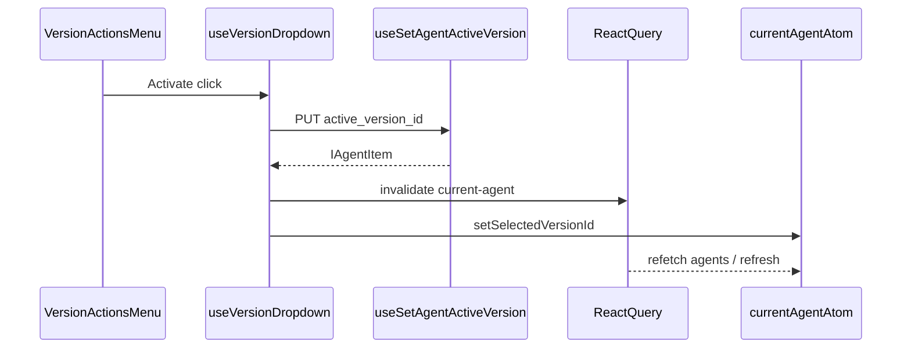

# Activate Version in VersionDropdown

## Context

- The backend contract you shared is already implemented in the shared API layer: `[useSetAgentActiveVersion](libs/api/src/api/AgentSettings/AgentsApi/useAgentsApi.ts)` sends **PUT** `/v1/agents/{id}/active-version` with body `{ active_version_id }` via `[ISetAgentActiveVersionPayload](libs/api/src/api/AgentSettings/AgentsApi/types.ts)` (`urlParams.id` → agent id, `active_version_id` in JSON body). **No new endpoint or lib types are required.**
- That mutation is tagged with `mutationKey: ['agent-file-sync']`, which already triggers the debounced `refreshCurrentAgent` path in `[useCurrentAgent](apps/operator/src/hooks/useCurrentAgent.ts)` (same key as agent file sync). Still mirror publish by invalidating the agents query so the list-driven sync in `useCurrentAgent` stays consistent.

## UI changes

1. `**[VersionActionsMenuItems.tsx](apps/operator/src/components/VersionDropdown/partial/VersionActionsMenuItems.tsx)**`

- Extend `IVersionActionsMenuItemsProps` with `onActivateVersion`, `isActivateDisabled` (and optionally treat pending as disabled via `isActivateDisabled` from parent).
- Insert a new `MenuItem` **immediately after** "Publish Version" (before "Edit Version Details"): label **Activate Version**, icon consistent with the row (e.g. `IconCircleCheck` from `central-icons`, already used elsewhere in operator).
- Same `noop` + `disabled` pattern as publish.

1. `**[VersionActionsButton.tsx](apps/operator/src/components/VersionDropdown/partial/VersionActionsButton.tsx)`

- Add props `onActivateVersion`, `isActivateDisabled` and pass them into `renderVersionActionsMenuItems`.

## Hook logic (`[useVersionDropdown.ts](apps/operator/src/components/VersionDropdown/useVersionDropdown.ts)`)

- Import `useSetAgentActiveVersion` from `@aui/api` (exported via `[libs/api/src/index.ts](libs/api/src/index.ts)`).
- `const { mutateAsync: setAgentActiveVersion, isLoading: isActivatingVersion } = useSetAgentActiveVersion();` — match the existing destructuring style used for publish/archive in this file.
- **Disable rules** (cause-aligned, avoid useless or clearly invalid calls):
  - No `currentAgent?.id` or no target version id → disabled.
  - `**version.id === currentAgent.active_version_id` → disabled (already active).
  - `**version.status === 'archived'` → disabled (aligned with not offering destructive/invalid ops on archived rows).
  - For the main Actions menu, use the **currently selected** version (`selectedVersionValue?.version`); for history rows, use `isActivateDisabledForVersion(version)` mirroring `isPublishDisabledForVersion`.
- **Handlers**
  - `handleActivateVersion(version?: IAgentVersionItem)` — resolve `versionId` as `version?.id ?? currentAgent?.selected_version_id`; guard and call `setAgentActiveVersion({ urlParams: { id: currentAgent.id }, active_version_id: versionId })`.
  - On success:
    - `queryClient.invalidateQueries({ queryKey: ['current-agent'], exact: false })` (same as `[handlePublishVersionConfirm](apps/operator/src/components/VersionDropdown/useVersionDropdown.ts)`).
    - `setSelectedVersionId(versionId)` so the dropdown selection matches the newly active version (local `selected_version_id` on the atom).
    - `toast.success('Version activated successfully')` (or similar).
  - On error: same `toast.error` shape as publish/archive (`error?.response?.data?.msg || ...`).
  - While `isActivatingVersion`, treat activate as disabled to avoid double submits (fold into `isActivateDisabled` / per-version helper).
- **Agent switch cleanup**: In the existing `useEffect` that resets modal/version state when `currentAgent?.id` changes, no new modal state is required; no extra reset unless you introduce a modal later.

## Wiring from `[VersionDropdown.tsx](apps/operator/src/components/VersionDropdown/VersionDropdown.tsx)`

- Destructure new values from the hook and pass `onActivateVersion`, `isActivateDisabled`, `isActivatingVersion` only as needed (loading folded into disabled).

## Version History parity

- `**[VersionHistoryPanel.tsx](apps/operator/src/components/VersionDropdown/partial/VersionHistoryPanel.tsx)` — add props `onActivateVersion: (version) => void`, `isActivateDisabledForVersion`, and for each row call `onActivateVersion` with `onRequestClose()` after click (same pattern as publish: close sheet when opening an action from the list).
- `**[VersionHistoryRow.tsx](apps/operator/src/components/VersionDropdown/partial/VersionHistoryRow.tsx)` — pass the new callbacks into `renderVersionActionsMenuItems`.

## Out of scope / optional follow-up

- **No confirmation modal** unless you want parity with publish’s two-step flow; the API is reversible by activating another version. If product wants a confirm step, add a small modal later following `[ArchiveVersionConfirmModal](apps/operator/src/components/VersionDropdown/partial/ArchiveVersionConfirmModal.tsx)`.
- If the API rejects activating a **draft** in some environments, the existing error toast is sufficient; tightening disable rules for drafts would require confirmed product rules.

## Validation

- Run `nx lint operator` (and build if you touch types/exports).
