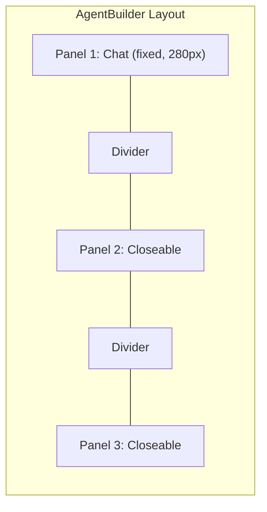
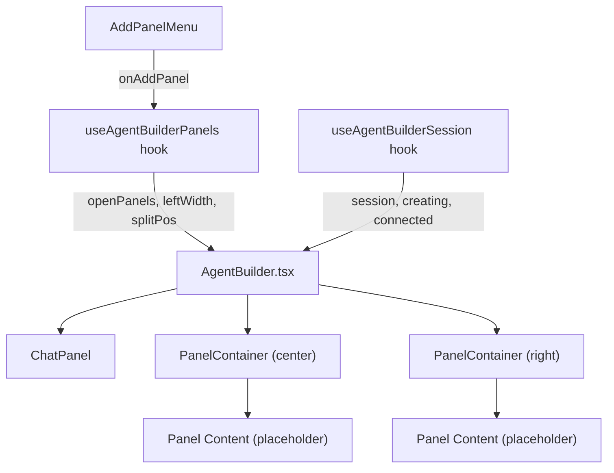

# Agent Builder Multi-Panel Layout

## Current State

[`AgentBuilder.tsx`](apps/operator/src/pages/agent-builder/AgentBuilder.tsx) has a 3-column layout (chat | file-tree | file-viewer) with custom mouse-event-based resizing. Session management (create, keep-alive, export) is mixed into the component. The existing chat/session logic will be preserved; the file-tree/viewer columns will be replaced by the new panel system.

## Architecture



### State Flow



## Key Design Decisions

- **Reuse existing components**: `Tabs`/`TabItem` from `@aui/break` for internal panel tabs; `Menu`/`MenuItem` for the Add Panel dropdown; `Button` for the "+" trigger; `Flex` for layout
- **Toast**: `react-hot-toast` (already used across the operator app) for "Maximum 3 panels reached" message
- **Resizing**: Extend the existing custom mouse-event pattern (no new library) to support 2 dividers (left|center, center|right)
- **State management**: Local state via custom hooks, following operator `.cursorrules` pattern
- **SCSS**: Use design system variables from `libs/break/src/styles/variables_v2.scss`; follow BEM naming with `ab-` prefix (matching existing styles)
- **Indentation**: Tabs (per operator `.cursorrules`)

## File Structure

```
agent-builder/
  AgentBuilder.tsx              # Refactored: presentation only
  useAgentBuilder.ts            # NEW: orchestrates session + panel hooks
  useAgentBuilderSession.ts     # NEW: extracted session logic from current AgentBuilder
  useAgentBuilderPanels.ts      # NEW: panel state management
  types.ts                      # Extended with panel types
  styles.scss                   # Refactored with new panel layout styles
  index.ts                      # Unchanged
  chat-api.ts                   # Unchanged
  chat-helpers.ts               # Unchanged
  components/
    ChatPanel.tsx               # Adapted: new input UI matching screenshots
    PanelContainer.tsx          # NEW: generic panel wrapper (header + tabs + close + content)
    PanelDivider.tsx            # NEW: reusable resizable divider
    AddPanelMenu.tsx            # NEW: "+" button with panel type dropdown
    CreatingSession.tsx         # Unchanged
    FileTree.tsx                # Unchanged (can be used inside panels later)
    MessageSegments.tsx         # Unchanged
    NewSessionModal.tsx         # Unchanged
```

## Detailed Component Specs

### 1. Panel Types & Config (`types.ts`)

```typescript
type PanelType =
  | "code-editor"
  | "system-prompts"
  | "thread"
  | "reasoning-trace"
  | "context"
  | "my-threads"
  | "control-panel";

interface PanelTabConfig {
  key: string;
  title: string;
}

interface PanelDefinition {
  type: PanelType;
  title: string;
  tabs: PanelTabConfig[];
}

interface OpenPanel {
  id: string;
  type: PanelType;
  activeTab: string;
}
```

Panel definitions (hard-coded, user can change later):

- **Code Editor**: title="Code Editor", tabs=[{key:'code', title:'config/agent.json'}]
- **System Prompts**: title="System Settings", tabs=[{key:'ui', title:'UI'}, {key:'code', title:'Code'}] with sub-sections Files/Tools
- **Thread**: title="Thread", tabs=[{key:'thread', title:'Thread'}, {key:'reasoning', title:'Reasoning'}, {key:'trace', title:'Trace'}, {key:'constraints', title:'Constraints'}]
- **Reasoning Trace**: title="Reasoning Trace", tabs=[]
- **Context**: title="Context & Previous State", tabs=[]
- **My Threads**: title="My Threads", tabs=[]
- **Control Panel**: title="Control Panel", tabs=[{key:'thread', title:'Thread'}, {key:'reasoning', title:'Reasoning'}, {key:'trace', title:'Trace'}, {key:'constraints', title:'Constraints'}]

### 2. `useAgentBuilderPanels` Hook

State:

- `openPanels: OpenPanel[]` (max 2) -- default: `[{system-prompts}, {thread}]`
- `leftPanelWidth: number` (default 280, min 200, max 500)
- `centerRightSplit: number` (percentage, default 50, min 20, max 80)

Actions:

- `handleAddPanel(type: PanelType)` -- adds panel or shows toast if at max
- `handleClosePanel(panelId: string)` -- removes panel
- `handleSetActiveTab(panelId: string, tabKey: string)` -- switches tab within panel
- `handleLeftDividerDrag` / `handleCenterDividerDrag` -- resize handlers (mousedown/move/up pattern)
- `handleReorderPanels(fromIndex, toIndex)` -- swap center/right panels (bonus)
- `handleMaximizePanel(panelId: string)` -- double-click maximize (bonus)

Keyboard shortcut: `Cmd/Ctrl + Shift + P` registered via `useEffect` with `keydown` listener.

### 3. `useAgentBuilderSession` Hook

Extract existing session logic from current [`AgentBuilder.tsx`](apps/operator/src/pages/agent-builder/AgentBuilder.tsx) lines 13-97:

- `session`, `creating`, `creatingSteps`, `error`, `connected`, `exporting`
- `fileRefreshTrigger`, `selectedFile`
- `handleCreateSession`, `handleExport`, `handleOpencodeSessionId`
- Keep-alive `useEffect`

### 4. `useAgentBuilder` Hook

Orchestrates both hooks:

```typescript
const useAgentBuilder = () => {
  const session = useAgentBuilderSession();
  const panels = useAgentBuilderPanels();
  return { ...session, ...panels };
};
```

### 5. `PanelContainer` Component

Props:

- `panel: OpenPanel`
- `definition: PanelDefinition`
- `onClose: () => void`
- `onTabChange: (tabKey: string) => void`
- `onDoubleClickHeader?: () => void`
- `children: ReactNode` (panel content)

Renders:

- Header bar with title text, `Tabs` component (from `@aui/break` with `appearance="segmented"`) for internal tabs, and an X close `Button`
- Content area below that renders `children`
- Subtle border + shadow styling matching screenshots

### 6. `PanelDivider` Component

Props:

- `onDragStart: () => void` (attaches mousemove/mouseup to window)
- `orientation?: 'vertical'`

Renders a thin vertical bar (4px wide) with `col-resize` cursor, highlight on hover -- identical pattern to existing [`styles.scss`](apps/operator/src/pages/agent-builder/styles.scss) lines 36-47.

### 7. `AddPanelMenu` Component

Uses `Menu` + `MenuItem` from `@aui/break`:

```tsx
<Menu
  label={
    <Button leftIcon={faPlus} size="xs" appearance="light">
      Add Panel
    </Button>
  }
>
  {PANEL_DEFINITIONS.map((def) => (
    <MenuItem
      key={def.type}
      label={def.title}
      onClick={() => onAddPanel(def.type)}
    />
  ))}
</Menu>
```

Rendered in the header area / top-right of the agent-builder layout.

### 8. `ChatPanel` Adaptation

The existing [`ChatPanel.tsx`](apps/operator/src/pages/agent-builder/components/ChatPanel.tsx) will be lightly adapted:

- Top area: centered purple icon + "Ask anything or specify changes to the agent" text
- Bottom: input area styled to match screenshots -- "What would you like to do?" placeholder, send arrow button, and a "Freeze Card #interaction N" tag badge above the input
- No close button in the panel header (this panel has no `PanelContainer` wrapper)

### 9. `AgentBuilder.tsx` (Refactored)

Pure presentation component consuming `useAgentBuilder`:

```tsx
const AgentBuilder = () => {
  const { session, panels, ... } = useAgentBuilder();

  return (
    <Flex className="agent-builder">
      {/* Left: Chat (always visible) */}
      <div className="ab-panel ab-panel--chat" style={{ width: leftPanelWidth }}>
        <ChatPanel ... />
      </div>

      {openPanels.map((panel, i) => (
        <Fragment key={panel.id}>
          <PanelDivider onDragStart={...} />
          <PanelContainer panel={panel} onClose={...} onTabChange={...}>
            {renderPanelContent(panel)}
          </PanelContainer>
        </Fragment>
      ))}

      <AddPanelMenu onAddPanel={handleAddPanel} />
    </Flex>
  );
};
```

### 10. SCSS Changes

- Replace the current 3-column fixed layout with a flexible panel system
- `.ab-panel` base class: `display:flex; flex-direction:column; height:100%; overflow:hidden;`
- `.ab-panel--chat`: fixed width, no close button, border-right
- `.ab-panel__header`: flex row with title, tabs, close button; subtle bottom border + shadow
- `.ab-panel__content`: `flex:1; overflow:auto;`
- Use `$shadow-sm`, `$gray-*`, `$font-*`, `$space-*` variables from design system
- Panel divider styles (reuse existing `.agent-builder__divider` pattern)

### 11. Bonus Features

- **Drag to reorder**: On `PanelContainer` header, add `draggable` attribute and `onDragStart`/`onDrop` handlers to swap the 2 closeable panels
- **Double-click maximize**: `onDoubleClick` on header toggles a `maximizedPanelId` state that hides other panels temporarily
- **Keyboard shortcut**: `Cmd/Ctrl + Shift + P` opens the Add Panel menu (via ref to `Menu` component or custom state)

## What Will NOT Change

- `chat-api.ts`, `chat-helpers.ts` -- untouched
- `CreatingSession.tsx`, `FileTree.tsx`, `FileViewer`, `MessageSegments.tsx`, `NewSessionModal.tsx` -- untouched
- Routing, `DashboardLayout`, `InstructionsLayout` -- untouched
- No new npm dependencies needed
