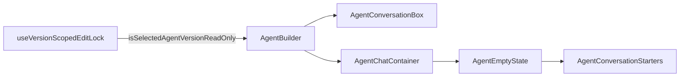

# Agent Builder read-only (minimal / composer-only)

## Scope (per your direction)

- **In**: Composer-facing controls only — the bottom [`AgentConversationBox.tsx`](apps/operator/src/widgets/AgentBuilder/partials/AgentConversationBox.tsx) and suggested prompts in empty state [`AgentEmptyState.tsx`](apps/operator/src/widgets/AgentBuilder/partials/AgentEmptyState.tsx) / [`AgentConversationStarters.tsx`](apps/operator/src/widgets/AgentBuilder/partials/AgentConversationStarters.tsx).
- **Out (for now)**: `useAgentBuilder` early returns / toasts, pending-composer / auto-send handling, `AgentChatHeader` new-thread button, `AgentConversationMessages` (Fix it / rerun / follow-ups). Those remain as today; if you need hard guarantees against programmatic sends later, add a small guard in `handleSendMessage` only.

## Read-only signal

- Use [`useVersionScopedEditLock`](apps/operator/src/hooks/useVersionScopedEditLock.ts) → `isSelectedAgentVersionReadOnly` (draft = editable; published/archived = read-only when versioning is enabled).

## Wiring

1. [`AgentBuilder.tsx`](apps/operator/src/widgets/AgentBuilder/AgentBuilder.tsx): call `useVersionScopedEditLock()` next to `useAgentBuilder()`; pass a boolean prop (e.g. `isComposerReadOnly` or `isSelectedAgentVersionReadOnly`) to `AgentConversationBox` and into `AgentChatContainer` for the empty state path only.
2. [`AgentChatContainer.tsx`](apps/operator/src/widgets/AgentBuilder/partials/AgentChatContainer.tsx): add optional prop; forward to `AgentEmptyState` so `AgentConversationStarters` gets `isDisabled={isCliSessionLoading || isComposerReadOnly}` (exact prop names to match your naming).

## `AgentConversationBox` behavior when read-only

- Textarea: `disabled={isStreaming || isComposerReadOnly}` (keep stop/streaming behavior unchanged).
- Send: extend `isSendDisabled` with read-only; `handleKeyDown` Enter already respects `isSendDisabled`.
- Attach: `disabled` when read-only (same as streaming/disconnected rules).
- `useFileMentions` `isEnabled`: add `&& !isComposerReadOnly` so `@` mentions cannot be edited from the composer.
- **Composer chrome**: when read-only, do not allow removing file mentions, attachment chips, or widget pill (omit `onRemove` / `onClick` clears or guard them) so the draft line cannot be “edited” via pills.
- **Placeholder** (optional, minimal): e.g. short line like “This version is read-only — select a draft to chat.” inline string is fine; no new `constants.ts` required unless you prefer one shared string.

## Known gap (acceptable for “minimal”)

- Code paths that call `handleSendMessage` without going through the disabled composer (e.g. welcome / pending composer) could still send until you add a one-line guard in [`useAgentBuilder.ts`](apps/operator/src/widgets/AgentBuilder/useAgentBuilder.ts). Call that out in PR/review if product cares.

## Files to touch

- [`apps/operator/src/widgets/AgentBuilder/AgentBuilder.tsx`](apps/operator/src/widgets/AgentBuilder/AgentBuilder.tsx)
- [`apps/operator/src/widgets/AgentBuilder/partials/AgentConversationBox.tsx`](apps/operator/src/widgets/AgentBuilder/partials/AgentConversationBox.tsx)
- [`apps/operator/src/widgets/AgentBuilder/partials/AgentChatContainer.tsx`](apps/operator/src/widgets/AgentBuilder/partials/AgentChatContainer.tsx)
- [`apps/operator/src/widgets/AgentBuilder/partials/AgentEmptyState.tsx`](apps/operator/src/widgets/AgentBuilder/partials/AgentEmptyState.tsx)

No changes to [`useAgentBuilder.ts`](apps/operator/src/widgets/AgentBuilder/useAgentBuilder.ts), [`constants.ts`](apps/operator/src/widgets/AgentBuilder/constants.ts), message list partials, or header — unless you later widen scope.
