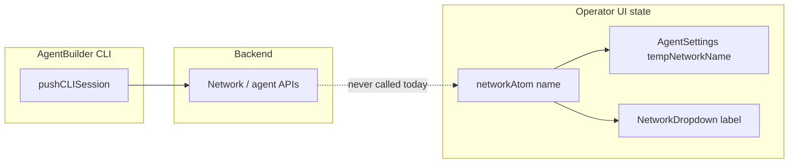

# Agent Builder agent name not updating in UI

## What the user sees

- **Header / Network dropdown** and **Settings → Agent Identity** use `[Network.name](apps/operator/src/api/network.ts)` from Jotai via `[useNetwork()](apps/operator/src/atoms/network-atoms.ts)` (see `[useNetworkManager](apps/operator/src/hooks/useNetworkManager.ts)` and `[useAgentIdentity](apps/operator/src/pages/agent-settings/useAgentIdentity.ts)` `tempNetworkName` / `selectedNetworkAtom`).
- **Manual save** in agent settings calls `updateNetwork` then `[fetchNetworks](apps/operator/src/layouts/dashboard-layout/dashboard-layout.tsx)` / state updates so the atoms match the API (`[useAgentIdentity` onSave](apps/operator/src/pages/agent-settings/useAgentIdentity.ts) around lines 743–757).

## Why Agent Builder changes do not show up

### 1. CLI push is not wired to network state

`[useAgentBuilder.ts](apps/operator/src/widgets/AgentBuilder/useAgentBuilder.ts)` calls `[pushCLISession](libs/api/src/api/CLIConnectionApi/cliConnectionApi.ts)` as a **plain async function** (around lines 728–838). On success it invalidates many React Query keys (agent tools, config hub, placeholders, etc.) but **never refetches or updates the selected `Network`** in Jotai.

`[useAgentFileRefreshSync](apps/operator/src/hooks/useAgentFileRefreshSync.ts)` only runs `refreshCLISession` + `refetchFiles` when a mutation is tagged with `AGENT_FILE_SYNC_MUTATION_KEY`. `**pushCLISession` is not a React Query mutation, so it does not participate in that mechanism.

### 2. `agent-file-sync` would not fix the header anyway

`[useCurrentAgent](apps/operator/src/hooks/useCurrentAgent.ts)` listens for successful mutations with `mutationKey: ['agent-file-sync']` and calls `refreshCurrentAgent()`, which uses `getAgentById` / agent list. That updates `[currentAgentAtom](apps/operator/src/atoms/current-agent-atom.ts)`, **not** `networkAtom`. The top bar agent label comes from `**selectedNetwork.name`, not `currentAgent.name`.

### 3. Extra defect if you rely on `currentAgent` for renames

`[isSameAgent](apps/operator/src/hooks/useCurrentAgent.ts)` (lines 29–37) compares only `id`, `active_version_id`, and `scope.network_id`. If only `**name`** changes, it treats the agent as “the same” and **skips `setCurrentAgent`, so the atom can stay stale even when `getAgentById` returns a new name.

## Recommended implementation

### A. Primary: refresh selected network after successful CLI push (cause-level)

In `[useAgentBuilder.ts](apps/operator/src/widgets/AgentBuilder/useAgentBuilder.ts)`, in the `pushCLISession(...).then(...)` success path (where you already invalidate queries after `result.status` indicates pushed changes):

1. Use `[useGetNetworkById](apps/operator/src/api/network.ts)` (`mutateAsync`) with `urlParams: { networkId: selectedNetwork._id }` (same pattern as `[MainContext](apps/operator/src/contexts/MainContext.tsx)` lines 547–554).
2. Update Jotai:

- `setSelectedNetwork` from `[useNetwork()](apps/operator/src/atoms/network-atoms.ts)` with the returned `Network` (merge with previous if needed for partial responses).
- Update `[useNetworkOptions](apps/operator/src/atoms/network-atoms.ts)` so the dropdown list row for the same `_id` shows the new `name` (map/replace entry by id), mirroring what a full `[fetchNetworks](apps/operator/src/layouts/dashboard-layout/dashboard-layout.tsx)` would do.

Keep this **scoped to the current `networkId`** to avoid unrelated UI churn.

Optional: also call `refreshCurrentAgent()` from `[useCurrentAgent](apps/operator/src/hooks/useCurrentAgent.ts)` in the same hook file (dashboard already mounts `useCurrentAgent()` in `[dashboard-layout.tsx](apps/operator/src/layouts/dashboard-layout/dashboard-layout.tsx)`) so versioning / agent-scoped UI stays aligned—**only after** fixing B below, or it will still no-op on name-only changes.

### B. Secondary: fix `isSameAgent` so renames update `currentAgentAtom`

In `[useCurrentAgent.ts](apps/operator/src/hooks/useCurrentAgent.ts)`, extend the equality check so a **name** change is not treated as “no update” (e.g. include `currentAgent.name !== nextAgent.name` as a reason to update, or compare a small set of display fields). This makes `refreshCurrentAgent` and the `useFetchAgents` sync effect correct for renames and matches the intent of `agent-file-sync` listeners.

### C. Not the right place: `AgentChatContainer.tsx`

`[AgentChatContainer.tsx](apps/operator/src/widgets/AgentBuilder/partials/AgentChatContainer.tsx)` only renders messages/empty state; **no data subscription** belongs there. All changes should stay in `useAgentBuilder.ts` (and optionally `useCurrentAgent.ts`).

## Verification

- On staging: rename agent via Agent Builder, confirm push succeeds, **without full page reload**:
  - Network dropdown label updates.
  - Settings → Agent Identity field matches.
- Regression: manual rename via Settings still works; switching agents still works.

## Files to touch

- `[apps/operator/src/widgets/AgentBuilder/useAgentBuilder.ts](apps/operator/src/widgets/AgentBuilder/useAgentBuilder.ts)` — network refetch + atom updates after successful push.
- `[apps/operator/src/hooks/useCurrentAgent.ts](apps/operator/src/hooks/useCurrentAgent.ts)` — `isSameAgent` / refresh behavior for name changes.
