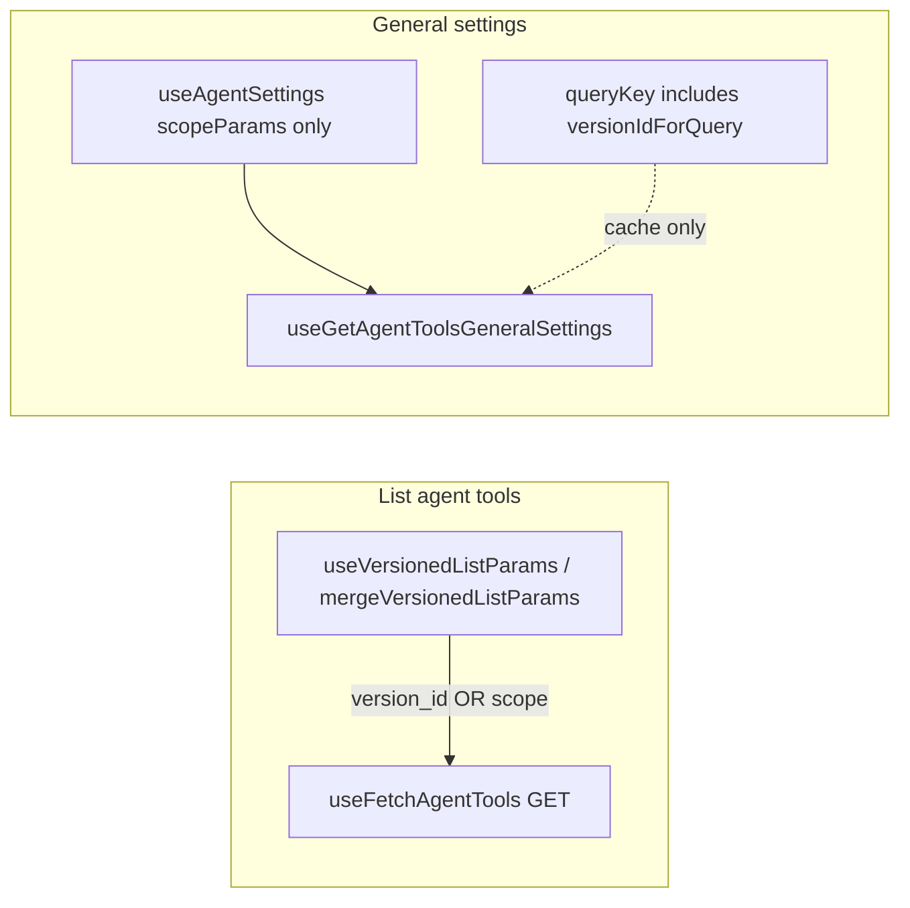

# Agent tools API and agent versioning

## What looks “missing” in `[useAgentToolsApi.ts](libs/api/src/api/AgentSettings/AgentToolsApi/useAgentToolsApi.ts)`

`[useFetchAgentTools](libs/api/src/api/AgentSettings/AgentToolsApi/useAgentToolsApi.ts)` declares `params` as `any`. Other Agent Settings list hooks typically use a named params type that **extends** `[IScopedParams](libs/api/src/api/AgentSettings/Common/types.ts)`, which already includes optional `version_id` (this is the query-string versioning mechanism used across agent-settings, together with `[IScopeFunnelParams](libs/api/src/api/AgentSettings/Common/types.ts)` for things like `enable_reduce_by_scope`). Example: `[IListSimplifiedWorkflowsParams](libs/api/src/api/AgentSettings/SimplifiedWorkflowsApi/types.ts)` extends `IScopedParams` + `IScopeFunnelParams`.

So the file does **not** “turn off” versioning at the HTTP layer; it mostly **does not document** the same contract in TypeScript that other modules do.

## Where versioning actually applies today

**GET `/v1/agent-tools` (list)**

- Operator builds params with `[mergeVersionedListParams](apps/operator/src/helpers/mergeVersionedListParams.ts)` via `[useVersionedListParams](apps/operator/src/hooks/useVersionedListParams.ts)`: when a version is selected, the request sends `**version_id` only (scope fields are stripped, per API rules in the helper comment).
- Both call sites pass merged params: `[useGetWorkflowsByScope](apps/operator/src/api/workflows.ts)` and `[useAgentToolOptions](apps/operator/src/hooks/useAgentToolOptions.ts)`.

So list calls **do** use the same versioning pattern as other versioned lists; it is just implemented in the app layer + loose typing in the lib.

**Mutations / bodies**

- Create payload `[ICreateAgentToolPayload](libs/api/src/api/AgentSettings/AgentToolsApi/types.ts)` includes optional `agent_version_id` (body field, not the same name as query `version_id`).
- Delete variables in `[useDeleteAgentTool](libs/api/src/api/AgentSettings/AgentToolsApi/useAgentToolsApi.ts)` include optional `agent_version_id`.
- PATCH general settings payload `[IUpdateAgentToolsGeneralSettingsPayload](libs/api/src/api/AgentSettings/AgentToolsApi/types.ts)` includes `agent_version_id`; operator passes it on save in `[useAgentSettings.ts](apps/operator/src/pages/base-model/partials/AgentSettings/useAgentSettings.ts)` via `agentVersionIdForMutations`.

**Rules API (for comparison)**

- `[TGetAgentToolRulesParams](libs/api/src/api/AgentSettings/AgentToolsRulesApi/types.ts)` explicitly lists `version_id`, matching the documented pattern.

## Real inconsistency to be aware of: general settings GET

`[useGetAgentToolsGeneralSettings](libs/api/src/api/AgentSettings/AgentToolsApi/useAgentToolsApi.ts)` is typed with `IScopedParams` (so `version_id` is allowed), but `[useAgentSettings](apps/operator/src/pages/base-model/partials/AgentSettings/useAgentSettings.ts)` passes `**scopeParams` without merging `version_id`, while the React Query `queryKey` includes `versionIdForQuery`. That separates caches but may or may not match what the backend expects for version-scoped reads—worth confirming against the API contract (your attached PDF may describe this; it was not read from the workspace).

## Why it ended up this way (most likely)

- **Historical / expedient typing**: `params: any` avoids modeling the “either scope+funnel **or** `{ version_id }`” union that `[mergeVersionedListParams](apps/operator/src/helpers/mergeVersionedListParams.ts)` enforces.
- **Separation of concerns**: the lib exposes thin `useDataFetch` wrappers; operator owns the version-merge helper. Other APIs still export explicit param types for ergonomics and consistency.

## Optional follow-ups (only if you want code changes)

1. Introduce something like `IListAgentToolsParams extends IScopedParams, IScopeFunnelParams` and use it in `useFetchAgentTools` (and export it from the agent-settings barrel) so versioning is visible in types like `[useFetchSimplifiedWorkflows](libs/api/src/api/AgentSettings/SimplifiedWorkflowsApi/useSimplifiedWorkflowsApi.ts)`.
2. Align `useGetAgentToolsGeneralSettings` usage with the backend: pass `version_id` via the same merge helper (or document that GET is intentionally non-versioned and drop version from `queryKey` if redundant).

No code changes are required to answer the “why”—this is primarily **typing and documentation drift**, plus a **possible** GET general-settings param/queryKey mismatch to validate against the spec.
