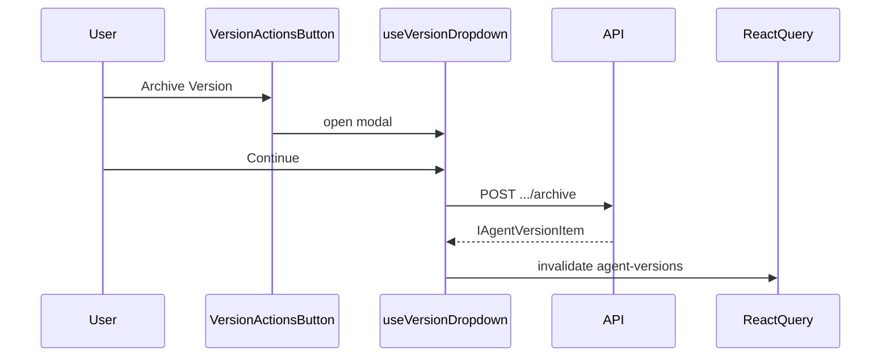

# Archive agent version (API + confirmation modal)

## API layer

**File:** `[apps/operator/src/api/agent-versions.ts](apps/operator/src/api/agent-versions.ts)`

- Add `useArchiveAgentVersion` using the same stack as `[useUpdateAgentVersion](apps/operator/src/api/agent-versions.ts)` / `[useCreateAgentVersion](apps/operator/src/api/agent-versions.ts)`:
  - `url: '/v1/agents/{agentId}/versions/{versionId}/archive'`
  - `method: 'POST'`
  - `instance: INSTANCES.AGENT_SETTINGS`
  - `meta: { unwrapResponse: true }`
- **Payload type:** `{ urlParams: { agentId: string; versionId: string } }` only (no body fields). `@aui/api` `useMutate` will POST with an empty object body, which matches a typical archive action.
- **Response type:** `IAgentVersionItem` (already matches the JSON shape you shared: `status: 'archived'`, stats, etc.).

The full Postman path (`/api/outer-bridge/agent-settings/v1/...`) is already covered by the app’s AGENT_SETTINGS base URL + relative `/v1/agents/...` paths used elsewhere in this file.

## Confirmation modal UI

**New file:** `apps/operator/src/components/VersionDropdown/partial/ArchiveVersionConfirmModal.tsx`

Mirror `[EditVersionModal.tsx](apps/operator/src/components/VersionDropdown/partial/EditVersionModal.tsx)`:

- `Modal` with `className="version-dropdown-modal"`, `withCloseIcon`, `showTitleSeparator`, `onRequestClose`
- `Modal.Title`: e.g. `Archive Version`
- `Modal.Content`: message in two short blocks (first sentence, then second + “Continue?”), using `Flex direction="vertical"` like Edit; add a **small SCSS class** under the existing `[.break-modal-container.version-dropdown-modal](apps/operator/src/components/VersionDropdown/styles.scss)` block for body copy (muted white, readable line-height) so we do not rely on inline styles.
- `Modal.Footer`: `Button variant="outline"` **Cancel** and `Button variant="primary"` **Continue** with `isLoading` while the mutation runs — same button/theming pattern as Edit (footer styles are already scoped in `styles.scss`).

**Exact copy:**

1. `Archived versions cannot be activated.`
2. `They can still be viewed and cloned. Continue?`

## Hook wiring

**File:** `[apps/operator/src/components/VersionDropdown/useVersionDropdown.ts](apps/operator/src/components/VersionDropdown/useVersionDropdown.ts)`

- Import `useArchiveAgentVersion`.
- State: `isArchiveVersionModalOpen` (boolean).
- Handlers:
  - `handleOpenArchiveVersionModal`: set modal open, `setMenuOpen(false)` (same as `[handleOpenEditVersionModal](apps/operator/src/components/VersionDropdown/useVersionDropdown.ts)`).
  - `handleCloseArchiveVersionModal`: close + reset.
  - `handleArchiveVersionConfirm`: guard `currentAgent?.id` and `selectedVersionId` (or the version id passed in); `await archiveAgentVersion({ urlParams: { agentId, versionId } })`; `queryClient.invalidateQueries({ queryKey: [AGENT_VERSIONS_QUERY_KEY, currentAgent.id], exact: false })`; `toast.success` / error handling matching `[handleEditSubmit](apps/operator/src/components/VersionDropdown/useVersionDropdown.ts)`; close modal on success.
- Reset archive modal state in the existing `useEffect` that runs when `[currentAgent?.id](apps/operator/src/components/VersionDropdown/useVersionDropdown.ts)` changes (alongside edit/create resets).
- Export modal state, loading flag from the mutation, and handlers.

**UX guard:** derive `isArchiveDisabled` when the **currently selected** version has `status === 'archived'` so the menu item does not offer archiving again (API might error otherwise).

## Component integration

**File:** `[apps/operator/src/components/VersionDropdown/partial/VersionActionsButton.tsx](apps/operator/src/components/VersionDropdown/partial/VersionActionsButton.tsx)`

- Extend props: `onOpenArchiveVersion: () => void`, `isArchiveDisabled?: boolean`.
- Wire **Archive Version** `MenuItem` `onClick` to `onOpenArchiveVersion`; pass `disabled={isArchiveDisabled}` if `MenuItem` supports it (match how other menus in the repo disable items; if not supported, no-op in callback when disabled).

**File:** `[apps/operator/src/components/VersionDropdown/VersionDropdown.tsx](apps/operator/src/components/VersionDropdown/VersionDropdown.tsx)`

- Render `ArchiveVersionConfirmModal` next to `EditVersionModal` / `CreateVersionModal`.
- Pass `onOpenArchiveVersion` from the hook; pass `isArchiveDisabled` from `selectedVersionValue?.version?.status === 'archived'`.

## Flow (high level)

## Validation

- Run `nx lint operator` (and fix any new issues in touched files).

**Note:** Do not embed or commit the sample JWT from Postman; the app continues to use the configured Axios / auth headers.
