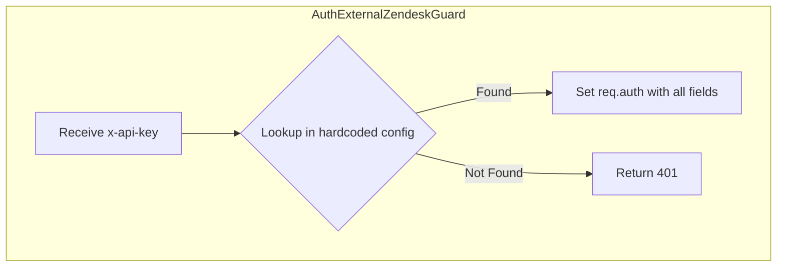
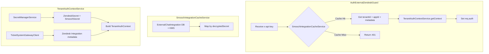

# Auth Guard Dynamic Configuration Refactoring

## Overview

Replace hardcoded config in `AuthExternalZendeskGuard` with dynamic values from multiple sources. The Guard will use a cache for fast API key validation, while a new service handles fetching tenant-specific context.

## Current Architecture

## Proposed Architecture

## Data Sources

| Field | Source | Cacheable ||-------|--------|-----------|| `owner` (tenantId) | ExternalChatIntegration DB | Yes (15 min) || `appId` | ExternalChatIntegration DB | Yes (15 min) || `defaultGroupOnEscalation` | ExternalChatIntegration.metadata | Yes (15 min) || `defaultBrandId` | ExternalChatIntegration.metadata | Yes (15 min) || `email`, `token` | AWS SecretManager (Zendesk) | No (security) || `username`, `password` | AWS SecretManager (Smooch) | No (security) || `subdomain` | TicketSystemGateway API | Optional TTL cache |

## Implementation Tasks

### 1. Create Type Definitions

Create [`src/auth/auth.types.ts`](src/auth/auth.types.ts):

- `TenantAuthContext` interface with all required fields
- `CachedIntegrationData` type for cache entries
- Use discriminated unions for type safety (no `as` or `any`)

### 2. Create TenantAuthContextService

Create [`src/auth/tenant-auth-context.service.ts`](src/auth/tenant-auth-context.service.ts):

- Inject `SecretManagerService` and `TicketSystemGatewayClient`
- `getContext(tenantId: string, appId: string, cachedMetadata: SmoochMetadata)` method
- Fetches Zendesk/Smooch secrets and Zendesk integration metadata
- Returns fully typed `TenantAuthContext`
- Consider optional TTL caching for `subdomain` (external API call)

### 3. Refactor AuthExternalZendeskGuard

Update [`src/auth/auth.external-zendesk.guard.ts`](src/auth/auth.external-zendesk.guard.ts):

- Remove hardcoded `config` object
- Inject `TenantAuthContextService`
- `canActivate()` becomes thin wrapper around `canActivateDynamic()`
- Guard flow:

1. Validate API key against `SmoochIntegrationCacheService`
2. Call `TenantAuthContextService.getContext()` for full context
3. Set typed `req.auth`

### 4. Create AuthExternalZendeskModule

Create [`src/auth/auth.external-zendesk.module.ts`](src/auth/auth.external-zendesk.module.ts):

- Encapsulates `AuthExternalZendeskGuard` and `TenantAuthContextService`
- Imports all required modules in one place
- Export and import this module wherever the guard is used

### 5. Update Controller Modules

Update these modules to import `AuthExternalZendeskModule`:

- [`src/quackchat/controller/quackchat.controller.module.ts`](src/quackchat/controller/quackchat.controller.module.ts)
- [`src/chat-session/controller/external-zendesk/chat-session-external-zendesk.controller.module.ts`](src/chat-session/controller/external-zendesk/chat-session-external-zendesk.controller.module.ts)

### 6. Update Request Types

Update [`src/quackchat/service/live-chat-systems/quackchat-smooch.types.ts`](src/quackchat/service/live-chat-systems/quackchat-smooch.types.ts):

- Import `TenantAuthContext` from auth types
- Update `SmoochWebhookRequest.auth` to use the shared type