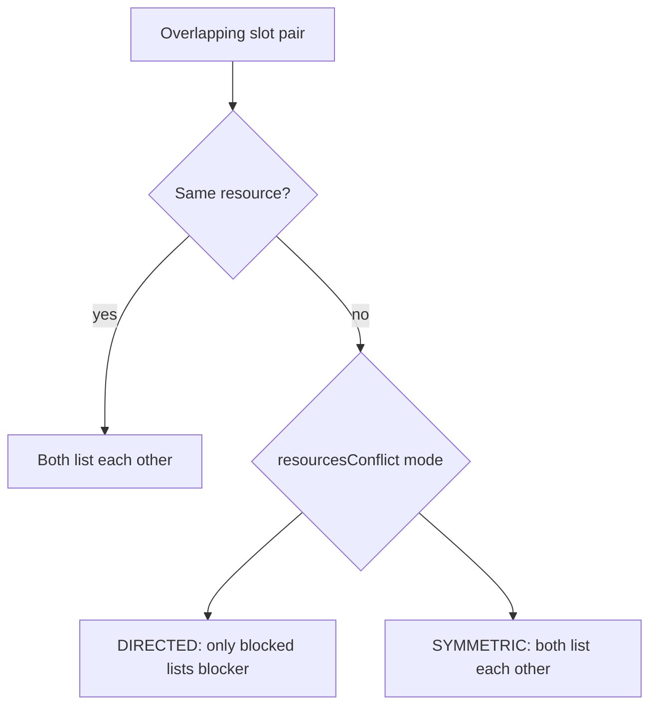
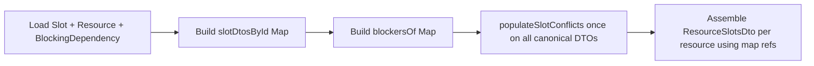

# Blocking dependency conflicts

## Goal

When Pool blocks Lane 1 ([`BlockingDependency`](server/src/entities/blocking-dependency.entity.ts)):

1. **Lane 1 entry** includes Lane 1 slots **and** Pool slots (same object refs as Pool entry)
2. **Conflicts** use a pluggable **blocking conflict mode** (see below) — default **directed** to match REQUIREMENTS/e2e; flip one constant to get **symmetric** Pool↔Lane marking
3. **Shared instances**: one `SlotDto` per slot id in a `Map` — the Pool `"Aqua Aerobics"` object in Lane 1's array is the **same reference** as in Pool's array, with an **identical** `conflicts` array everywhere it appears

**Display assembly is unchanged:** Pool entry only contains Pool slots in its `slots` array. Lane 1 slots are never copied into the Pool entry — only `conflicts` arrays differ by mode.

## Switchable conflict modes

Product is undecided between two cross-resource rules. **Isolate the difference in one function** — everything else (assembly, canonical map, populate sweep) stays the same.

### Option A — enum constant (recommended for assignment)

New file or top of service:

```ts
export enum BlockingConflictModeEnum {
  DIRECTED = 'directed',
  SYMMETRIC = 'symmetric',
}
```

Single switch point:

```ts
private readonly blockingConflictMode = BlockingConflictModeEnum.DIRECTED;
```

### Option B — env var (flip without code edit)

```ts
private readonly blockingConflictMode =
  process.env.BLOCKING_CONFLICT_MODE === 'symmetric'
    ? BlockingConflictModeEnum.SYMMETRIC
    : BlockingConflictModeEnum.DIRECTED;
```

Run symmetric locally: `BLOCKING_CONFLICT_MODE=symmetric npm run start:dev`

### The one function that differs

```ts
private resourcesConflict(
  targetResourceId: number,
  candidateResourceId: number,
  blockersOf: Map<number, number[]>,
): boolean {
  if (targetResourceId === candidateResourceId) return true;

  const targetBlockers = blockersOf.get(targetResourceId) ?? [];

  if (this.blockingConflictMode === BlockingConflictModeEnum.DIRECTED) {
    // REQUIREMENTS: candidate must block target (upstream blocker only)
    return targetBlockers.includes(candidateResourceId);
  }

  // SYMMETRIC: either resource blocks the other
  const candidateBlockers = blockersOf.get(candidateResourceId) ?? [];
  return (
    targetBlockers.includes(candidateResourceId) ||
    candidateBlockers.includes(targetResourceId)
  );
}
```

`isConflictFor(target, candidate, blockersOf)` = not same id + `slotsOverlap` + `resourcesConflict(target.resourceId, candidate.resourceId, blockersOf)`.

### Behaviour comparison (Pool blocks Lane 1, overlapping slots)

| Mode | Lane 1 slot lists Pool? | Pool slot lists Lane 1? | e2e |
|------|-------------------------|-------------------------|-----|
| **DIRECTED** | yes | no | Passes REQUIREMENTS |
| **SYMMETRIC** | yes | yes | Fails `should NOT list Lane 1...` on Pool |

Same-resource overlaps are **identical** in both modes.



**Default to `DIRECTED`** so e2e passes out of the box. Change one line (or env var) to experiment with symmetric.

## Conflict rule

```
Pool ──blocks──▶ Lane 1, Lane 2, Lane 3, Lane 4
Lane 3 ──blocks──▶ Lane 2
Lane 2 ──blocks──▶ Lane 3
```

**Per-resource entry contents** (slots shown in `GET /slots` response):

| Resource | Own slots | + Blocker slots from |
|----------|-----------|----------------------|
| Pool | Pool | — |
| Lane 1 | Lane 1 | Pool |
| Lane 2 | Lane 2 | Pool, Lane 3 |
| Lane 3 | Lane 3 | Pool, Lane 2 |
| Lane 4 | (none) | Pool |

## Why populate runs once on canonical objects

Conflicts must be computed **once** on the canonical `Map<id, SlotDto>` before assembly, because the same Pool object is referenced from Pool and Lane 1 entries. One populate pass → consistent `conflicts` everywhere.



## Implementation — [`server/src/slots/slots.service.ts`](server/src/slots/slots.service.ts)

### 1. Load data in parallel

```ts
const [slots, resources, dependencies] = await Promise.all([
  this.manager.find(Slot, { order: { id: 'ASC' } }),
  this.manager.find(Resource, { order: { id: 'ASC' } }),
  this.manager.find(BlockingDependency),
]);
```

### 2. Build `slotDtosById`

```ts
const slotDtosById = new Map<number, SlotDto>(
  slots.map((slot) => [slot.id, { ...slot, conflicts: [] }]),
);
```

### 3. Build `blockersOf`

```ts
private buildBlockersOf(dependencies: BlockingDependency[]): Map<number, number[]> {
  const blockersOf = new Map<number, number[]>();
  for (const dep of dependencies) {
    const list = blockersOf.get(dep.blockedResourceId) ?? [];
    list.push(dep.blockingResourceId);
    blockersOf.set(dep.blockedResourceId, list);
  }
  return blockersOf;
}
```

### 4. Extend `populateSlotConflicts`

```ts
populateSlotConflicts(slots: SlotDto[], blockersOf: Map<number, number[]>): void
```

```ts
private isConflictFor(
  target: SlotDto,
  candidate: SlotDto,
  blockersOf: Map<number, number[]>,
): boolean {
  if (target.id === candidate.id) return false;
  if (!this.slotsOverlap(target, candidate)) return false;
  return this.resourcesConflict(
    target.resourceId,
    candidate.resourceId,
    blockersOf,
  );
}
```

In the `(i, j)` loop — evaluate each direction independently (required for DIRECTED; harmless for SYMMETRIC):

```ts
if (this.isConflictFor(sorted[i], sorted[j], blockersOf)) {
  this.addToConflicts(sorted[i], sorted[j]);
}
if (this.isConflictFor(sorted[j], sorted[i], blockersOf)) {
  this.addToConflicts(sorted[j], sorted[i]);
}
```

Call once:

```ts
this.populateSlotConflicts([...slotDtosById.values()], blockersOf);
```

Remove per-resource `groupBy` + per-bucket populate in `getSlots`.

### 5. Assemble `ResourceSlotsDto[]`

```ts
private collectSlotsForResource(
  resourceId: number,
  slotDtosById: Map<number, SlotDto>,
  blockersOf: Map<number, number[]>,
): SlotDto[] {
  const blockerIds = new Set(blockersOf.get(resourceId) ?? []);
  return [...slotDtosById.values()].filter(
    (slot) => slot.resourceId === resourceId || blockerIds.has(slot.resourceId),
  );
}
```

```ts
return resources.map((resource) => ({
  resourceId: resource.id,
  slots: this.collectSlotsForResource(resource.id, slotDtosById, blockersOf),
}));
```

### 6. Remove dead `groupBy` import if no longer used

## Expected e2e impact

With **`BlockingConflictModeEnum.DIRECTED`** (default):

| Test | Expected |
|------|----------|
| All GET /slots tests | Pass |
| POST/PUT 409 | Still fail — follow-up |

With **`SYMMETRIC`**: all GET tests pass **except** `should NOT list Lane 1 slots as conflicts on Pool slots`.

## Out of scope (follow-up)

- Today-only slot filtering
- `addSlot` / `updateSlot` 409 validation (reuse same `isConflictFor` + mode)
- JSDoc / import cleanup
- Parameterized e2e running both modes (optional: `describe.each` if product picks one)

## Verification

```bash
cd server
npm run test:e2e -- --testNamePattern="GET /slots"
```

Toggle mode and re-run to compare Pool conflict behaviour.
