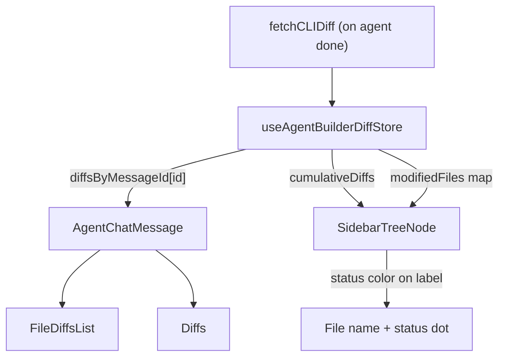

# Centralized Diff Store

## Architecture



## 1. Create the diff store

**New file:** [apps/operator/src/stores/useAgentBuilderDiffStore.ts](apps/operator/src/stores/useAgentBuilderDiffStore.ts)

```typescript
import type { ICLIDiffFile } from "@aui/api";
import { create } from "zustand";

interface IAgentBuilderDiffState {
  // Latest full cumulative snapshot from the server
  cumulativeDiffs: ICLIDiffFile[];
  // Per-message deltas: messageId -> files changed by that message
  diffsByMessageId: Record<string, ICLIDiffFile[]>;

  setCumulativeDiffs: (files: ICLIDiffFile[]) => void;
  setDiffsForMessage: (messageId: string, diffs: ICLIDiffFile[]) => void;
  clearAll: () => void;
}
```

- `cumulativeDiffs` replaces `previousDiffRef` in `useAgentBuilder.ts` -- it holds the latest full server snapshot
- `diffsByMessageId` replaces `fileDiffs` on `IAgentBuilderMessage` -- each message's diffs are stored by message ID
- `clearAll` resets both fields (called on session change)

## 2. Remove `fileDiffs` from the message interface

**File:** [apps/operator/src/stores/useAgentBuilderStore.ts](apps/operator/src/stores/useAgentBuilderStore.ts)

- Remove `fileDiffs?: IAgentBuilderFileDiff[]` from `IAgentBuilderMessage` (line 24)
- Remove `IAgentBuilderFileDiff` type alias and the `ICLIDiffFile` import (lines 1, 12) since they move to the diff store

## 3. Update `useAgentBuilder.ts` to write to the diff store

**File:** [apps/operator/src/widgets/AgentBuilder/useAgentBuilder.ts](apps/operator/src/widgets/AgentBuilder/useAgentBuilder.ts)

- Remove `previousDiffRef` (line 25) and the `console.log` (line 26)
- Remove the `useEffect` that resets `previousDiffRef` on session change (lines 101-103)
- Import and use the new diff store:
  - On session change: call `clearAll()` (replaces the useEffect that reset the ref)
  - In the `done` handler (lines 297-316):
    - Read `cumulativeDiffs` from the store as the "previous" baseline
    - Compute `delta = computeDiffDelta(cumulativeDiffs, resp.files)`
    - Call `setCumulativeDiffs(resp.files)` to update the snapshot
    - Call `setDiffsForMessage(assistantId, delta)` to store per-message diffs
    - Remove the `updateMessageInTask` call that sets `fileDiffs`

## 4. Update chat message components to read from the diff store

**File:** [apps/operator/src/widgets/AgentBuilder/partials/AgentConversationMessages.tsx](apps/operator/src/widgets/AgentBuilder/partials/AgentConversationMessages.tsx)

- Stop passing `fileDiffs={message.fileDiffs}` to `AgentChatMessage`
- Instead pass `messageId={message.id}`

**File:** [apps/operator/src/widgets/AgentBuilder/partials/AgentChatMessage.tsx](apps/operator/src/widgets/AgentBuilder/partials/AgentChatMessage.tsx)

- Replace `fileDiffs` prop with `messageId` prop
- Read diffs from the diff store: `const fileDiffs = useAgentBuilderDiffStore((s) => s.diffsByMessageId[messageId]) ?? []`
- The condition on line 85 of `AgentConversationMessages.tsx` (`message.fileDiffs?.length ?? 0 > 0`) needs to check the store instead -- simplest approach: let `AgentChatMessage` always render and internally return null if no diffs and no text

## 5. Add `modifiedFiles` prop to the file tree sidebar

**File:** [libs/break/src/lib/JsonCodeEditor/types.ts](libs/break/src/lib/JsonCodeEditor/types.ts)

- Add optional `modifiedFiles` prop to `JsonCodeEditorProps`:
  ```typescript
  modifiedFiles?: Record<string, string>; // path -> status ('modified' | 'added' | 'deleted')
  ```

**File:** [libs/break/src/lib/JsonCodeEditor/JsonCodeEditor.tsx](libs/break/src/lib/JsonCodeEditor/JsonCodeEditor.tsx)

- Accept `modifiedFiles` prop and pass it down to `EditorWithSidebar`

**File:** [libs/break/src/lib/JsonCodeEditor/partials/EditorWithSidebar.tsx](libs/break/src/lib/JsonCodeEditor/partials/EditorWithSidebar.tsx)

- Add `modifiedFiles?: Record<string, string>` to `EditorWithSidebarProps` (line 13)
- Pass it to `SidebarTreeNode`
- In `SidebarTreeNode` (file node rendering, lines 80-94):
  - Look up `modifiedFiles?.[node.path]` to get the status
  - If present, add a status indicator: a small colored dot or letter after the file label
    - `modified` -> yellow/orange dot or "M"
    - `added` -> green dot or "A"
    - `deleted` -> red dot or "D"
  - Add a CSS modifier class on the `cv__file-label` span: `cv__file-label--modified`, `cv__file-label--added`, `cv__file-label--deleted`

## 6. Add sidebar diff status styles

**File:** [libs/break/src/lib/JsonCodeEditor/styles.scss](libs/break/src/lib/JsonCodeEditor/styles.scss)

After the `&__file-label` block (~line 605), add status modifier styles using design system variables where possible:

```scss
&__file-status {
  flex-shrink: 0;
  margin-left: auto;
  font-size: 11px;
  font-weight: $fontWeightMedium;
  line-height: 1;

  &--modified {
    color: #e5c07b; // amber
  }
  &--added {
    color: #98c379; // green
  }
  &--deleted {
    color: #e06c75; // red
  }
}
```

## 7. Wire the diff store to `BaseModel.tsx`

**File:** [apps/operator/src/pages/base-model/BaseModel.tsx](apps/operator/src/pages/base-model/BaseModel.tsx)

- Import `useAgentBuilderDiffStore`
- Derive a `modifiedFiles` record from `cumulativeDiffs`:
  ```typescript
  const cumulativeDiffs = useAgentBuilderDiffStore((s) => s.cumulativeDiffs);
  const modifiedFiles = useMemo(() => {
    const map: Record<string, string> = {};
    for (const f of cumulativeDiffs) {
      if (f.hunks?.length > 0) map[f.file] = f.status;
    }
    return map;
  }, [cumulativeDiffs]);
  ```
- Pass `modifiedFiles={modifiedFiles}` to `JsonCodeEditor` (line 135)

## Files changed (summary)

| File                                                                            | Change                                                           |
| ------------------------------------------------------------------------------- | ---------------------------------------------------------------- |
| `apps/operator/src/stores/useAgentBuilderDiffStore.ts`                          | **New** -- Zustand diff store                                    |
| `apps/operator/src/stores/useAgentBuilderStore.ts`                              | Remove `fileDiffs` from message interface                        |
| `apps/operator/src/widgets/AgentBuilder/useAgentBuilder.ts`                     | Write to diff store instead of message; remove `previousDiffRef` |
| `apps/operator/src/widgets/AgentBuilder/partials/AgentConversationMessages.tsx` | Pass `messageId` instead of `fileDiffs`                          |
| `apps/operator/src/widgets/AgentBuilder/partials/AgentChatMessage.tsx`          | Read diffs from store by `messageId`                             |
| `libs/break/src/lib/JsonCodeEditor/types.ts`                                    | Add `modifiedFiles` prop                                         |
| `libs/break/src/lib/JsonCodeEditor/JsonCodeEditor.tsx`                          | Pass `modifiedFiles` to sidebar                                  |
| `libs/break/src/lib/JsonCodeEditor/partials/EditorWithSidebar.tsx`              | Render status indicator per file                                 |
| `libs/break/src/lib/JsonCodeEditor/styles.scss`                                 | Status indicator styles                                          |
| `apps/operator/src/pages/base-model/BaseModel.tsx`                              | Derive and pass `modifiedFiles` from diff store                  |

## What stays unchanged

- `diffAnnotation.ts` -- `computeDiffDelta` and `annotateHunkLines` remain as-is
- `Diffs.tsx`, `FileDiffsList.tsx` -- rendering logic unchanged, they still receive `ICLIDiffFile[]`
- `fetchCLIDiff` in `cliConnectionApi.ts` -- no API changes
- `useCLIFiles` / file tree data flow -- unmodified; the diff status is layered on top via the new prop
