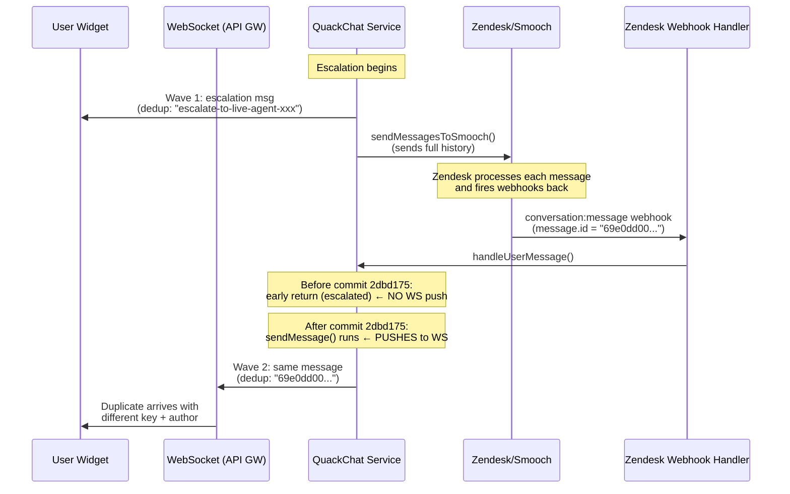

# Root Cause Analysis: Chat Message Rendering Duplication

## Definitive Root Cause

Commit `2dbd175` ("fix: persist all agent messages before escalation guard in handleUserMessage") in [zendesk-chat-session.service.ts](src/chat-session/service/zendesk-chat/zendesk-chat-session.service.ts) broke the escalation guard.

### What the commit changed

**Before the commit** -- the method had an early return that prevented ANY processing when the session was escalated:

```diff
-    if (chatSession.status === ChatSessionStatus.ESCALATED || hasNonQuackAgentMessage) {
-      this.logger.log(`zendesk chat session escalated`, { chatSession, owner });
-      return;   // ← exited before reaching sendMessage
-    }
```

**After the commit** -- the early return was removed and replaced with a later guard that only skips AI processing:

```diff
+    const isEscalated =
+      chatSession.status === ChatSessionStatus.ESCALATED ||
+      chatSession.status === ChatSessionStatus.ESCALATED_LIVE_AGENT ||
+      hasNonQuackAgentMessage;
+
     // ... author determination ...
     // ... sendMessage (persists AND pushes to WebSocket) ...
     // ... THEN:
+    if (isEscalated) {
+      return;   // ← only skips AI, message was already sent to client
+    }
```

The `sendMessage` call at line 124 both **persists** the message to the DB and **pushes it to the client's WebSocket** via `postToApiGatewayAndSave`. By moving the escalation guard to AFTER this call, every message from Zendesk webhooks now gets forwarded to the user.

### How this causes the duplication

The full chain during escalation:



1. Backend escalates and sends full conversation history TO Zendesk via `sendMessagesToSmooch`
2. Zendesk receives each message and fires `conversation:message` webhooks back to `POST /zendesk-chat/conversation`
3. The [ExternalZendeskChatController](src/chat-session/controller/external-zendesk/chat-session-external-zendesk.controller.ts) (line 70-73) extracts the **Zendesk message ID** (`data.events[0].payload?.message.id`) and passes it as `message.id`
4. `ZendeskChatSessionService.handleUserMessage` now calls `quackchatMessageSenderService.sendMessage` with `deduplicationKey: message.id` -- the Zendesk message ID (24-hex-char string like `69e0dd009c8a0626b1f01d95`)
5. This persists a NEW row in the DB and pushes the message to the user's WebSocket

### Why the dedup keys and authors differ

- **Dedup keys**: Wave 1 uses semantic keys (`escalate-to-live-agent-{sessionId}`), Wave 2 uses Zendesk message IDs (`69e0dd00...`). The frontend's `uniqueMessages` Map sees them as completely different messages.
- **Authors**: The author determination at line 115-121 re-attributes based on the Zendesk webhook data:
  - Original `SYSTEM` messages arrive as `role: 'assistant'` with status `ESCALATED_LIVE_AGENT` -> mapped to `LIVE_AGENT`
  - Original `USER` messages arrive as `role: 'user'` -> mapped to `USER`

### Why it worked before

Before commit `2dbd175`, the early return at the top of `handleUserMessage` caught escalated sessions and returned immediately. The Zendesk webhook echoes were silently dropped. No messages were persisted or pushed to the WebSocket. The duplication was invisible.

## The Fix

The intent of the commit was correct -- agent messages during live chat SHOULD be persisted. But the implementation needs to separate **DB persistence** from **WebSocket delivery to the end user**.

The fix should restore the early-return behavior for WebSocket delivery while still persisting messages that arrive during escalation. Specifically: when the session is already escalated and the incoming message is an echo of the conversation history (not a new live agent message), it should be persisted but NOT pushed to the user's WebSocket.

Two approaches:

**Option A -- Minimal: Skip sendMessage for echoed messages during escalation**

Only call `sendMessage` (which pushes to WS) for messages from a real live agent (when `isAgent === true`), and use `chatMessageService.pushNewMessage` directly (DB-only, no WS push) for other messages during escalation.

**Option B -- Use externalId dedup to block echoes**

The messages sent TO Smooch during `sendMessagesToSmooch` have their `externalId` updated with the Smooch message ID via `updateMessageExternalId`. When the same message comes back through the Zendesk webhook with that same Smooch message ID, the `pushNewMessage` externalId dedup check (line 35-42 in [chat-message.service.ts](src/chat-messages/chat-message/chat-message.service.ts)) would catch it and return the existing message. The WS push in `postToApiGatewayAndSave` would still fire, but since `pushNewMessage` returns the existing message (no new row), the message content would at least be consistent.

**Recommendation**: Option A is cleaner and more explicit. The key change is: for escalated sessions, persist the message to the DB but do NOT push it to the user's WebSocket unless it's from a real live agent (`isAgent === true`).
