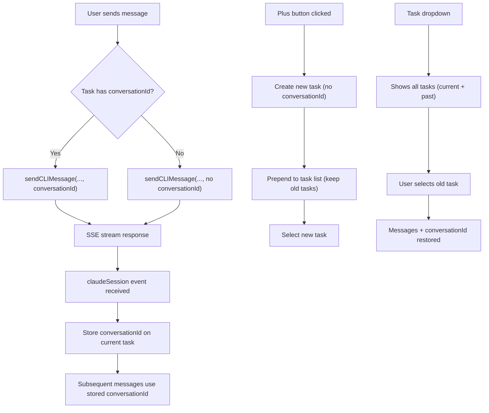

# Claude Conversation ID Tracking

## Context

When sending a message via `sendCLIMessage`, the backend returns a `claudeSession` SSE event with an `id` field:

```
data: {"type":"claudeSession","id":"445e93b9-..."}
```

This is the **Claude SDK conversation ID** -- separate from the CLI sandbox session (`cliSession.id` / `sandboxId`). The same sandbox session can host multiple Claude conversations. Currently, this event is ignored.

## Architecture



## Changes

### 1. API Layer -- [cliConnectionApi.ts](libs/api/src/api/CLIConnectionApi/cliConnectionApi.ts)

- Add `conversationId?: string` to `ICLISendMessageOptions` (line ~59)
- Include `conversationId` in the `body` of the fetch call inside `sendCLIMessage` (line ~219):
  ```typescript
  conversationId: conversationId || undefined,
  ```

### 2. Store -- [useAgentBuilderStore.ts](apps/operator/src/stores/useAgentBuilderStore.ts)

- Add `conversationId?: string` to `IAgentBuilderTask` interface (line ~4)
- Add a `updateTaskConversationId(taskId: string, conversationId: string)` action that patches the matching task in `agentTasksList`
- Add a `updateTaskTitle(taskId: string, title: string)` action so we can rename "New Chat" to a truncated version of the first user message (critical for distinguishing conversations in the dropdown)

### 3. Hook -- [useAgentBuilder.ts](apps/operator/src/widgets/AgentBuilder/useAgentBuilder.ts)

**Handle `claudeSession` event (inside `onEvent` callback, line ~238):**

Add a handler alongside the existing `opencodeSession` handler:

```typescript
if (event.type === "claudeSession") {
  const conversationId = typeof event.id === "string" ? event.id : undefined;
  if (conversationId) {
    updateTaskConversationId(taskId, conversationId);
  }
}
```

**Pass `conversationId` when sending (line ~230):**

Read the current task's `conversationId` and include it in `sendCLIMessage`:

```typescript
conversationId: selectedTask?.conversationId,
```

**Fix `handleCreateTask` (line ~138):**

Currently it replaces the entire task list and invalidates the session. Change to:

- **Prepend** the new task to the existing list instead of replacing
- **Do NOT** call `invalidateSession()` / `createSession()` -- the sandbox session stays alive; only the Claude conversation changes
- Select the new task

**Update task title on first user message (inside `handleSendMessage`, after line ~213):**

When the task title is still "New Chat" and the user sends a message, update it to a truncated version of the message text (~30 chars) so conversations are distinguishable in the dropdown.

### 4. Header -- [AgentChatHeader.tsx](apps/operator/src/widgets/AgentBuilder/partials/AgentChatHeader.tsx)

No structural changes needed. The dropdown already iterates `tasks` and calls `handleSelectTask`. Once we stop replacing the task list in `handleCreateTask`, past conversations will naturally appear. The `isCreateDisabled` prop should remain tied to `isCliSessionLoading` since we need a live sandbox to chat.

### Key Design Decisions

- **conversationId lives on `IAgentBuilderTask**`, not on the CLI session -- because one sandbox session can have many Claude conversations.
- `**handleCreateTask` no longer destroys the sandbox -- it just creates a new task entry with no `conversationId`. The next message will trigger the backend to create a new Claude conversation.
- **Task title auto-updates** from "New Chat" to the first message text so users can identify past conversations in the dropdown.
- **No changes to `AgentChatHeader.tsx` rendering logic** -- it already supports multiple tasks in the dropdown; the bug was that `handleCreateTask` was wiping the list.
