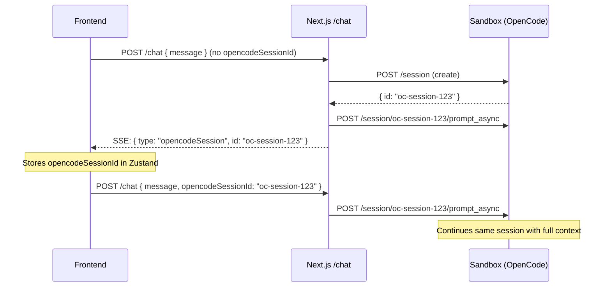
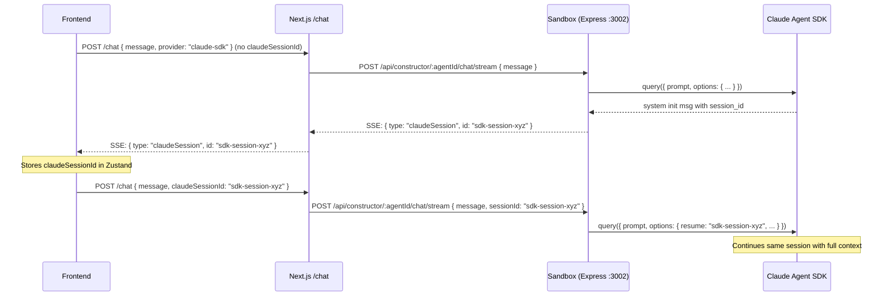

# Claude SDK Conversation Continuity

## Problem

OpenCode has conversation continuity: the first message creates a session, subsequent messages reuse it via `opencodeSessionId`. Claude SDK currently starts a **new SDK session** on every single message -- no context is carried between messages.

## How OpenCode does it (the model to replicate)



## Proposed claude-sdk flow (symmetric)



## Files to change

### 1. Sandbox agent -- `[sandbox-templates/agent-builder-claude-sdk/agent/src/agent.ts](sandbox-templates/agent-builder-claude-sdk/agent/src/agent.ts)`

`**streamAgent()**` (primary -- used by the stream endpoint):

- Add optional `sessionId?: string` parameter.
- If `sessionId` is provided, add `resume: sessionId` to `query()` options.
- Capture `session_id` from the first message where `msg.type === "system" && msg.subtype === "init"`.
- Emit a new event: `onEvent({ type: "claudeSession", id: capturedSessionId })` so the HTTP layer can forward it.

`**runAgent()**` (secondary -- non-streaming endpoint):

- Same changes: accept optional `sessionId`, pass `resume`, capture and return the `session_id`.

Add `"claudeSession"` to the `StreamEvent.type` union:

```typescript
export interface StreamEvent {
  type: "text" | "thinking" | "tool" | "error" | "done" | "claudeSession";
  // ... existing fields ...
  id?: string; // for claudeSession events
}
```

Key `query()` change:

```typescript
for await (const rawMsg of query({
  prompt,
  options: {
    cwd: agentPath,
    model: LITELLM_REQUEST_MODEL,
    ...(sessionId ? { resume: sessionId } : {}),
    allowedTools: ["Read", "Write", "Edit", "Grep", "Glob", "Skill"],
    // ... rest unchanged
  },
})) {
  const msg = rawMsg as ClaudeMessage;

  // Capture session ID from init message
  if (msg.type === "system" && msg.subtype === "init" && msg.session_id) {
    onEvent({ type: "claudeSession", content: "", id: String(msg.session_id) });
  }
  // ... rest of processing unchanged
}
```

### 2. Sandbox agent -- `[sandbox-templates/agent-builder-claude-sdk/agent/src/index.ts](sandbox-templates/agent-builder-claude-sdk/agent/src/index.ts)`

Both Express routes (`/chat` and `/chat/stream`) need to:

- Read optional `sessionId` from `req.body.sessionId`.
- Pass it to `streamAgent()` / `runAgent()`.

```typescript
app.post("/api/constructor/:agentId/chat/stream", async (req, res) => {
  const agentId = req.params.agentId || req.body.agentId;
  const prompt = req.body.prompt || req.body.message;
  const systemPrompt = req.body.systemPrompt;
  const sessionId = req.body.sessionId; // NEW
  // ...
  await streamAgent(
    String(agentId),
    String(prompt),
    writeEvent,
    typeof systemPrompt === "string" ? systemPrompt : undefined,
    typeof sessionId === "string" ? sessionId : undefined // NEW
  );
});
```

### 3. Next.js API -- `[src/app/api/sessions/[id]/chat/route.ts](src/app/api/sessions/[id]/chat/route.ts)`

`**POST` handler (line 14): Parse `claudeSessionId` from the request body alongside existing fields.

`**handleClaudeSdkChat()**` (line 513):

- Accept new param `claudeSessionId?: string`.
- Forward it to the sandbox as `sessionId` in the request body.
- In the stream proxy: detect `{ type: "claudeSession" }` events from the sandbox and forward them to the client (same pattern as `opencodeSession` forwarding for opencode).

```typescript
// line 27-28: pass claudeSessionId
if (provider === "claude-sdk") {
  return handleClaudeSdkChat({ sandbox, message, systemPrompt, agentId, claudeSessionId });
}

// in handleClaudeSdkChat, line 543: include sessionId in body
body: JSON.stringify({ agentId, message, systemPrompt, sessionId: claudeSessionId }),
```

### 4. Session types -- `[src/lib/types.ts](src/lib/types.ts)`

Add `claudeSessionId` to the `Session` interface:

```typescript
export interface Session {
  // ... existing fields ...
  claudeSessionId?: string; // Claude Agent SDK session ID for conversation continuity
}
```

### 5. Session store -- `[src/stores/session-store.ts](src/stores/session-store.ts)`

Add `updateClaudeSessionId` action (mirrors `updateOpencodeSessionId`):

```typescript
updateClaudeSessionId: (id: string) => {
  const { session } = get();
  if (session) {
    set({ session: { ...session, claudeSessionId: id } });
  }
},
```

### 6. Frontend -- `[src/components/app-shell.tsx](src/components/app-shell.tsx)`

**ChatPanel `sendMessage()` (line 2139-2152):**

- For `claude-sdk`, include `claudeSessionId` in the request body.
- Handle `claudeSession` SSE events (like `opencodeSession` at line 2174).

```typescript
body: JSON.stringify({
  message: userMsg,
  provider: session.provider || "opencode",
  ...(session.provider === "claude-sdk"
    ? {
        agentId: session.agentId || undefined,
        systemPrompt: session.systemPrompt || undefined,
        claudeSessionId: session.claudeSessionId || undefined, // NEW
      }
    : {
        opencodeSessionId: session.opencodeSessionId || undefined,
        systemPrompt: session.systemPrompt || undefined,
        agentId: session.agentId || undefined,
      }),
}),
```

In the SSE event handler (around line 2173):

```typescript
if (event.type === "claudeSession") {
  updateClaudeSessionId(event.id);
}
```

### 7. Conversation route -- `[src/app/api/sessions/[id]/conversation/route.ts](src/app/api/sessions/[id]/conversation/route.ts)`

Purpose: "Start a new conversation" within the same sandbox.

- `**provider === "opencode"**`: Return `501` with `{ error: "unsupported" }`.
- `**provider === "claude-sdk"**`: Return `200` with `{ conversationId: crypto.randomUUID() }`. The frontend will clear `claudeSessionId` from the store, so the next `/chat` call starts a fresh SDK session. No sandbox call needed -- the SDK creates a new session when `resume` is omitted.

```typescript
import { NextRequest } from "next/server";

export async function POST(request: NextRequest) {
  const sandboxId = request.headers.get("X-Sandbox-Id");
  if (!sandboxId) {
    return new Response(
      JSON.stringify({ error: "Missing X-Sandbox-Id header" }),
      { status: 400, headers: { "Content-Type": "application/json" } }
    );
  }

  const { provider } = await request.json();

  if (provider === "opencode") {
    return new Response(
      JSON.stringify({
        error: "New conversation is not supported for the opencode provider.",
      }),
      { status: 501, headers: { "Content-Type": "application/json" } }
    );
  }

  if (provider !== "claude-sdk") {
    return new Response(
      JSON.stringify({ error: "Invalid or missing provider" }),
      { status: 400, headers: { "Content-Type": "application/json" } }
    );
  }

  return new Response(JSON.stringify({ conversationId: crypto.randomUUID() }), {
    status: 200,
    headers: { "Content-Type": "application/json" },
  });
}
```

The frontend, upon calling this endpoint, should:

1. Clear `claudeSessionId` from the store.
2. Clear the chat messages array.
3. Optionally store the `conversationId` for tracking purposes.

## Sandbox rebuild note

After changing files in `sandbox-templates/agent-builder-claude-sdk/agent/`, the sandbox template will need to be rebuilt and re-published to E2B so new sandboxes pick up the changes. Existing sandboxes will not be affected until they are recreated.

## Summary of the symmetry

| Concept              | OpenCode                                  | Claude SDK (proposed)                   |
| -------------------- | ----------------------------------------- | --------------------------------------- |
| Session ID field     | `opencodeSessionId`                       | `claudeSessionId`                       |
| Store action         | `updateOpencodeSessionId`                 | `updateClaudeSessionId`                 |
| SSE event            | `{ type: "opencodeSession", id }`         | `{ type: "claudeSession", id }`         |
| How continuity works | Reuse OpenCode session ID in prompt_async | Pass `resume: sessionId` to `query()`   |
| New conversation     | Don't send `opencodeSessionId`            | Don't send `claudeSessionId` (clear it) |
