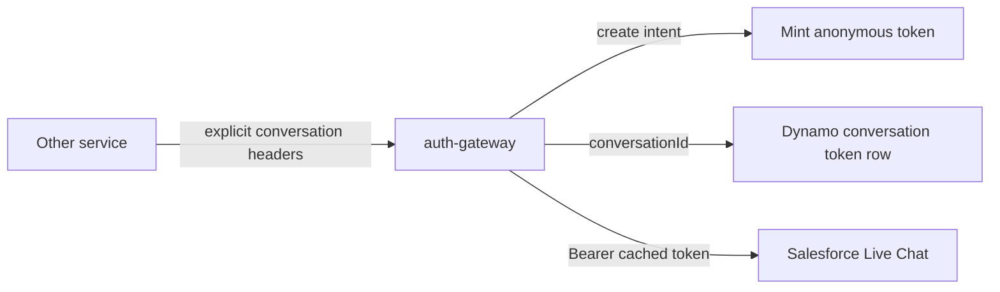

# Clean Livechat Token Flow

## What I Found

- The current diff adds about 467 lines, with the largest growth in [src/salesforce-livechat/client/salesforce-livechat.client.ts](src/salesforce-livechat/client/salesforce-livechat.client.ts) and Dynamo types/storage.
- The gateway is currently inferring `conversationId` from header, URL, and body in [src/salesforce-livechat/client/salesforce-livechat.session-key.ts](src/salesforce-livechat/client/salesforce-livechat.session-key.ts). Since the upstream service can pass this explicitly, that extraction is avoidable.
- [src/salesforce-livechat/client/salesforce-livechat.client.ts](src/salesforce-livechat/client/salesforce-livechat.client.ts) now mixes auth, proxying, token lifecycle decisions, Dynamo record mapping, JWT diagnostics, and logging. That is the main source of bloat.
- Salesforce-specific token claims in [src/dynamo/dynamo.types.ts](src/dynamo/dynamo.types.ts) are observability-only and not required for the behavior fix.

## Target Shape

Use an explicit proxy contract from the upstream service:

- `x-salesforce-livechat-conversation-id`: required for conversation-bound requests.
- `x-salesforce-livechat-create-conversation: true`: set only for the request that creates a new Salesforce conversation.

The gateway reads those headers, removes them before forwarding to Salesforce, and stops parsing Salesforce URL/body shapes to infer intent.

## Implementation Plan

1. Replace request-shape extraction with a small explicit contract helper.

   - Remove URL/body UUID parsing from [src/salesforce-livechat/client/salesforce-livechat.session-key.ts](src/salesforce-livechat/client/salesforce-livechat.session-key.ts), or rename it to something like `salesforce-livechat.proxy-contract.ts`.
   - Keep only header parsing for `conversationId` and create intent.
   - Strip these internal headers from forwarded `params.headers` so Salesforce never receives gateway coordination metadata.

2. Simplify [src/salesforce-livechat/service/salesforce-livechat.service.ts](src/salesforce-livechat/service/salesforce-livechat.service.ts).

   - Keep metadata validation, but avoid broad `unknown` casts where possible.
   - Read `conversationId` and `isNewConversation` from headers only.
   - Pass both explicitly into `SalesforceLivechatProxyParams`.

3. Slim [src/salesforce-livechat/client/salesforce-livechat.client.ts](src/salesforce-livechat/client/salesforce-livechat.client.ts).

   - Make `proxy()` follow one direct flow: resolve token, send request, handle errors.
   - Keep the important invariant: mint only when `isNewConversation === true`; never silently mint a new anonymous identity for an existing conversation.
   - Remove JWT diagnostic claim logging/storage. Keep only expiry extraction if needed for token expiration.

4. Reduce Dynamo-specific bloat.

   - Keep only the minimal persisted record fields needed for behavior: `id`, `tenantID`, `owner`, `type`, `entityType`, `integrationName`, `conversationId`, `accessToken`, optional `lastEventId`, `expiresAt`, `ttl`, `createdAt`, `updatedAt`.
   - Remove `SalesforceLivechatTokenClaims` from [src/dynamo/dynamo.types.ts](src/dynamo/dynamo.types.ts) unless you explicitly want those claims stored for observability.
   - Consider renaming Dynamo methods to `getSalesforceLivechatConversationToken` / `putSalesforceLivechatConversationToken` so the table-specific behavior is obvious.

5. Tighten tests around behavior, not implementation noise.
   - Keep focused Dynamo tests for key shape and no `name` collision.
   - Add or update livechat client/service tests for: create conversation mints and stores, existing conversation uses cache, existing conversation without cache returns an auth error, internal headers are not forwarded.

## Expected Result

The diff should lose most of the extraction and diagnostic code, the client should read as token lifecycle plus proxying instead of a bundle of helpers, and the contract with the upstream service becomes explicit and testable.
