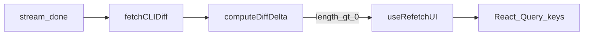

# CLI diff → refresh Settings / Tools / Business Rules / Ontology / Integrations

## Current behavior (already in place)

In [`apps/operator/src/widgets/AgentBuilder/useAgentBuilder.ts`](apps/operator/src/widgets/AgentBuilder/useAgentBuilder.ts), after streaming finishes, `fetchCLIDiff` runs; when [`computeDiffDelta`](apps/operator/src/widgets/AgentBuilder/partials/diffAnnotation.ts) returns a non-empty `delta`, the code already runs:

```938:940:apps/operator/src/widgets/AgentBuilder/useAgentBuilder.ts
                    if (delta.length > 0) {
                      updateMessageInTask(taskId, assistantId, (msg) => ({ ...msg, diffs: delta }));
                      void refetchUI();
```

[`useRefetchUI`](apps/operator/src/widgets/AgentBuilder/useRefetchUI.ts) is intentionally the single place that “fans out” cache refresh when agent files/config change: widget builder refresh, [`current-agent`](apps/operator/src/hooks/useCurrentAgent.ts), [`/v1/agent-tools/rules`](libs/api/src/api/AgentSettings/AgentToolsRulesApi/useAgentToolsRulesApi.ts), config hub keys (`config-hub-data-*`), [`network-api-integration/{id}`](apps/operator/src/api/workflows.ts) (workflow/BE configs), placeholders, [`agent-tools-general-settings`](apps/operator/src/pages/base-model/partials/AgentSettings/useAgentSettings.ts), ontology-related [`/v1/scope-entities`](apps/operator/src/api/entities.ts), `scope-entities-list`, `parameters-list`, [`agent-context-integrations`](apps/operator/src/api/agent-context.ts), [`refreshAndSyncAgentTools`](apps/operator/src/hooks/useRefreshAgentTools.ts) (**`/v1/agent-tools`** — same family as Tools list via [`useGetWorkflowsByScope`](apps/operator/src/api/workflows.ts)), [`handleTaskRulesChanged`](apps/operator/src/contexts/MainContext.tsx) (main-chat task cloning; often no-op in Agent Builder because of early-return guards), and [`/v1/simplified-workflows`](libs/api/src/api/AgentSettings/SimplifiedWorkflowsApi/useSimplifiedWorkflowsApi.ts).

So you do **not** need a second parallel invalidation block inside `useAgentBuilder.ts` unless you deliberately want divergent behavior from other “files changed” entry points.



## Gap: Integrations tab list

Integrations V3 loads its table from [`useGetIntegrationsApi`](libs/api/src/api/AgentSettings/IntegrationsApi/useIntegrationsApi.ts), which queries **`GET /v1/integrations/view`**. [`useFetch`](libs/api/src/api/react-query.ts) builds keys as `[url, params, headers]`, so those queries match the prefix **`/v1/integrations/view`**.

**That URL is not invalidated in `useRefetchUI` today**, while adjacent integration-related keys (`network-api-integration/...`, `agent-context-integrations`) are. This is the most likely missing piece for the **Integrations** control tab (see [`CONTROL_TABS.INTEGRATIONS_V3`](apps/operator/src/pages/base-model/tabs.ts)).

## Recommended implementation

1. **Extend** [`apps/operator/src/widgets/AgentBuilder/useRefetchUI.ts`](apps/operator/src/widgets/AgentBuilder/useRefetchUI.ts): add `invalidateQueries` + `refetchQueries` with `{ queryKey: ['/v1/integrations/view'], exact: false }` next to the other agent-settings style keys (same pattern as `/v1/agent-tools/rules` and scope-entity keys).
2. **Do not duplicate** that list inside `useAgentBuilder.ts` — keep one source of truth so future tabs only need updating in one hook.
3. **Optional hygiene** (only if you see stubborn staleness): add explicit `refetchQueries` for `agent-tools-general-settings` after invalidate, matching keys that already use both invalidate + refetch; default `invalidateQueries` should refetch active queries, but mirroring patterns reduces surprises with `staleTime: Infinity` ([`apps/operator/AGENTS.md`](apps/operator/AGENTS.md)).

## Important limitation (sandbox vs persisted config)

CLI **diff reflects the sandbox/workspace**. Many base-model tabs read **persisted** network/agent settings via REST. If nothing has **`pushCLISession`’d** changes to the backend yet, refetching may still show the **old** API payload even though the diff is correct. In this codebase, **`refetchUI()` also runs after a successful push** (same hook at ~line 1027 in `useAgentBuilder.ts`). If your product expectation is “sidebar always tracks sandbox before push,” that would require a different data path (not just query invalidation).

## Verification

- With Agent Builder open: trigger a response that yields a non-empty CLI diff touching integrations-relevant YAML/JSON if applicable → open **Integrations** tab → list should refresh without a hard reload once step (1) is in place.
- Run `nx lint operator` (narrowest target) after edits.
