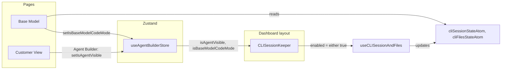

# CLI session keep-alive in dashboard layout

## Current state

- **[useAgentBuilderStore.ts](apps/operator/src/stores/useAgentBuilderStore.ts)** already has `isBaseModelCodeMode` and `setIsBaseModelCodeMode`; Base Model reads them and passes `codeViewEnabled = isBaseModelCodeMode` into `useCLISessionAndFiles`.
- **[useBaseModel.tsx](apps/operator/src/pages/base-model/useBaseModel.tsx)** is the only caller of `useCLISessionAndFiles(codeViewEnabled, cliAui)`, so connect and keep-alive run only when the Base Model page is mounted. On Customer View (or other routes) with Agent Builder open, the session is created by `useAgentBuilder` (via `useCLISessionManager`) but nothing runs keep-alive.
- **[useCLISessionAndFiles.ts](libs/api/src/api/CLIConnectionApi/cliFiles/useCLISessionAndFiles.ts)** runs connect, keep-alive (timeout), invalidate-on-disable, and file-error invalidation; it uses shared Jotai atoms (`cliSessionStateAtom`, `cliFilesStateAtom`) so any consumer of `useCLISessionManager` / `useCLIFiles` sees the same session and file tree.

## Target architecture

- **Single place for lifecycle:** `CLISessionKeeper` in the layout calls `useCLISessionAndFiles(enabled, aui)` with `enabled = isAgentVisible || isBaseModelCodeMode` and `aui` from layout’s user/account/network. Connect and keep-alive run on any route when either flag is true.
- **Base Model only consumes:** Replace `useCLISessionAndFiles` in `useBaseModel` with `useCLISessionManager(cliAui)` + `useCLIFiles(cliAui)` and combine return values so the code view UI keeps using `session`, `fileTree`, loadings, `error`, `invalidateSession` from the same atoms.

## Implementation steps

### 1. Add CLISessionKeeper and mount it in the layout

- **New file:** `apps/operator/src/layouts/dashboard-layout/CLISessionKeeper.tsx`
  - Component that renders `null`.
  - Read from `useAgentBuilderStore`: `isAgentVisible`, `isBaseModelCodeMode`.
  - Compute `enabled = isAgentVisible || isBaseModelCodeMode`.
  - Build `aui` from `useUser()` (token), `useAccountAtom()` (account), `useNetwork()` (selectedNetwork): same shape as in useBaseModel — `{ token, accountId: account._id, agentId: selectedNetwork._id, environment: 'staging' }` when `token && account?._id && selectedNetwork?._id`.
  - Call `useCLISessionAndFiles(enabled, aui)` from `@aui/api` (no need to use the return value).
- **Edit:** [dashboard-layout.tsx](apps/operator/src/layouts/dashboard-layout/dashboard-layout.tsx)
  - Import and render `<CLISessionKeeper />` inside the authenticated layout tree (e.g. inside `<MainProvider>`, near the top of the main content so it is mounted on every dashboard route). Do not render it in the early-return branches (LandingPage, NavigateToLogin, etc.) so it only runs when the user is authenticated and account/network are in use; the same layout block that has `useUser`, `useAccountAtom`, `useNetwork` is the right place (e.g. right after the opening `<MainProvider>` div so the keeper runs whenever the dashboard content is shown).

### 2. Switch useBaseModel to useCLISessionManager + useCLIFiles

- **Edit:** [useBaseModel.tsx](apps/operator/src/pages/base-model/useBaseModel.tsx)
  - Remove the `useCLISessionAndFiles` import and call.
  - Add imports for `useCLISessionManager` and `useCLIFiles` from `@aui/api`.
  - After building `cliAui` (unchanged), call:
    - `useCLISessionManager(cliAui)` → take `session`, `isSessionLoading`, `error: sessionError`, `invalidateSession`.
    - `useCLIFiles(cliAui)` → take `fileTree`, `isFilesLoading`, `error: filesError`, `refetchFiles`.
  - Derive combined error: `cliError = sessionError ?? filesError`.
  - Keep all existing variable names used by the rest of the hook: `cliSession` (from session), `fileTree`, `isSessionLoading`, `isFilesLoading`, `cliError`, `invalidateSession`. Add `refetchFiles` only if it is needed later; the current return object does not expose it, so it can be omitted unless you plan to use it.
  - No changes to code view effects, `handleSaveFile`, `codeViewFileList`, or the returned object (except that values now come from the two hooks). Ensure `isInitialCodeViewLoading` / `isCodeViewLoading` still use `isSessionLoading` and `isFilesLoading`.

### 3. Optional: reset code view when leaving Base Model

- If desired: in Base Model (e.g. in a small effect in useBaseModel or BaseModel), when `location.pathname !== ERoutes.BASE_MODEL`, call `setIsBaseModelCodeMode(false)` so code view is off when the user navigates away. This is optional and can be a follow-up.

## Files to create

| File                                                                                                                               | Purpose                                                                                                      |
| ---------------------------------------------------------------------------------------------------------------------------------- | ------------------------------------------------------------------------------------------------------------ |
| [apps/operator/src/layouts/dashboard-layout/CLISessionKeeper.tsx](apps/operator/src/layouts/dashboard-layout/CLISessionKeeper.tsx) | Runs `useCLISessionAndFiles(enabled, aui)` with `enabled` from store and `aui` from layout; renders nothing. |

## Files to modify

| File                                                                                                                               | Change                                                                                                                                                                                                                                                   |
| ---------------------------------------------------------------------------------------------------------------------------------- | -------------------------------------------------------------------------------------------------------------------------------------------------------------------------------------------------------------------------------------------------------- |
| [apps/operator/src/layouts/dashboard-layout/dashboard-layout.tsx](apps/operator/src/layouts/dashboard-layout/dashboard-layout.tsx) | Import and render `<CLISessionKeeper />` inside the main dashboard content (e.g. inside MainProvider, so it mounts on every dashboard route after auth/account checks).                                                                                  |
| [apps/operator/src/pages/base-model/useBaseModel.tsx](apps/operator/src/pages/base-model/useBaseModel.tsx)                         | Replace `useCLISessionAndFiles(codeViewEnabled, cliAui)` with `useCLISessionManager(cliAui)` + `useCLIFiles(cliAui)`; combine session, fileTree, loadings, error, invalidateSession (and refetchFiles if needed). Remove `useCLISessionAndFiles` import. |

## Verification

- On Base Model with code view on: session connects, file tree loads, keep-alive runs; code view UI works (file list, load/save).
- On Customer View with Agent Builder open: session connects (or is restored), keep-alive runs; chat works.
- Navigate from Base Model (code view on) to Customer View: session stays alive via layout keeper.
- Toggle code view off on Base Model (and close Agent Builder on another page): `enabled` becomes false; no duplicate keep-alive; existing “when disabled and session expired” cleanup in `useCLISessionAndFiles` still runs in the keeper.
