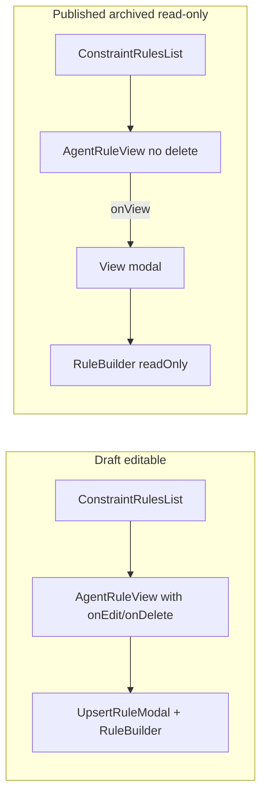

# Constraint rules read-only: recommended approach

## What the code does today

- `[ConstraintRulesList.tsx](apps/operator/src/components/AgentRules/ConstraintRulesList/ConstraintRulesList.tsx)` uses `isSelectedAgentVersionReadOnly` from `[useManageConstraintRules.tsx](apps/operator/src/components/AgentRules/ConstraintRulesList/useManageConstraintRules.tsx)` (via `[useVersionScopedEditLock](apps/operator/src/hooks/useVersionScopedEditLock.ts)`): **Add** is disabled; `onEdit` / `onDelete` are `undefined` when read-only.
- `[AgentRuleView.tsx](apps/operator/src/components/AgentRules/AgentRuleView/AgentRuleView.tsx)` only renders the action row when `(onEdit || onDelete)` — so in read-only mode users still see the **description** (and “No description added” when empty), not a blank card.
- `[BaseModel.tsx](apps/operator/src/pages/base-model/BaseModel.tsx)` already wraps the Constraints tab with `[VersionScopedReadOnlyBanner](apps/operator/src/pages/base-model/partials/VersionScopedReadOnlyBanner/VersionScopedReadOnlyBanner.tsx)` when the selected version is published/archived.
- `[saveRules](apps/operator/src/components/AgentRules/ConstraintRulesList/useManageConstraintRules.tsx)` already blocks mutations with a toast when read-only.

So “read-only” for the **list row** is already the right pattern: **reuse `AgentRuleView` without callbacks** — you do **not** need a separate component that only reimplements the description line.

## When a new component _would_ make sense

`AgentRuleView` only surfaces `description` (plus `**highlight`** parsing). The full constraint lives on `TAgentToolRule` (`when`, `then`, `applied_to`, etc.) per `[types.ts](libs/api/src/api/AgentSettings/AgentToolsRulesApi/types.ts)`. If the product requirement is “on published/archived, users must see the **same structural settings** as in the editor, but not change them,” that is **not solved by another thin duplicate of description text — it needs either:

1. **A view path through existing RuleBuilder UI** (preferred for consistency and one source of truth for labels/layout), or
2. A **dedicated read-only summary renderer** (only justified if RuleBuilder is too heavy for a quick snapshot or you need a radically different layout).

## Recommended implementation (cause-level, no duct tape)

**Do not** fork a second “read-only list component” for the same description row. **Do** add an explicit **read-only / view mode** to the editor stack so “view full settings” is truly non-mutating:

1. **Thread `readOnly` (or `mode: 'edit' | 'view'`)** through `[RuleBuilder.tsx](apps/operator/src/components/AgentRules/RuleBuilder/RuleBuilder.tsx)` → `[RuleItemContainer.tsx](apps/operator/src/components/AgentRules/RuleBuilder/components/RuleItemContainer.tsx)` → `[RuleItem.tsx](apps/operator/src/components/AgentRules/RuleBuilder/components/RuleItem.tsx)` → `[RuleWhen](apps/operator/src/components/AgentRules/RuleBuilder/components/RuleWhen.tsx)` / `[RuleAction](apps/operator/src/components/AgentRules/RuleBuilder/components/RuleAction.tsx)` (and any nested inputs), setting `disabled` / `readOnly` on controls and hiding add/delete/footer actions.

- Note: today `[RuleBuilder](apps/operator/src/components/AgentRules/RuleBuilder/RuleBuilder.tsx)` uses `canManageRules = Boolean(onChange)`; when `onChange` is omitted, **local state can still update** via the internal `onChange` passed to `RuleItemContainer` — so “no `onChange` prop” is **not** sufficient for trustworthy read-only. A dedicated `readOnly` flag is the correct fix.

1. **View entry point in the list (read-only versions only)**

- Extend `[AgentRuleView](apps/operator/src/components/AgentRules/AgentRuleView/AgentRuleView.tsx)` with an optional `onView?: () => void` (e.g. eye icon + accessible label) **or** reuse `onEdit` but rename internally to “open rule details” — product decision.
- Open a small modal (new `ViewConstraintRuleModal` or a `mode="view"` variant of `[UpsertRuleModal](apps/operator/src/components/AgentRules/UpsertRuleModal/UpsertRuleModal.tsx)`) that renders `RuleBuilder` with `readOnly`, `isSingleRule`, `withAccordion={false}`, and shows **Connected tools** as static text/chips instead of the multi-select `[Dropdown](apps/operator/src/components/AgentRules/UpsertRuleModal/UpsertRuleModal.tsx)`.

1. **Hardening**

- When `isSelectedAgentVersionReadOnly`, **do not mount** `UpsertRuleModal` (or force `isOpen={false}`) so add/edit flows cannot open from stale state or future code paths.

## If rules truly “don’t show” for a version

That behavior is unlikely to be fixed by a new display component: loading uses `[useVersionedListParams](apps/operator/src/hooks/useVersionedListParams.ts)` + `[mergeVersionedListParams](apps/operator/src/helpers/mergeVersionedListParams.ts)` so GET `/v1/agent-tools/rules` gets `version_id` when a version is selected. If the list is empty while the banner shows, verify the API response for that `version_id` (backend or snapshot content), not the read-only UI pattern.

## Optional cleanup (unrelated but in the same file)

`[ConstraintRulesList.tsx](apps/operator/src/components/AgentRules/ConstraintRulesList/ConstraintRulesList.tsx)` line 55 duplicates the same `findIndex` predicate twice; `handleUpsertRuleChange` lists `selectedRule?.code` in deps but does not use it — small hygiene when touching the file.
