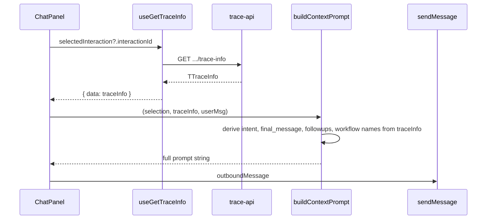

# Use trace info in context-to-prompt

## Current state

- [context-to-prompt.ts](apps/operator/src/pages/agent-builder/context-to-prompt.ts) uses `InteractionInfoResponse` (interaction_sentence, final_message, followup_suggestions, workflow_responses) and is called from [ChatPanel.tsx](apps/operator/src/pages/agent-builder/components/ChatPanel.tsx) with data from `useGetInteractionInfo` (structure-info API).
- [message-right-side.ts](apps/operator/src/api/message-right-side.ts) already defines `TTraceInfo` (lines 142–177) and `useGetTraceInfo` (lines 405–424), which fetches from `/api/v1/tasks/${sessionId}/interactions/${id}/trace-info` and returns `TTraceInfo`.

## Goal

Have context-to-prompt consume **trace info** instead of interaction info: accept `TTraceInfo`, derive the same four inputs used for the context block from the trace shape, and wire ChatPanel to use `useGetTraceInfo` and pass trace data into `buildContextPrompt`.

## Field mapping (trace -> context block)

| Context block need   | Source in TTraceInfo                                       |
| -------------------- | ---------------------------------------------------------- |
| Intent / sentence    | `understanding?.intents?.[0]` or fallback `input?.message` |
| Final message        | `response?.message`                                        |
| Followup suggestions | `response?.suggestions`                                    |
| Workflow/tool names  | Unique `decisions?.[].tool` values                         |

## Implementation steps

### 1. Update context-to-prompt.ts to use TTraceInfo

- **Import** `TTraceInfo` from `@operator/api/message-right-side` (or a path alias used in the app).
- **Replace** the public type and function contract:
  - Remove or keep `InteractionInfoResponse` only if still used elsewhere (grep shows it’s only used in context-to-prompt and by ChatPanel via the hook’s return type). So: remove the export of `InteractionInfoResponse` from context-to-prompt and use `TTraceInfo` as the only input type for this flow.
- **Implement derivation** from `TTraceInfo` to the values `formatContextBlock` needs:
  - `interaction_sentence`: `trace.understanding?.intents?.[0] ?? trace.input?.message ?? undefined`
  - `final_message`: `trace.response?.message`
  - `followup_suggestions`: `trace.response?.suggestions`
  - Workflow names: `Array.from(new Set((trace.decisions ?? []).map((d) => d.tool).filter(Boolean))) as string[]`
- **Refactor** `formatContextBlock(selection, data)` so it either:
  - **Option A**: Takes `(selection, trace: TTraceInfo)` and computes the four values inside the function, or
  - **Option B**: Takes `(selection, data)` where `data` is a small inline type `{ interaction_sentence?: string; final_message?: string; followup_suggestions?: string[]; workflowNames: string[] }` and add a helper `traceToContextData(trace: TTraceInfo)` that returns that object (then `formatContextBlock` stays unchanged and `buildContextPrompt` calls `traceToContextData(trace)` before `formatContextBlock`).

Recommendation: **Option A** to avoid an extra type and keep a single source of truth (`TTraceInfo`) inside this file.

- **Signature change**: `buildContextPrompt(selection, traceInfo: TTraceInfo | null | undefined, userMessage: string): string`. When `traceInfo` is null/undefined, return `userMessage` as today.

### 2. Update ChatPanel to use trace info

- In [ChatPanel.tsx](apps/operator/src/pages/agent-builder/components/ChatPanel.tsx):
  - Replace `useGetInteractionInfo(selectedInteraction?.interactionId)` with `useGetTraceInfo(selectedInteraction?.interactionId)`.
  - Replace the variable name (e.g. `interactionInfo` -> `traceInfo`) and pass `traceInfo` into `buildContextPrompt(selectedInteraction, traceInfo, userMsg)`.

**Note on sessionId:** `useGetTraceInfo` currently gets `sessionId` from `useMessageStore` (rightSideData). In agent-builder, if the selected interaction belongs to a different task/session than the one in the store, the trace request may use the wrong session. If that’s a real scenario, the hook would need to accept an optional `sessionId` (e.g. from agent-builder’s `session?.id`) and use it when provided; that can be a follow-up if you see wrong or missing trace data.

### 3. Cleanup and types

- Ensure no other callers of `buildContextPrompt` or `InteractionInfoResponse` in agent-builder are broken (only ChatPanel uses `buildContextPrompt`).
- Remove the now-unused `InteractionInfoResponse` type from context-to-prompt (and any unused imports).

## Files to change

| File                                                                                                                             | Changes                                                                                                                                                                                             |
| -------------------------------------------------------------------------------------------------------------------------------- | --------------------------------------------------------------------------------------------------------------------------------------------------------------------------------------------------- | ---- | ------------------------------------------------------- |
| [apps/operator/src/pages/agent-builder/context-to-prompt.ts](apps/operator/src/pages/agent-builder/context-to-prompt.ts)         | Import `TTraceInfo`; refactor `formatContextBlock` to accept `TTraceInfo` and derive intent, final_message, followups, workflow names from trace; change `buildContextPrompt` to accept `TTraceInfo | null | undefined`; remove `InteractionInfoResponse` if unused. |
| [apps/operator/src/pages/agent-builder/components/ChatPanel.tsx](apps/operator/src/pages/agent-builder/components/ChatPanel.tsx) | Switch to `useGetTraceInfo(selectedInteraction?.interactionId)`, rename data to `traceInfo`, pass `traceInfo` into `buildContextPrompt`.                                                            |

## Data flow (after change)

No changes to [message-right-side.ts](apps/operator/src/api/message-right-side.ts) are required; `TTraceInfo` and `useGetTraceInfo` are already defined and typed.
