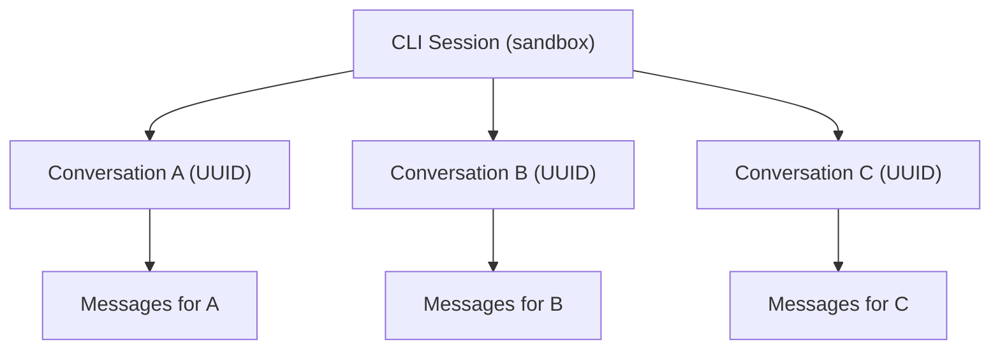

# Conversation List Implementation

## Current State

The Agent Builder currently uses a **task-based model** where:

- Clicking "+" invalidates the session and creates a brand new CLI session (`handleCreateTask` in `useAgentBuilder.ts` lines 138-164)
- Tasks are local objects with no backend persistence
- `conversationId` exists in the store but is **never used** in any API call
- The `sendCLIMessage` function sends `{ message, agentId, opencodeSessionId, systemPrompt }` - no conversation identity

## Architecture Change

Replace the "task" abstraction with a "conversation" abstraction. A **session** is the sandbox/CLI connection; a **conversation** is a thread within that session identified by a UUID.



## Changes By File

### 1. Store: `[useAgentBuilderStore.ts](apps/operator/src/stores/useAgentBuilderStore.ts)`

- Rename `IAgentBuilderTask` to `IAgentBuilderConversation` with fields: `id` (UUID), `title`, `createdAt`
- Rename `agentTasksList` to `conversations` (type: `IAgentBuilderConversation[]`)
- Rename `selectedAgentTaskId` to `activeConversationId`
- Rename `messagesByTaskId` to `messagesByConversationId`
- Rename all related setters/actions accordingly (`setConversations`, `setActiveConversationId`, etc.)
- Update `appendMessagesToTask` -> `appendMessagesToConversation`, `updateMessageInTask` -> `updateMessageInConversation`, `setMessagesForTask` -> `setMessagesForConversation`
- Remove `createConversation` and `addConversation` (the unused store methods at lines 64-65)
- Default state: one initial conversation with `id: crypto.randomUUID()`, `title: 'New Chat'`

### 2. API: `[cliConnectionApi.ts](libs/api/src/api/CLIConnectionApi/cliConnectionApi.ts)`

- Add `conversationId?: string` to `ICLISendMessageOptions` (line 59)
- Include `conversationId` in the `sendCLIMessage` request body (line 218):
  ```typescript
  body: JSON.stringify({
    message,
    agentId: agentId || undefined,
    opencodeSessionId: opencodeSessionId || undefined,
    systemPrompt: systemPrompt || undefined,
    conversationId: conversationId || undefined,
  });
  ```

### 3. Session Manager: `[useCLISessionManager.ts](libs/api/src/api/CLIConnectionApi/useCLISessionManager.ts)`

- Remove the unimplemented `createConversation` and `changeConversation` from the `IUseCLISessionManagerResult` interface (lines 29-30), since conversations are frontend-managed and the ID is simply passed in the chat body

### 4. Hook: `[useAgentBuilder.ts](apps/operator/src/widgets/AgentBuilder/useAgentBuilder.ts)`

- Update all store references from task terminology to conversation terminology
- `**handleCreateTask` becomes `handleNewConversation**`:
  - Generate `crypto.randomUUID()` for the new conversation ID
  - **Do NOT** invalidate or recreate the session - just add a new conversation to the list and select it
  - Clear the text input and thread message, but keep the session alive
- `**handleSelectTask` becomes `handleSelectConversation**`: switch `activeConversationId`, close dropdown
- `**handleSendMessage**`: pass the `activeConversationId` (the UUID) as `conversationId` in the `sendCLIMessage` call
- Update the auto-title logic: after the first message in a conversation, update the conversation title to the first ~30 chars of the user's message (truncated with ellipsis)

### 5. Header: `[AgentChatHeader.tsx](apps/operator/src/widgets/AgentBuilder/partials/AgentChatHeader.tsx)`

- Update props interface: `tasks` -> `conversations` (type `IAgentBuilderConversation[]`), `handleCreateTask` -> `handleNewConversation`, `handleSelectTask` -> `handleSelectConversation`
- Dropdown renders conversations instead of tasks
- Plus icon calls `handleNewConversation` (no longer disabled during session loading since we're not creating sessions)
- Disable plus icon only when `isSendingMessage` is true (to prevent creating conversations mid-stream)

### 6. Parent: `[AgentBuilder.tsx](apps/operator/src/widgets/AgentBuilder/AgentBuilder.tsx)`

- Update prop names passed to `AgentChatHeader` to match the renamed hook outputs

## Key Behavioral Changes

| Action              | Before                                       | After                                            |
| ------------------- | -------------------------------------------- | ------------------------------------------------ |
| Click "+"           | Invalidates session, creates new CLI sandbox | Generates new UUID, adds conversation to list    |
| Switch conversation | Switches `selectedAgentTaskId`               | Switches `activeConversationId`                  |
| Send message        | No `conversationId` in request               | Includes `conversationId` (UUID) in request body |
| Session lifecycle   | Destroyed on every "+" click                 | Persists across conversations                    |
