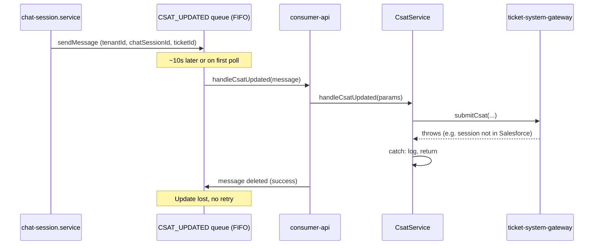

# Re-queue failed CSAT updates to SQS

## Current flow

- **Producer**: [src/chat-session/service/chat-session.service.ts](src/chat-session/service/chat-session.service.ts) publishes to `CSAT_UPDATED_INTERNAL_QUEUE_URL` (FIFO) with payload `{ tenantId, chatSessionId, ticketId }` and FIFO params `messageGroupId: chatSessionId`, `messageDeduplicationId: ${chatSessionId}-csat-${Date.now()}`.
- **Consumer**: [src/consumer/api/consumer-api.service.ts](src/consumer/api/consumer-api.service.ts) binds `csatUpdatedQueueUrl` to `handleCsatUpdated`, which validates and calls `CsatService.handleCsatUpdated`.
- **Handler**: [src/csat/service/csat.service.ts](src/csat/service/csat.service.ts) loads session, calls `ticketSystemGatewayClient.submitCsat()`. On throw it catches, logs, and returns; the consumer then deletes the message, so there is no retry.

Queue is FIFO (e.g. `csat_updated-production.fifo`).

---

## Standard options

**Option A – Rely on SQS visibility timeout (no delete on failure)**

- In `CsatService.handleCsatUpdated`, **rethrow** the error instead of returning in the catch.
- The `sqs-consumer` library does not delete the message when the handler throws, so the message becomes visible again after the queue’s **visibility timeout**.
- **Pros**: No publisher changes, no new params; minimal code (remove catch return, rethrow).
- **Cons**: Delay is fixed by the queue’s visibility timeout (same for all queues using that setting). No explicit “retry N times then stop” unless the queue has a redrive policy (e.g. max receives + DLQ).

**Option B – Explicit re-queue with delay and retry cap (recommended)**

- On `submitCsat` failure, **re-publish** the same logical payload to the **same** `CSAT_UPDATED_INTERNAL_QUEUE_URL` with:
  - **DelaySeconds** (e.g. 30) so the next attempt happens after Salesforce has time to sync.
  - An **attempt** counter in the payload; if `attempt >= maxRetries` (e.g. 5), do not re-queue (log and return so the message is deleted and the job is dropped after max retries).
- **Pros**: Controlled delay and max retries; fits the “try again after a short wait” use case.
- **Cons**: Requires adding optional `DelaySeconds` to the publisher and giving CsatService access to queue URL and publisher.

---

## Chosen approach: Option B with 120s delay, no consumer schema change

**Constraints**: Option B (explicit re-queue), **delay 120 seconds**, **no change to consumer schema** (minimal change). The existing `csatUpdatedSchema` already has `.unknown()`, so re-queued messages that include `attempt` will validate and pass through without touching [src/consumer/api/consumer-api.schemas.ts](src/consumer/api/consumer-api.schemas.ts).

### 1. Add optional `DelaySeconds` to SQS publish

- In [src/publisher/publisher.service.ts](src/publisher/publisher.service.ts), extend `sendMessageToSqsQueue` with an optional third parameter (e.g. `options?: { delaySeconds?: number }`) or extend the existing options type. Pass `DelaySeconds` into `SendMessageCommandInput` when provided (0–900).
- In [src/publisher/publisher.types.ts](src/publisher/publisher.types.ts), add optional `delaySeconds?: number` to the type used by that method (e.g. extend `SendMessageFifoParams` or add a small options type) so FIFO callers can pass delay without changing the consumer schema.

### 2. Type-only: optional `attempt` in CsatUpdatedParams

- In [src/csat/service/csat.types.ts](src/csat/service/csat.types.ts), add optional `attempt?: number` to `CsatUpdatedParams`. No schema change: the consumer schema is unchanged; `attempt` is only used inside CsatService for typing and retry logic.

### 3. Re-queue from CsatService on submitCsat failure (120s delay)

- Inject `PublisherService` and `QuackConfigService` into `CsatService`. In [src/csat/csat.module.ts](src/csat/csat.module.ts), add `PublisherModule` and `QuackConfigModule` (or the module that exports `QuackConfigService`, e.g. [src/config/config.module.ts](src/config/config.module.ts)).
- In the catch block of `handleCsatUpdated` in [src/csat/service/csat.service.ts](src/csat/service/csat.service.ts):
  - If `(params.attempt ?? 0) >= MAX_CSAT_RETRIES` (e.g. 5): log failure and return (no re-queue).
  - Else: call `publisherService.sendMessageToSqsQueue(..., csatUpdatedQueueUrl, { messageGroupId, messageDeduplicationId:` ${params.chatSessionId}-csat-retry-${(params.attempt ?? 0)}-${Date.now()}`, delaySeconds: 120 }, ...)` with payload `{ ...params, attempt: (params.attempt ?? 0) + 1 }`. Then return so the current message is deleted.
- Use constants: **120** seconds delay, `MAX_CSAT_RETRIES = 5`.

### 4. No consumer schema change

- Do **not** modify [src/consumer/api/consumer-api.schemas.ts](src/consumer/api/consumer-api.schemas.ts). First-time messages have no `attempt`; retried messages include `attempt` and are allowed by the existing `.unknown()` on `csatUpdatedSchema`.

### 5. Producer unchanged

- [src/chat-session/service/chat-session.service.ts](src/chat-session/service/chat-session.service.ts) stays as is; it does not send `attempt`.

### 6. Tests and observability

- Unit test CsatService: when `submitCsat` throws and `attempt < max`, assert one `sendMessageToSqsQueue` with delay **120**, incremented `attempt`, and correct FIFO params. When `attempt >= max`, assert no re-queue.
- Log when re-queuing (attempt, chatSessionId) and when giving up after max retries.

---

## Alternative: Option A (minimal change)

- In `CsatService.handleCsatUpdated`, remove the `return` in the catch and **rethrow** the error.
- Ensure the CSAT queue has a **visibility timeout** of e.g. 30 seconds and, if desired, a **redrive policy** (e.g. max receives = 5 and a DLQ) so messages are not retried forever.
- No publisher or schema changes; delay is whatever the queue’s visibility timeout is.

---

## Summary (chosen: Option B, 120s, no schema change)

| Item                | Choice                                                             |
| ------------------- | ------------------------------------------------------------------ |
| **Approach**        | Option B – explicit re-queue with delay                            |
| **Delay**           | 120 seconds                                                        |
| **Retry cap**       | 5 attempts (then stop, no re-queue)                                |
| **Consumer schema** | No change; `attempt` allowed by existing `.unknown()`              |
| **Files to touch**  | Publisher (delaySeconds), CsatService, CsatModule, csat.types only |
