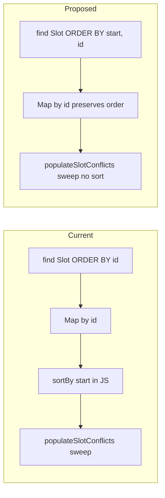
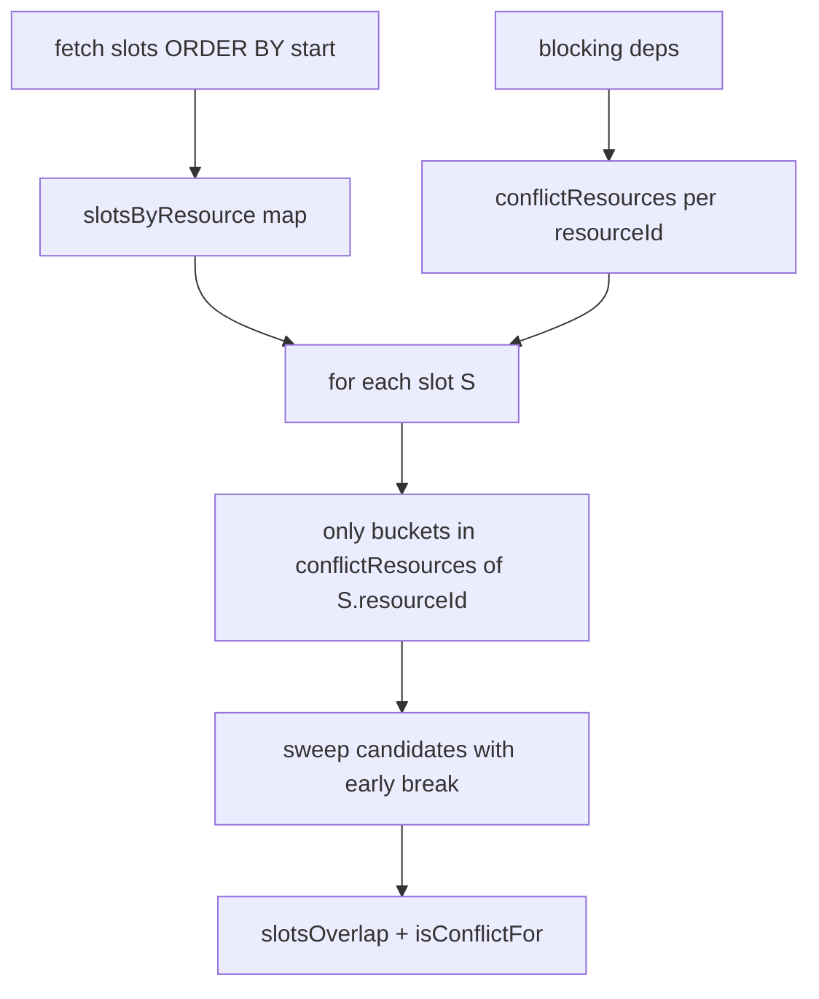

# Move Slot Sorting to DB Fetch

## What `populateSlotConflicts` actually needs from sorting

The sort is **not** for API presentation — it enables the early-break optimization in the nested loop:

```45:68:server/src/slots/slots.service.ts
  populateSlotConflicts(
    slots: SlotDto[],
    blockersOf: Map<number, number[]>,
  ): void {
    const sorted = sortBy(slots, (s) => s.start);
    // ...
        if (sorted[j].start >= sorted[i].end) {
          break;
        }
```

Once slots are ordered by `start`, any slot at index `j` with `start >= sorted[i].end` cannot overlap `sorted[i]`, so inner iterations can stop.

## Yes: move sorting to the fetch

**Change** the slot query in [`getSlots()`](server/src/slots/slots.service.ts) from:

```ts
this.manager.find(Slot, { order: { id: 'ASC' } })
```

to:

```ts
this.manager.find(Slot, { order: { start: 'ASC', id: 'ASC' } })
```

`id` as a tiebreaker keeps ordering stable when two slots share the same start.

**Then** in `populateSlotConflicts`, drop `sortBy` and iterate the array as-is. Also pass the already-ordered `slots` array directly instead of `[...slotDtosById.values()]` so ordering intent is explicit:

```ts
const slotDtos = slots.map((slot) => ({ ...slot, conflicts: [] }));
const slotDtosById = new Map(slotDtos.map((dto) => [dto.id, dto]));
this.populateSlotConflicts(slotDtos, blockersOf);
```

**Why this is safe**

- `start` / `end` are `text` columns storing ISO-like datetimes (`YYYY-MM-DDThh:mm:ss`) — lexicographic `ORDER BY` matches chronological order in SQLite, which is what the assignment uses.
- [`Map`](https://developer.mozilla.org/en-US/docs/Web/JavaScript/Reference/Global_Objects/Map) preserves insertion order, so `slotDtosById.values()` and `collectSlotsForResource` filtering will inherit start order without extra sorting.
- E2E tests do not assert a specific slot order in responses — only shape, inclusion rules, and conflict correctness.

**Cleanup:** remove the `sortBy` import from lodash if unused elsewhere.



## Partially: resource grouping at DB level

The response shape groups slots per resource **plus blocker resources** via [`collectSlotsForResource`](server/src/slots/slots.service.ts). That filter can be expressed in SQL per resource:

```sql
SELECT * FROM Slots
WHERE resource_id = :resourceId
   OR resource_id IN (
     SELECT blocking_resource_id
     FROM BlockingDependencies
     WHERE blocked_resource_id = :resourceId
   )
ORDER BY start ASC, id ASC
```

**Trade-offs**

| Approach | Pros | Cons |
|---|---|---|
| **Current (1 global fetch + JS filter)** | 1 query; conflict map built once | Filter runs in memory |
| **Per-resource fetch (N queries)** | DB does grouping/filtering | N+2 queries total; conflict detection still needs all slots unless duplicated per resource |
| **Single query with JOIN** | One round-trip | Awkward to fan out into per-resource arrays; still need JS assembly |

**Recommendation:** keep a single global slot fetch for conflict detection. Resource grouping is cheap in memory (small seeded dataset) and the dependency graph is already loaded for `blockersOf`. DB-level grouping only pays off at much larger scale.

## No: full conflict detection in SQL (not worth it here)

Conflict pairing requires:

1. Time overlap: `a.start < b.end AND a.end > b.start`
2. Resource rules from [`isConflictFor`](server/src/slots/slots.service.ts) / [`resourcesConflict`](server/src/slots/slots.service.ts) — same resource, plus directed/symmetric blocking edges
3. Nested `conflicts[]` on each slot DTO (omit nested `conflicts` on conflict entries)

A SQL self-join can produce conflict **edges**, but assembling nested DTOs, handling asymmetric directed mode, and deduplicating still belongs in TypeScript. The sweep-line algorithm is simpler and fast enough for this assignment's data size.

## Optional follow-up: date filtering at fetch time

[`getSlots()`](server/src/slots/slots.service.ts) currently loads **all** slots, while the API is documented as "today's slots". When that filter is added, it belongs on the fetch (not in `populateSlotConflicts`):

```ts
this.manager
  .createQueryBuilder(Slot, 'slot')
  .where('slot.end > :dayStart AND slot.start < :dayEnd', { dayStart, dayEnd })
  .orderBy('slot.start', 'ASC')
  .addOrderBy('slot.id', 'ASC')
  .getMany();
```

Overnight slots (start yesterday, end today) are included via `end > todayStart`.

## Yes: resource-scoped conflict checks (recommended optimization)

The current all-pairs loop compares **every** slot against **every** later slot, then filters by `resourcesConflict`. Most pairs are doomed from the start — e.g. a Lane 1 slot vs a Lane 4 slot can never conflict (no shared resource, no blocking edge).

This is the same relevance rule already used in [`collectSlotsForResource`](server/src/slots/slots.service.ts): for resource `R`, only slots on `R` and on `blockersOf(R)` matter.

### Precompute conflict resources per resource

Extract a shared helper used by both `collectSlotsForResource` and conflict detection:

```ts
private buildConflictResources(
  blockersOf: Map<number, number[]>,
): Map<number, Set<number>> {
  // For each resourceId: { resourceId } ∪ blockersOf(resourceId)
  // In SYMMETRIC mode, also union resources that this resource blocks
}
```

For **directed** mode (what the assignment spec and e2e tests expect):

| Resource | Conflict resources | Meaning |
|---|---|---|
| Pool | `{Pool}` | Only same-resource overlaps |
| Lane 1 | `{Lane1, Pool}` | Self + upstream blockers |
| Lane 4 | `{Lane4}` | Independent — never checks Pool/Lanes |

### Index slots by resource (already start-ordered)

After the DB fetch `ORDER BY start ASC, id ASC`, bucket slots:

```ts
const slotsByResource = new Map<number, SlotDto[]>();
for (const slot of slotDtos) {
  const list = slotsByResource.get(slot.resourceId) ?? [];
  list.push(slot);
  slotsByResource.set(slot.resourceId, list);
}
```

Per-resource lists inherit start order from the global fetch (Map insertion order when iterating resources doesn't matter; each bucket is append-ordered).

### Replace all-pairs with resource-scoped sweep

```ts
for (const slot of slotDtos) {
  const relevantResourceIds = conflictResources.get(slot.resourceId)!;
  for (const resourceId of relevantResourceIds) {
    const candidates = slotsByResource.get(resourceId) ?? [];
    for (const candidate of candidates) {
      if (candidate.id === slot.id) continue;
      // Same-resource pairs: process once (mirrors current i < j guard)
      if (resourceId === slot.resourceId && candidate.id <= slot.id) continue;
      if (candidate.start >= slot.end) break; // per-bucket start sort → early break
      if (!this.slotsOverlap(slot, candidate)) continue;
      if (this.isConflictFor(slot, candidate, blockersOf)) {
        this.addToConflicts(slot, candidate);
      }
      if (this.isConflictFor(candidate, slot, blockersOf)) {
        this.addToConflicts(candidate, slot);
      }
    }
  }
}
```



### Why this is correct in directed mode

- A Pool slot never iterates Lane 1 candidates (`conflictResources(Pool) = {Pool}`).
- A Lane 1 slot iterates Pool candidates; `isConflictFor(Lane1, Pool)` is true, `isConflictFor(Pool, Lane1)` is false — Lane 1 gets Pool in its conflicts, Pool does not get Lane 1. Matches e2e expectations.
- Cross-resource pairs are examined exactly once (from the blocked resource's slot).
- Same-resource pairs use the `candidate.id <= slot.id` skip to avoid duplicate work (same role as `j > i` today).

### Complexity comparison

| Approach | Pair checks (worst case) |
|---|---|
| Current all-pairs | O(n²) |
| Resource-scoped | O(n × k × m) where k = avg relevant resources per slot (~1–3 here), m = avg slots per relevant bucket |

For this assignment (~30 slots, sparse dependency graph), the win is not measurable latency — it's **correctness alignment** with `collectSlotsForResource` and a cleaner foundation for `addSlot` / `updateSlot` conflict validation (check only relevant buckets, not all slots).

### Minimal alternative (not recommended)

A lighter change: keep the all-pairs loop but add a cheap guard before `slotsOverlap`:

```ts
if (!this.resourcesCanConflict(sorted[i].resourceId, sorted[j].resourceId, blockersOf)) continue;
```

This skips overlap checks for irrelevant pairs but still iterates O(n²) indices. The resource-scoped approach is strictly better structurally.

## Summary

- **Sorting for the conflict sweep:** move to DB `ORDER BY start ASC, id ASC` — removes redundant in-memory sort.
- **Resource relevance:** replace global all-pairs with per-resource buckets + `conflictResources` map — each slot only checks slots on resources that can actually conflict. Reuse the same rule as `collectSlotsForResource`.
- **Resource grouping in response:** keep in-memory filter via shared `buildConflictResources`; no per-resource DB queries needed.
- **Conflict pairing:** keep in `populateSlotConflicts`; DB cannot meaningfully replace the nested DTO assembly.
