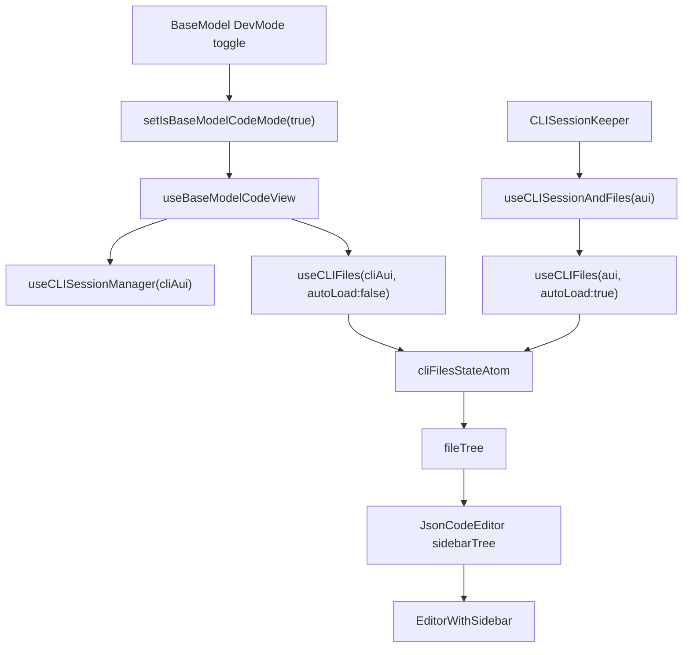

# Debug CLI Sidebar Flicker

## Current Flow



## What looks wrong

- Base Model Dev Mode does not fetch the file tree when opened. It reads shared state via `[apps/operator/src/pages/base-model/useBaseModelCodeView.ts](apps/operator/src/pages/base-model/useBaseModelCodeView.ts)`:
  - `useCLISessionManager(cliAui)`
  - `useCLIFiles(cliAui, { autoLoad: false })`
- The actual loading happens elsewhere in `[apps/operator/src/components/CLISessionKeeper/CLISessionKeeper.tsx](apps/operator/src/components/CLISessionKeeper/CLISessionKeeper.tsx)` through `[libs/api/src/api/CLIConnectionApi/cliFiles/useCLISessionAndFiles.ts](libs/api/src/api/CLIConnectionApi/cliFiles/useCLISessionAndFiles.ts)`.
- The file hook can actively clear the shared file tree in `[libs/api/src/api/CLIConnectionApi/cliFiles/useCLIFiles.ts](libs/api/src/api/CLIConnectionApi/cliFiles/useCLIFiles.ts)`:

```59:63:libs/api/src/api/CLIConnectionApi/cliFiles/useCLIFiles.ts
useEffect(() => {
  if (!belongsToCurrentAui || sessionState.session == null) {
    setFilesState(initialCliFilesState);
  }
```

- Session ownership and file ownership use different matching rules:
  - `[libs/api/src/api/CLIConnectionApi/useCLISessionManager.ts](libs/api/src/api/CLIConnectionApi/useCLISessionManager.ts)` matches current context by `accountId` only.
  - `[libs/api/src/api/CLIConnectionApi/cliFiles/useCLIFiles.ts](libs/api/src/api/CLIConnectionApi/cliFiles/useCLIFiles.ts)` matches by `accountId + agentId`.
- Even without resetting the atom, `useCLIFiles` can hide data by returning `[]` when its local `belongsToCurrentAui` is false.
- `invalidateSession()` clears files indirectly from several places: invalid session errors during file load/refetch, file content fetch/save, expired sessions, and Agent Builder message flow.

## Likely Root Cause

The most likely root cause is a shared-state race caused by:

- one global `cliFilesStateAtom` and one global session atom shared across Keeper, Base Model, and Agent Builder
- `useCLIFiles` clearing shared files from inside any consumer when its local `aui` is missing or mismatched
- session hooks treating a session as current by `accountId` only while file hooks require `accountId + agentId`
- Base Model Dev Mode depending on preloaded shared state rather than loading on demand

This can produce the exact intermittent sequence: files load, then a later effect decides the context no longer matches and clears or hides the tree.

## Recommended Changes

- Align context identity everywhere to `accountId + agentId`.
  - Update matching logic in `[libs/api/src/api/CLIConnectionApi/useCLISessionManager.ts](libs/api/src/api/CLIConnectionApi/useCLISessionManager.ts)`.
  - Update `connectSession()` reuse logic so an existing session is only reused when both account and agent match.
- Stop clearing the global file tree from generic consumer effects in `[libs/api/src/api/CLIConnectionApi/cliFiles/useCLIFiles.ts](libs/api/src/api/CLIConnectionApi/cliFiles/useCLIFiles.ts)`.
  - Reserve hard resets for explicit ownership transitions in the session manager or invalidation flow.
  - At minimum, distinguish “return empty for this consumer” from “destroy shared state for everyone”.
- Add stale-request protection.
  - Guard async session creation and file loads so older in-flight results cannot overwrite newer context.
- Make Base Model Dev Mode fetch on open instead of assuming Keeper already populated the tree.
  - Use `refetchFiles()` or a shared `loadFiles` path when `isBaseModelCodeMode` becomes `true` and a valid session exists.
- Surface CLI file errors in Base Model Dev Mode instead of silently showing an empty sidebar.
- Review global sandbox reuse behavior if requests can target the wrong sandbox during context transitions.

## Highest-Value Files

- `[libs/api/src/api/CLIConnectionApi/useCLISessionManager.ts](libs/api/src/api/CLIConnectionApi/useCLISessionManager.ts)`
- `[libs/api/src/api/CLIConnectionApi/cliFiles/useCLIFiles.ts](libs/api/src/api/CLIConnectionApi/cliFiles/useCLIFiles.ts)`
- `[libs/api/src/api/CLIConnectionApi/cliFiles/useCLISessionAndFiles.ts](libs/api/src/api/CLIConnectionApi/cliFiles/useCLISessionAndFiles.ts)`
- `[apps/operator/src/pages/base-model/useBaseModelCodeView.ts](apps/operator/src/pages/base-model/useBaseModelCodeView.ts)`
- `[apps/operator/src/components/CLISessionKeeper/CLISessionKeeper.tsx](apps/operator/src/components/CLISessionKeeper/CLISessionKeeper.tsx)`

## Success Criteria

- Opening Dev Mode reliably triggers a file-tree fetch or consumes a guaranteed-current tree.
- Switching agents never reuses a session or file tree from the wrong agent.
- A mismatched consumer no longer wipes shared file state for everyone.
- Intermittent “files appear then disappear” behavior stops, and any failure path is visible in the UI.
