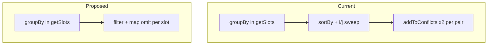

# Document and simplify `SlotsService`

**Cancelled:** [getSlots empty resources plan](getslots_empty_resources_bfa2cec7.plan.md) — not pursuing Resource-driven assembly for now.

**Scope:** [`server/src/slots/slots.service.ts`](server/src/slots/slots.service.ts) only. No DTO or test file changes.

---

## Documentation (JSDoc only)

Per workspace rules, use **JSDoc on functions/methods** — no step comments or inline explanations.

| Method | JSDoc should cover |
|--------|-------------------|
| `getSlots` | Loads all slots, groups by resource, populates per-resource conflicts, returns `ResourceSlotsDto[]` |
| `populateSlotConflicts` | **Contract:** caller passes slots for a **single resource**. Finds bidirectional time overlaps; mutates `conflicts` in place |
| `addToConflicts` | Appends a shallow copy via `omit(other, 'conflicts')` to avoid circular JSON refs |
| `slotsOverlap` | Half-open overlap rule: `start < other.end && end > other.start` (touching endpoints are OK) |

Example shape:

```ts
/**
 * Annotates each slot with its conflicting bookings on the same resource.
 * Mutates the input array in place. Each conflict entry is a shallow SlotDto
 * without nested conflicts.
 */
async populateSlotConflicts(slots: SlotDto[]): Promise<void> { ... }
```

Keep JSDoc factual — document **current** behavior, not future blocking/today-filter work.

---

## Simplification opportunities

### 1. Remove unused imports (do this)

These are imported but unused:

- `HttpException`, `HttpStatus` (needed later for 409, not yet)
- `BlockingDependency`, `Resource`

Remove now; re-add when `addSlot` / blocking work starts.

### 2. Drop unnecessary `async`/`await` (do this)

`populateSlotConflicts` has no `await`. Make it synchronous:

```ts
populateSlotConflicts(slots: SlotDto[]): void
```

In `getSlots`, remove `await` in the loop. Cleaner and honest about I/O boundaries.

### 3. Replace sort-and-sweep with naive filter (recommended — readability)

At ~8 slots per resource, the sweep's early-break optimization adds complexity for negligible gain. A filter per slot is easier to read and naturally bidirectional:

```ts
populateSlotConflicts(slots: SlotDto[]): void {
  for (const slot of slots) {
    slot.conflicts = slots
      .filter(
        (other) =>
          other.id !== slot.id && this.slotsOverlap(slot, other),
      )
      .map((other) => omit(other, 'conflicts'));
  }
}
```

**Removes:** sort-by-start, nested `(i, j)` indices, early break, dual `addToConflicts` calls, and the `addToConflicts` helper entirely.

**Keeps:** `slotsOverlap` private helper (reuse in future `addSlot` 409 checks), `omit` for circular-ref safety.

**Trade-off:** O(n²) per bucket vs O(n log n + pairs). Irrelevant at assignment scale; much easier to reason about (matches the A/B/C/D examples from our discussion).

### 4. Minor `getSlots` tidy (optional)

Current return:

```ts
return Object.entries(byResource).map(([resourceId, resourceSlots]) => ({
  resourceId: Number(resourceId),
  slots: resourceSlots,
}));
```

Fine as-is. Could use `Object.keys(byResource).map(Number)` but no meaningful gain — leave unless simplifying elsewhere.

### 5. Do not simplify away

- **`omit(other, 'conflicts')`** — required for safe JSON; keep
- **`groupBy` in `getSlots`** — correct place to partition before per-resource populate; keep
- **Separate `slotsOverlap`** — worth keeping for reuse when write paths are implemented

---

## Before / after structure



---

## Verification

After changes:

```bash
cd server
npm run test:e2e -- --testNamePattern="conflicts|one entry per resource"
```

Same-resource conflict tests should still pass. Failures for blocking/Lane 4/409 remain expected.

No new unit test file unless you want one — e2e already covers conflict shape and presence.
