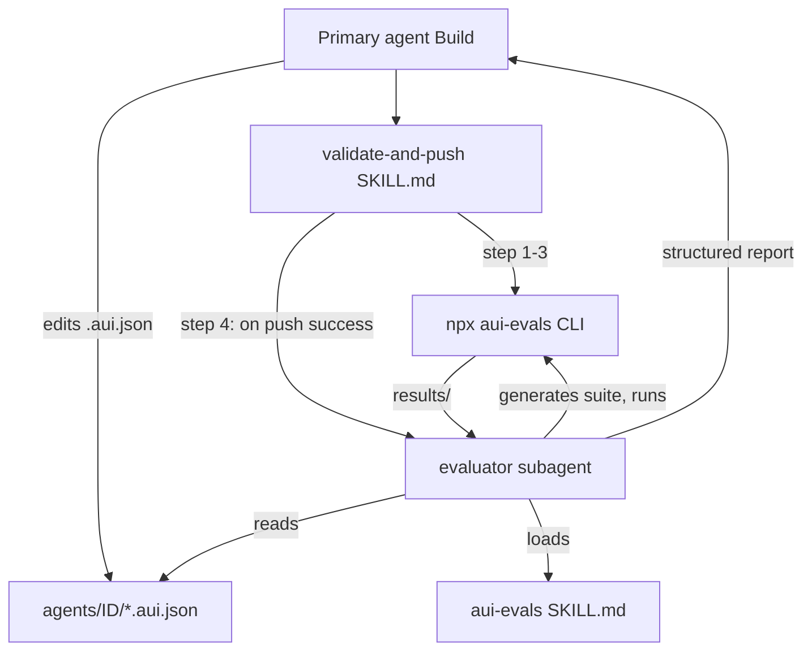

## Scope (recap of clarifications)

- Suite source: evaluator generates the suite at run time by introspecting the agent's `.aui.json` files (tools, params, rules).
- Loop: evaluator is read-only for agent config — it runs evals, diagnoses, and returns a structured report to the primary agent. The primary agent owns any fixes.
- Trigger: the `validate-and-push` skill gains a final step that `@` invokes the evaluator after a successful `aui push`. BFF's direct `/push` route is untouched.

## Architecture



## Files to add / change

### 1. Sandbox image — install the evals CLI

Update [sandbox-templates/agent-builder-subagents/template.ts](sandbox-templates/agent-builder-subagents/template.ts) to install the package globally and copy the new files. Add after the existing `npm install -g aui-agent-builder@...`:

```ts
.runCmd("npm install -g @aui.io/evals@latest", { user: "root" })
```

Add copy steps for the new agent markdown file and skill, plus the updated `validate-and-push` skill (already copied).

### 2. Evaluator subagent definition

Create `sandbox-templates/agent-builder-subagents/.opencode/agents/evaluator.md` — markdown with YAML frontmatter. Mode `subagent`, read-only for agent config (`write.**/*.aui.json: deny`), allow bash for `npx aui-evals *`, `aui validate`, read/list operations. Deny `aui push`. Model: `anthropic/claude-sonnet-4-5`. Short system prompt directing it to load the `aui-evals` skill and produce a structured report.

Key frontmatter:

```markdown
---
description: Evaluates the pushed agent using @aui.io/evals. Generates a test suite from the agent's .aui.json files, runs it, and returns a structured pass/fail report. Invoked automatically after every aui push.
mode: subagent
model: anthropic/claude-sonnet-4-5
permission:
  edit: deny
  write:
    "**/*.aui.json": deny
    "**/memory/**": deny
  bash:
    "*": deny
    "npx aui-evals *": allow
    "aui validate": allow
    "ls *": allow
    "cat *": allow
    "python3 *": allow
---
```

### 3. Skill — `aui-evals` (the CLI primer + suite-generation guide)

Create `sandbox-templates/agent-builder-subagents/.opencode/skills/aui-evals/SKILL.md`. It must cover:

- **Locating agent ID and API key** — read `agents/<folder>/agent.aui.json` for `agent.id`; read the network API key from env var `AUI_NETWORK_API_KEY` (document that the subagent must fail with a clear message if it's missing, since the suite can't run without it).
- **Generating the suite** — walk `tools/*.aui.json`, `parameters.aui.json`, `rules.aui.json`, `entities.aui.json`. For each tool:
  - one "happy path" test with `turns` hitting it and strict evals `tool_used` + `rule_triggered` for its success rule.
  - one "out of scope" test asserting `tool_not_used` or `escalated`.
  - Extract required parameters → add `param_exists` strict evals.
  - Add 1–2 LLM-judge criteria for tone/accuracy.
- **Suite file location** — write to `agents/<folder>/.eval-suite.generated.json` (regenerated each run). Use `--provider=anthropic --llm-key=$ANTHROPIC_API_KEY --parallel=3`.
- **Commands** — `npx aui-evals validate`, `npx aui-evals plan`, `npx aui-evals run` with recommended flags and timeout behavior.
- **Reading results** — results land in `results/<suite-slug>/<timestamp>/`. Always read `_summary.md` first; only open individual failing test `.md` files for details. Never `Read` `_results.json` whole (it's multi-MB) — use a `python3 -c` one-liner.
- **Structured report format** — define exactly what the subagent returns to the primary. Example template:

```markdown
## Eval Report — <suite name>

Score: <agg>% | Passed: <n>/<total>
Agent: <agentId>
Results: <path to _summary.md>

### Failing tests

- <test name> — <score>%
  - ✗ <criterion> → <reasoning>
  - Suspected config: `tools/<tool>.aui.json` → rules.summary.success
```

- **Hard rules** — (a) never edit `.aui.json` files; (b) never run `aui push`; (c) diagnose at the config level and name exact files/lines; (d) if no tools exist yet, skip with a clear message.

Reference the existing six-level funnel (Symptom → Conversation → Decisions → Params → Rule math → Config) for deep diagnosis, cloned and trimmed from the `eval-troubleshooting` skill in `/Users/bugo/Documents/Developer/aui/evaluations/claude-skills/eval-troubleshooting/SKILL.md`.

### 4. Update `validate-and-push` skill

Append a fourth step to [sandbox-templates/agent-builder-subagents/.opencode/skills/validate-and-push/SKILL.md](sandbox-templates/agent-builder-subagents/.opencode/skills/validate-and-push/SKILL.md):

```markdown
4. **Evaluate**: After a successful push, invoke the evaluator subagent
   - Call `@evaluator` with the agent folder path
   - Wait for its structured report
   - If any test failed: present the report to the user, propose fixes grounded in the suspected config files, and ask whether to apply them
   - If all pass: include a one-line success summary in your reply to the user
```

### 5. Update `opencode.json`

Update [sandbox-templates/agent-builder-subagents/opencode.json](sandbox-templates/agent-builder-subagents/opencode.json):

- Add `.opencode/skills/aui-evals/SKILL.md` to the `instructions` array so the primary agent is aware of it too (for when the user invokes evals manually).
- Add `"aui push": "allow"` stays; add `"npx aui-evals *": "allow"` under `bash`.
- Deny `**/.eval-suite.generated.json` writes from the primary (it's the evaluator's scratch file) — optional.

## Open items flagged for follow-up (not blocking plan acceptance)

- `**AUI_NETWORK_API_KEY` propagation — the sandbox template doesn't currently have this env var. If you want evals to actually run against the deployed agent, the BFF needs to pass the key into the sandbox at creation (parallel to how `/evaluate` receives `agentApiKey` from the client). If not provided, the evaluator will exit cleanly with a message saying evals are skipped.
- **Suite quality** — an auto-generated suite is a starting point, not a substitute for a hand-curated one. The skill explicitly marks generated tests with `tags: ["auto-generated"]` so the user can tell them apart if they later add their own suite.

## Todos (implementation order)
