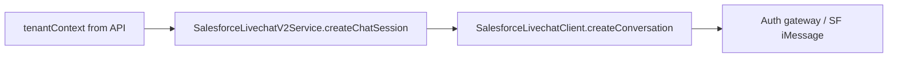

# Exclude `total_acv` from Salesforce V2 routing payload

## Root cause (verified in repo)

- `[CreateChatSessionParams](src/internal/live-chats/service/live-chat.types.service.ts)` allows `tenantContext?: Record<string, any>`.
- The only place that turns that into Salesforce iMessage `routingAttributes` is `[SalesforceLivechatV2Service.createChatSession](src/livechat-systems/service/salesforce-livechat/salesforce-livechat-v2.service.ts)` (lines 79–87): it spreads `params.tenantContext` and adds `Conversation_Status`, `QuackSessionID`, etc.
- `[SalesforceLivechatClient.createConversation](src/livechat-systems/client/salesforce-livechat-v2/salesforce-livechat.client.ts)` passes `routingAttributes` straight to the auth-gateway POST body — no validation or shaping (unlike v1, which uses Joi on a different `prechat` shape in `[salesforce-livechat.client.ts](src/livechat-systems/client/salesforce-livechat/salesforce-livechat.client.ts)`).

So the **integration boundary** for “what is safe to send as routing attributes” is `**SalesforceLivechatV2Service.createChatSession`, not the client (the client should stay a thin transport).

## Recommended placement

**Implement the exclusion when building `routingAttributes` in `[salesforce-livechat-v2.service.ts](src/livechat-systems/service/salesforce-livechat/salesforce-livechat-v2.service.ts)`** — immediately before or while constructing the object passed to `createConversationInput`.

- **Why here**: Single call site that defines the SF V2 contract; matches existing pattern of merging/overriding fields on `tenantContext` (`Conversation_Status`, `QuackSessionID`).
- **Why not only in the client**: The client is shared transport; polluting it with product-specific keys like `total_acv` couples a generic HTTP wrapper to one tenant’s payload. The service already owns “how we map internal chat session params to Salesforce.”

## Implementation sketch (follow codebase style)

1. **Omit the key** from the spread source, e.g. destructure `total_acv` out of `params.tenantContext` (with a rest object) or build `routingAttributes` from `{ ...rest, ...overrides }` after deleting `total_acv`.
2. **Name the intent**: a small private method like `buildSalesforceRoutingAttributes(tenantContext, overrides)` or a module-level constant list `SALESFORCE_IAMESSAGE_ROUTING_KEYS_TO_OMIT` / `['total_acv']` keeps the rule visible and testable without scattering magic strings.
3. **Optional hardening** (only if you want to fix the class of errors, not just this key): in the same helper, coerce every value with `String(value)` (or skip non-stringifiable) so future numeric/boolean fields do not break SF — your incident report points at **integer** vs **string**; exclusion fixes `total_acv` only; stringification fixes the API contract more generally. You asked to **exclude** this field; dropping `total_acv` at the service boundary matches that.

## Files to touch

| File                                                                                                                                                                       | Change                                                                                |
| -------------------------------------------------------------------------------------------------------------------------------------------------------------------------- | ------------------------------------------------------------------------------------- |
| `[src/livechat-systems/service/salesforce-livechat/salesforce-livechat-v2.service.ts](src/livechat-systems/service/salesforce-livechat/salesforce-livechat-v2.service.ts)` | Exclude `total_acv` (or delegate to a tiny helper) when building `routingAttributes`. |

No change required to `[salesforce-livechat.client.ts](src/livechat-systems/client/salesforce-livechat-v2/salesforce-livechat.client.ts)` unless you later centralize **generic** “all routing values must be strings” normalization for all callers — today there is only one caller.

## Tests

- Add or extend a unit test for `SalesforceLivechatV2Service.createChatSession` that mocks `SalesforceLivechatClient.createConversation` and asserts the payload’s `routingAttributes` does not contain `total_acv` when `tenantContext` includes it (if a test file for this service already exists; otherwise add a focused spec next to existing livechat tests).

## Note on other body fields

The sample payload also had `"internal_id":"undefined"` (string). That is separate from the integer/schema error and likely originates **before** this gateway; fixing that belongs upstream or as another sanitization rule if you choose to strip invalid placeholders here.
