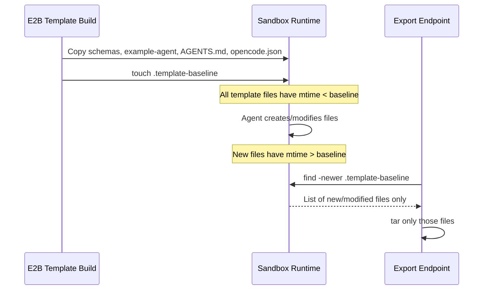

# Export only user-created/modified files

The cleanest approach: drop a **marker file** at template build time. At export time, use `find -newer` to only include files created or modified after the marker. This requires zero bookkeeping, works across reconnections, and automatically catches any file the agent creates or modifies.

### 1. Add a timestamp marker to the template

**File:** [sandbox-templates/agent-builder/template.ts](sandbox-templates/agent-builder/template.ts)

After all `.copy()` calls but before `.setStartCmd()`, add:

```typescript
.runCmd("touch /home/user/project/.template-baseline")
```

This creates a file with the timestamp of template build completion. Every template file will have been written before this marker.

### 2. Update the export route to use the marker

**File:** [src/app/api/sessions/[id]/export/route.ts](src/app/api/sessions/[id]/export/route.ts)

Replace the current `tar` command with a two-step process:

1. Use `find` with `-newer .template-baseline` to discover files created/modified after the baseline
2. Archive only those files

```typescript
const archivePath = "/tmp/project-export.tar.gz";

const findResult = await sandbox.commands.run(
  `cd /home/user/project && find . -type f -newer .template-baseline -not -path './.opencode/*' -not -name 'opencode.json' -not -path '*/node_modules/*' -not -name '.template-baseline'`,
  { timeoutMs: 10_000 }
);

const files = (findResult.stdout ?? "").trim();
if (!files) {
  return new Response(JSON.stringify({ error: "No new files to export" }), {
    status: 400,
    headers: { "Content-Type": "application/json" },
  });
}

await sandbox.commands.run(
  `cd /home/user/project && find . -type f -newer .template-baseline -not -path './.opencode/*' -not -name 'opencode.json' -not -path '*/node_modules/*' -not -name '.template-baseline' | tar -czf ${archivePath} -T -`,
  { timeoutMs: 30_000 }
);
```

This pipes the list of new files into `tar -T -` (read file names from stdin), so only user-created/modified files end up in the archive.

### 3. Update AGENTS.md to enforce new-folder convention

**File:** [sandbox-templates/agent-builder/AGENTS.md](sandbox-templates/agent-builder/AGENTS.md)

Add a section at the top (after the intro) making it clear the agent must create new agents in their own directory and treat `example-agent/` as read-only reference:

- Add a rule: "When building a new agent, always create a new folder at the project root (e.g. `my-agent/`). Use `example-agent/` as a read-only reference -- do not modify it."
- Update the "Required Files" section to use a generic `<agent-name>/` placeholder instead of hardcoding `example-agent/`
- Keep the rest of the file (Core Rules, Build Order, Validation Checklist) unchanged

This ensures the AI agent always creates new directories for user work, which keeps the template files untouched and makes the timestamp-based export work correctly.

### 4. Handle the "no new files" case in the frontend

**File:** [src/components/app-shell.tsx](src/components/app-shell.tsx)

The export button handler already checks `!res.ok` and shows an alert. The 400 response with `"No new files to export"` will be caught by the existing error path -- no frontend changes needed.

### 5. Rebuild the template

The `.template-baseline` marker file needs to be baked in, so a template rebuild is required.

### How it works


