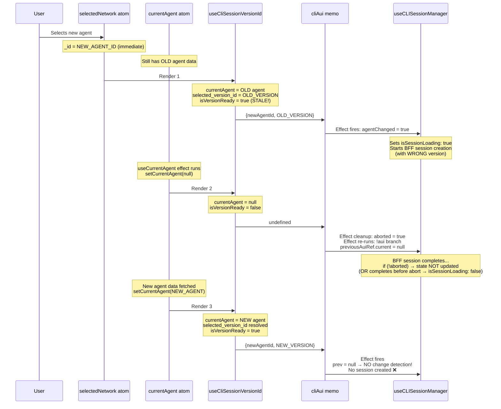
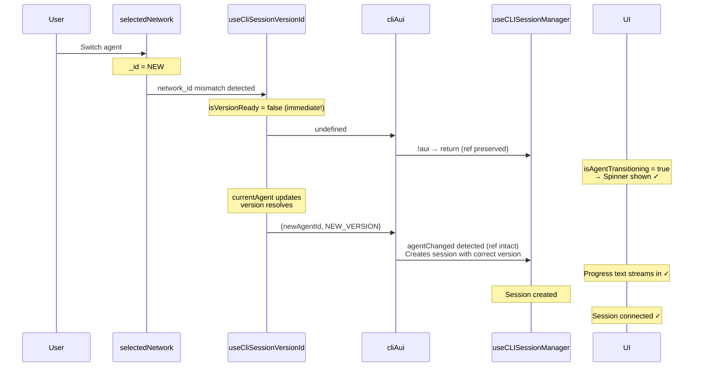

# Fix Agent-Switch Loading Regression

## Root Cause Analysis

There is a **render-timing race condition** involving three asynchronous state updates during an agent switch:

### The Sequence That Breaks



### Why the Button Shows

The "New Session" button renders when ALL of these are true (from [AgentEmptyState.tsx](apps/operator/src/widgets/AgentBuilder/partials/AgentEmptyState.tsx)):

- `isCliConnected` is `false` (`cliSession == null`)
- `isCliSessionLoading` is `false`
- `cliSessionError` is `null`

This happens because:

1. The session created with the wrong version has `auiContext: {newAgentId, OLD_VERSION}`
2. When `cliAui` returns with `{newAgentId, NEW_VERSION}`, `matchesContext` fails (version mismatch)
3. `belongsToCurrentAui = false` → `session: null` returned to consumer
4. `isSessionLoading` becomes `false` either because the wrong-version creation completed, or because no new creation was started
5. `previousAuiRef.current` was nulled → no change detection → no new session creation

### Three Sub-Problems

| #   | Problem                                                                                               | Where                                                                                           |
| --- | ----------------------------------------------------------------------------------------------------- | ----------------------------------------------------------------------------------------------- |
| 1   | `cliAui` is built with **stale version** (old agent's version + new agent's ID) for one render        | [useCliSessionVersionId.ts](apps/operator/src/hooks/useCliSessionVersionId.ts)                  |
| 2   | `previousAuiRef.current` is **cleared** when `aui` goes through `undefined`, killing change detection | [useCLISessionManager.ts](libs/api/src/api/CLIConnectionApi/useCLISessionManager.ts) L82-84     |
| 3   | No loading state shown during the gap while version resolves for the new agent                        | [useAgentBuilder.ts](apps/operator/src/widgets/AgentBuilder/useAgentBuilder.ts) computed values |

---

## Fix

### Fix 1 — Detect stale version immediately in `useCliSessionVersionId`

**File**: [apps/operator/src/hooks/useCliSessionVersionId.ts](apps/operator/src/hooks/useCliSessionVersionId.ts)

Add `useNetwork()` and compare `currentAgent.scope.network_id` against `selectedNetwork._id`. If they differ, the version belongs to a different agent and must not be used:

```typescript
const [selectedNetwork] = useNetwork();
const isAgentCurrent = currentAgent?.scope?.network_id === selectedNetwork?._id;

if (!isAgentCurrent) {
  return { versionId: undefined, isVersionReady: false };
}
```

This early-return fires on the **same render** that `selectedNetwork._id` changes, preventing `cliAui` from ever being built with a stale version. No premature BFF session creation.

### Fix 2 — Preserve `previousAuiRef` when `aui` goes through `undefined`

**File**: [libs/api/src/api/CLIConnectionApi/useCLISessionManager.ts](libs/api/src/api/CLIConnectionApi/useCLISessionManager.ts) L82-84

Remove the line `previousAuiRef.current = null` from the `if (!aui)` branch:

```typescript
if (!aui) {
  // Don't clear ref — preserves change detection when aui
  // goes through undefined during agent/version transitions.
  return;
}
```

When `cliAui` returns (after version resolves), the ref still holds the old agent's identity, allowing `agentChanged` to be correctly detected.

### Fix 3 — Show loading during the version-resolution gap

**File**: [apps/operator/src/widgets/AgentBuilder/useAgentBuilder.ts](apps/operator/src/widgets/AgentBuilder/useAgentBuilder.ts) computed values (~L1118)

Derive a composite loading flag that covers the version-resolution gap:

```typescript
const isAgentTransitioning = !!selectedNetwork?._id && !isSessionVersionReady;
```

Then in the computed return:

```typescript
computed: {
  isCliSessionLoading: isCliSessionLoading || isAgentTransitioning,
  ...
}
```

This ensures the spinner shows immediately when an agent is selected but its version hasn't resolved yet — covering initial load, agent switches, and version dropdown changes.

---

## Expected Flow After Fix



- Zero premature BFF calls (no wrong-version session creation)
- Loading indicator visible throughout the entire transition
- Single session creation with the correct version
