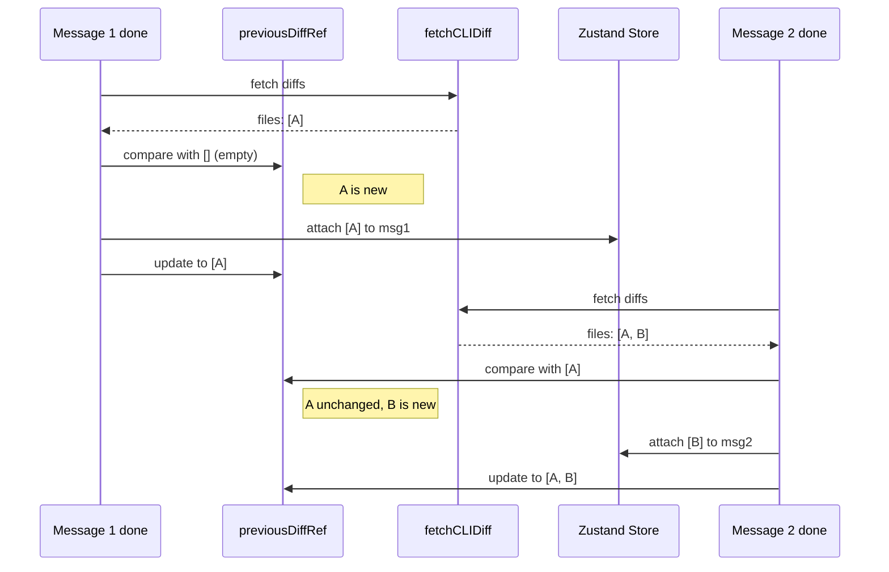

# Fix Cumulative Diff Display Per Message

## Problem

The backend `POST /sessions/{sessionId}/diff` endpoint returns **all** diffs accumulated across the session. The current code in [useAgentBuilder.ts](apps/operator/src/widgets/AgentBuilder/useAgentBuilder.ts) (lines 295-304) attaches the full response to every agent message, so every message shows the entire session's diffs instead of just its own.

## What was removed and why it matters

The old client-side diff system had per-message isolation via two mechanisms that were removed during the server-side migration:

- `**originalFileContentByAgentMessageId**` (module-level map in [useAgentBuilderStore.ts](apps/operator/src/stores/useAgentBuilderStore.ts)) -- captured a per-message baseline of the original file content the first time diffs were attached to a message, so each message only showed changes relative to when it started.
- `**attachFileDiffToLastAgentMessage**` (store action) -- used that baseline to compute per-message diffs. First call for a message stored the current content as baseline; subsequent calls always diffed against the same baseline.
- `**useBaseModel.tsx` useEffect (lines 346-369) -- reactively watched `currentFileContent` and `originalFileContentFromServer` and called `attachFileDiffToLastAgentMessage`.

These were correctly removed because the new system fetches structured diffs from the server instead of computing them client-side from raw file content. However, the per-message isolation behavior they provided was not replaced, causing all messages to display the full session's cumulative diffs.

## Approach -- restore the same per-message isolation behavior

The equivalent mechanism for server-side diffs: maintain a **previous diff snapshot** (a `useRef` of the last full diff response). This replaces `originalFileContentByAgentMessageId` conceptually -- instead of tracking "original file content per message", we track "cumulative diff state before this message". When a new diff response arrives after a message completes:

- Files not present in the previous snapshot are **new** -- include them.
- Files present in the previous snapshot but with **different hunks** have been further modified -- include them (shows the updated cumulative diff for that file, which now includes this message's changes).
- Files **identical** to the previous snapshot are unchanged by this message -- exclude them.

Then update the snapshot to the current full response.



## Files to change

### 1. Add `computeDiffDelta` to [diffAnnotation.ts](apps/operator/src/widgets/AgentBuilder/partials/diffAnnotation.ts)

A pure function that compares two snapshots and returns only the new/changed files:

```typescript
export const computeDiffDelta = (
  previous: ICLIDiffFile[],
  current: ICLIDiffFile[]
): ICLIDiffFile[] => {
  return current.filter((file) => {
    const prev = previous.find((p) => p.file === file.file);
    if (!prev) return true;
    return JSON.stringify(prev.hunks) !== JSON.stringify(file.hunks);
  });
};
```

Uses `JSON.stringify` on hunks for equality comparison -- adequate for this data shape (small arrays of simple objects).

### 2. Update [useAgentBuilder.ts](apps/operator/src/widgets/AgentBuilder/useAgentBuilder.ts)

Three changes:

**a) Add a ref** to track the previous diff snapshot:

```typescript
const previousDiffRef = useRef<ICLIDiffFile[]>([]);
```

**b) Reset the ref** when `cliSession` changes (new session = clean baseline). Add to the existing `useEffect` that watches `cliAui` (around line 97), or add a dedicated effect:

```typescript
useEffect(() => {
  previousDiffRef.current = [];
}, [cliSession]);
```

**c) Use the delta** in the `done` handler (lines 295-304). Replace the direct `resp.files` attachment with the delta computation:

```typescript
fetchCLIDiff(cliSession.id, cliSession.sandboxId, agentId)
  .then((resp) => {
    const delta = computeDiffDelta(previousDiffRef.current, resp.files);
    previousDiffRef.current = resp.files;
    if (delta.length > 0) {
      updateMessageInTask(taskId, assistantId, (msg) => ({
        ...msg,
        fileDiffs: delta,
      }));
    }
  })
  .catch(() => {});
```

## Edge cases

- **First message**: `previousDiffRef.current` is `[]`, so all files pass the filter -- correct.
- **Message touches a different file**: only the new file passes -- correct.
- **Message touches a file already changed by a prior message**: the file passes because its hunks differ; it shows the full updated diff for that file -- acceptable tradeoff given the backend returns cumulative diffs.
- **Message makes no file changes**: `computeDiffDelta` returns `[]`, nothing attached -- correct.
- **Session reset**: ref resets to `[]` via the `useEffect` -- correct.
