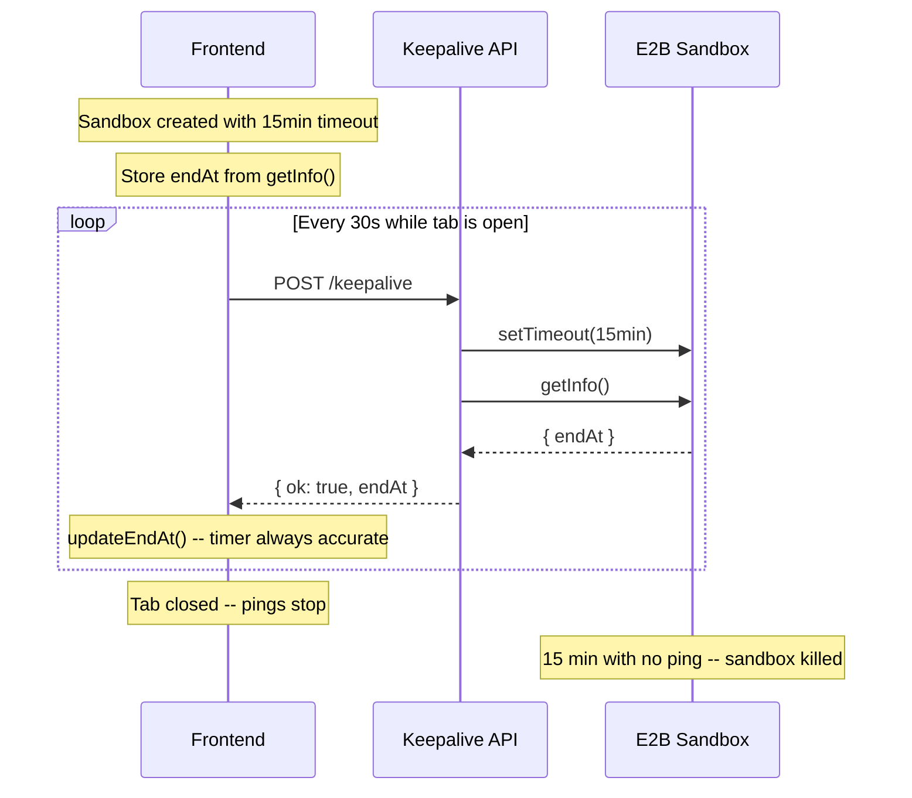

# Fix E2B session lifecycle

## The problem

E2B's `setTimeout(ms)` **replaces** the sandbox timeout with "die X ms from now." The current code creates the sandbox with a 1-hour timeout, then the first keepalive immediately overwrites it to 5 minutes. The 1-hour initial value is redundant -- it never survives past the first keepalive ping.

Meanwhile the frontend holds the original `endAt` (creation + 1 hour) and never updates it, so the countdown timer is wrong.

## The fix

### 1. Unify to a single 15-minute timeout constant

**File:** [src/lib/session-manager.ts](src/lib/session-manager.ts)

Replace the two constants with one. Both `Sandbox.create()` and `keepAlive()` use the same value:

```typescript
const SANDBOX_TIMEOUT_MS = 15 * 60 * 1000; // 15 min -- extended by keepalive, hard-capped at 1h by E2B
```

Remove `SANDBOX_KEEPALIVE_MS`. Use `SANDBOX_TIMEOUT_MS` in both `Sandbox.create({ timeoutMs })` and `sandbox.setTimeout()`.

### 2. Keepalive returns the real `endAt`

**File:** [src/lib/session-manager.ts](src/lib/session-manager.ts)

Change `keepAlive` to call `getInfo()` after `setTimeout()` and return the actual `endAt`:

```typescript
export async function keepAlive(
  sandboxId: string
): Promise<{ ok: true; endAt: number } | { ok: false }> {
  try {
    const sandbox = await connectSandbox(sandboxId);
    await sandbox.setTimeout(SANDBOX_TIMEOUT_MS);
    const info = await sandbox.getInfo();
    return { ok: true, endAt: info.endAt.getTime() };
  } catch {
    return { ok: false };
  }
}
```

### 3. Keepalive API route returns `endAt`

**File:** [src/app/api/sessions/[id]/keepalive/route.ts](src/app/api/sessions/[id]/keepalive/route.ts)

Return the full result object from `keepAlive`:

```typescript
const result = await keepAlive(sandboxId);
return NextResponse.json(result);
```

### 4. Zustand store gets an `updateEndAt` action

**File:** [src/stores/session-store.ts](src/stores/session-store.ts)

Add an action to update `endAt` without replacing the whole session:

```typescript
updateEndAt: (endAt: number) => {
  const { session } = get();
  if (session) set({ session: { ...session, endAt } });
},
```

### 5. Frontend keepalive syncs `endAt` and handles failure

**File:** [src/components/app-shell.tsx](src/components/app-shell.tsx)

Update the keepalive `useEffect`:

- On success: call `updateEndAt(data.endAt)` to keep the timer in sync with reality
- On failure (`ok: false` or network error): clear the session (sandbox is dead or unreachable)

## Resulting lifecycle



The timer always reflects the real `endAt` from E2B. If the sandbox dies (idle timeout or 1-hour hard cap), the next keepalive returns `ok: false` and the frontend clears the session.
