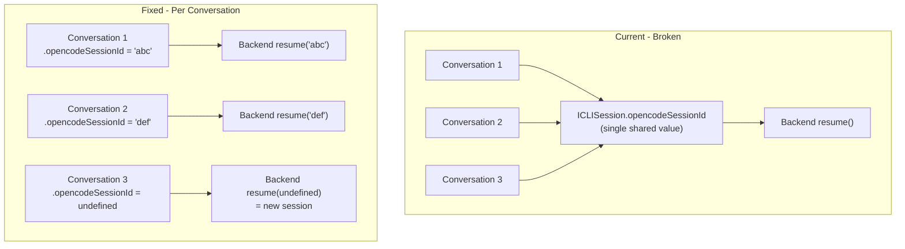

# Fix Per-Conversation Claude SDK Session Management

## Problem

The Claude SDK requires a **real SDK-generated session ID** for `resume` -- random UUIDs don't work. The current frontend has two issues:

1. **Shared session ID**: `opencodeSessionId` (the real SDK session ID) is stored on `ICLISession`, which is shared across all conversations. When a user creates a new conversation, the old conversation's SDK session ID is carried over and incorrectly used for `resume`.

2. **Random UUID sent as `claudeSessionId`**: The `conversationId` (from `crypto.randomUUID()`) is sent to the backend as `claudeSessionId`. If the backend tries to use this for `resume`, it will fail because it's not a real SDK session ID.

## Architecture (current vs fixed)



## Changes

### 1. Store - Add `opencodeSessionId` per conversation

**File**: [`apps/operator/src/stores/useAgentBuilderStore.ts`](apps/operator/src/stores/useAgentBuilderStore.ts)

- Add `opencodeSessionId?: string` to `IAgentBuilderConversation`
- Add `updateConversation(id, patch)` action to update a conversation's fields (needed to set the session ID after it's received from the stream)

```typescript
export interface IAgentBuilderConversation {
  id: string;
  title: string;
  createdAt: number;
  opencodeSessionId?: string; // real Claude SDK session ID for resume
}
```

### 2. Hook - Use per-conversation session ID

**File**: [`apps/operator/src/widgets/AgentBuilder/useAgentBuilder.ts`](apps/operator/src/widgets/AgentBuilder/useAgentBuilder.ts)

Two changes in `handleSendMessage`:

**a) Read from conversation, not CLI session (line ~221)**:

```typescript
// Before:
opencodeSessionId: cliSession.opencodeSessionId,

// After:
opencodeSessionId: activeConversation?.opencodeSessionId,
```

**b) On `opencodeSession` event (line ~226-231) -- update the conversation, not the CLI session**:

```typescript
// Before:
if (event.type === 'opencodeSession') {
  const nextOpencodeSessionId = ...;
  if (nextOpencodeSessionId) {
    updateSession({ opencodeSessionId: nextOpencodeSessionId });
  }
}

// After:
if (event.type === 'opencodeSession') {
  const nextOpencodeSessionId = ...;
  if (nextOpencodeSessionId) {
    updateConversation(convId, { opencodeSessionId: nextOpencodeSessionId });
  }
}
```

This means:

- **First message in a new conversation**: `activeConversation.opencodeSessionId` is `undefined` --> backend creates a fresh SDK session
- **Subsequent messages**: Uses the real SDK session ID from the `opencodeSession` event --> backend resumes correctly
- **Switching conversations**: Each conversation sends its own session ID

### 3. API layer - Stop sending random UUID as `claudeSessionId`

**File**: [`libs/api/src/api/CLIConnectionApi/cliConnectionApi.ts`](libs/api/src/api/CLIConnectionApi/cliConnectionApi.ts)

Line 227 currently sends `claudeSessionId: conversationId || undefined`. Since `conversationId` is a random UUID and can't be used for SDK resume, stop sending it. If the backend needs the conversation context for routing, the `opencodeSessionId` already serves that purpose per conversation.

```typescript
// Before (line 227):
claudeSessionId: conversationId || undefined,

// After:
// removed -- random UUID can't be used for SDK resume
```

Also remove `conversationId` from `ICLISendMessageOptions` since it's no longer sent.

### 4. Expose `updateConversation` from the store through the hook

In `useAgentBuilder.ts`, pull `updateConversation` from the store (alongside the existing selectors) and use it in the event handler.

## What stays unchanged

- `ICLISession.opencodeSessionId` and `cliSessionStorage.ts` -- kept for backward compatibility (other consumers may use it)
- `useCLISessionManager.ts` -- no changes needed
- The `updateSession` call is removed from the agent builder's event handler, but the function itself remains available for other uses
- `AgentBuilder.tsx`, `AgentChatHeader.tsx` -- no changes needed
