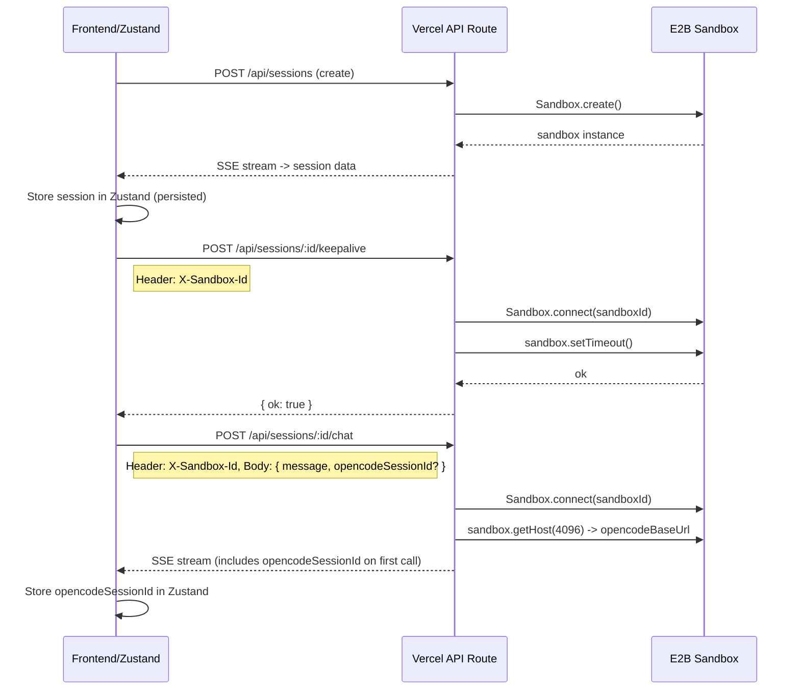

# Frontend-owned sessions with Zustand

The server currently stores sessions and sandbox handles in in-memory maps, which breaks on Vercel because requests can land on different instances. The fix: the frontend owns all session state (persisted via Zustand), and the server becomes stateless -- it receives `sandboxId` from the client and connects per-request.



## 1. Add Zustand dependency

```bash
npm install zustand
```

## 2. Create Zustand session store

**New file:** [src/stores/session-store.ts](src/stores/session-store.ts)

- Uses `zustand/middleware` persist with `partialize` to persist only session data to localStorage (key: `armadilo_session`)
- Transient UI state (`creating`, `creatingSteps`, `error`, `exporting`) is not persisted
- Session TTL is **1 hour** (E2B plan limit). On rehydration, check TTL and clear expired sessions
- `isExpired()` checks `savedAt` against the 1-hour TTL

```typescript
interface SessionStore {
  // Persisted
  session: Session | null;
  savedAt: number | null;

  // Transient (not persisted)
  creating: boolean;
  creatingSteps: string[];
  error: string | null;
  exporting: boolean;

  // Actions
  setSession: (session: Session) => void;
  clearSession: () => void;
  updateOpencodeSessionId: (id: string) => void;
  setCreating: (v: boolean) => void;
  addCreatingStep: (step: string) => void;
  resetCreatingSteps: () => void;
  setError: (e: string | null) => void;
  setExporting: (v: boolean) => void;
  isExpired: () => boolean;
}
```

Use `partialize` to only persist `session` and `savedAt`:

```typescript
partialize: (state) => ({ session: state.session, savedAt: state.savedAt });
```

## 3. Add a `connectSandbox` helper

**File:** [src/lib/session-manager.ts](src/lib/session-manager.ts)

Add a reusable helper for routes to connect to a sandbox by ID:

```typescript
export async function connectSandbox(sandboxId: string): Promise<Sandbox> {
  return Sandbox.connect(sandboxId, { apiKey: env.E2B_API_KEY });
}
```

Keep `createSession` as-is -- it only runs during creation (single request lifecycle). It can continue to use its local sandbox reference.

Remove `getSession`, `getSandbox`, `listSessions` exports (no longer used by routes). Remove the `sessions` and `sandboxes` global maps. `destroySession` changes to accept `sandboxId` directly.

## 4. Update all API routes to be stateless

Every route that needs the sandbox reads it from the `X-Sandbox-Id` request header and calls `connectSandbox()`.

### keepalive ([src/app/api/sessions/[id]/keepalive/route.ts](src/app/api/sessions/[id]/keepalive/route.ts))

- Read `sandboxId` from `X-Sandbox-Id` header
- `connectSandbox(sandboxId)` then `sandbox.setTimeout(SANDBOX_KEEPALIVE_MS)`
- No `getSession` / `getSandbox` calls

### files ([src/app/api/sessions/[id]/files/route.ts](src/app/api/sessions/[id]/files/route.ts))

- Read `sandboxId` from `X-Sandbox-Id` header
- `connectSandbox(sandboxId)` then run `find` command

### file ([src/app/api/sessions/[id]/file/route.ts](src/app/api/sessions/[id]/file/route.ts))

- Read `sandboxId` from `X-Sandbox-Id` header
- `connectSandbox(sandboxId)` then run `cat` command

### export ([src/app/api/sessions/[id]/export/route.ts](src/app/api/sessions/[id]/export/route.ts))

- Read `sandboxId` from `X-Sandbox-Id` header
- `connectSandbox(sandboxId)` then run `find -newer` / `tar` commands

### chat ([src/app/api/sessions/[id]/chat/route.ts](src/app/api/sessions/[id]/chat/route.ts))

- Read `sandboxId` from `X-Sandbox-Id` header
- Read `opencodeSessionId` and `systemPrompt` from request body (alongside `message`)
- `connectSandbox(sandboxId)` then `sandbox.getHost(4096)` to derive `opencodeBaseUrl`
- If `opencodeSessionId` is empty, create one via OpenCode API and emit `{ type: "opencodeSession", id: "..." }` SSE event so the client can store it
- Use the `opencodeSessionId` for the `session.idle` check

### GET/DELETE [id] ([src/app/api/sessions/[id]/route.ts](src/app/api/sessions/[id]/route.ts))

- GET: remove (or return 404 -- client owns session state)
- DELETE: read `sandboxId` from `X-Sandbox-Id` header, `connectSandbox(sandboxId)`, `sandbox.kill()`

### GET/POST /api/sessions ([src/app/api/sessions/route.ts](src/app/api/sessions/route.ts))

- POST (create): stays as-is -- creates sandbox with 1-hour timeout (`timeoutMs: 60 * 60 * 1000`), streams progress, returns full session including `createdAt` timestamp
- GET (list): remove or return empty array (server no longer tracks sessions)

## 5. Update frontend to use Zustand store

**File:** [src/components/app-shell.tsx](src/components/app-shell.tsx)

- Remove `SavedSession` interface, `saveSessionToStorage`, `loadSessionFromStorage`, `STORAGE_KEY`, `SESSION_TTL_MS`
- Remove all `useState` calls for: `session`, `creating`, `creatingSteps`, `error`, `exporting`, `showRestore`
- Replace with `useSessionStore()` hook
- On mount: check `isExpired()` from store; if expired, `clearSession()`. If session exists and not expired, show restore prompt
- While a session is active, display a countdown timer showing time remaining until the 1-hour limit. When the session expires, clear it and prompt the user to create a new one
- `handleCreateSession`: update store instead of local state
- Keepalive `fetch`: add `headers: { "X-Sandbox-Id": session.sandboxId }`
- Export `fetch`: add `headers: { "X-Sandbox-Id": session.sandboxId }`
- Pass store's session to child components as before

**File:** [src/components/app-shell.tsx](src/components/app-shell.tsx) (ChatPanel section)

- Chat `fetch`: add `X-Sandbox-Id` header, send `opencodeSessionId` and `systemPrompt` in the body
- Handle new `opencodeSession` SSE event type: call `store.updateOpencodeSessionId(event.id)`

**File:** [src/components/file-tree.tsx](src/components/file-tree.tsx)

- The `FileTree` component fetches `/api/sessions/${sessionId}/files`. It needs to send `X-Sandbox-Id` header.
- Either pass `sandboxId` as a prop, or have it use the Zustand store directly.
- Same for `FileViewer` (inline in app-shell.tsx) which fetches `/api/sessions/${sessionId}/file?path=...`
