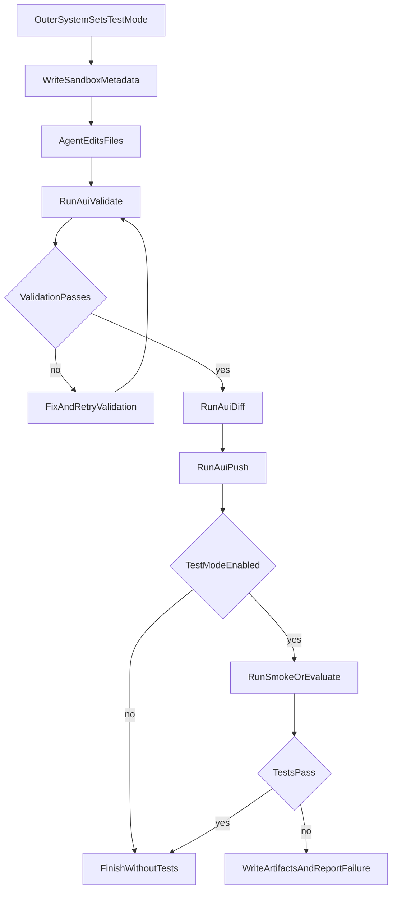

# Sandbox Template Test Mode

## Scope

This plan is only about `[/Users/bugo/Documents/Developer/aui/agent-builder-bff/sandbox-templates/agent-builder-subagents/](/Users/bugo/Documents/Developer/aui/agent-builder-bff/sandbox-templates/agent-builder-subagents/)`.

The key fact is:

- The sandbox does **not** receive frontend state directly.
- So a frontend toggle cannot affect this template by itself.
- The sandbox needs one signal injected from outside, either through the system prompt, a file like `.aui-sandbox.json`, or both.

Without that signal, the current template will keep behaving as it does now because `opencode.json` always loads its test-related instructions.

## What The Sandbox Does Today

The current template has three relevant pieces:

- `[/Users/bugo/Documents/Developer/aui/agent-builder-bff/sandbox-templates/agent-builder-subagents/opencode.json](/Users/bugo/Documents/Developer/aui/agent-builder-bff/sandbox-templates/agent-builder-subagents/opencode.json)` always loads:
  - `EVALUATE.md`
  - `.opencode/skills/validate-and-push/SKILL.md`
- `[/Users/bugo/Documents/Developer/aui/agent-builder-bff/sandbox-templates/agent-builder-subagents/EVALUATE.md](/Users/bugo/Documents/Developer/aui/agent-builder-bff/sandbox-templates/agent-builder-subagents/EVALUATE.md)` says every agent should maintain `test_questions.json`.
- `[/Users/bugo/Documents/Developer/aui/agent-builder-bff/sandbox-templates/agent-builder-subagents/.opencode/skills/validate-and-push/SKILL.md](/Users/bugo/Documents/Developer/aui/agent-builder-bff/sandbox-templates/agent-builder-subagents/.opencode/skills/validate-and-push/SKILL.md)` says every successful push should run the smoke flow.

So inside this sandbox, tests are effectively treated as always-on policy today.

## Best Sandbox-Only Design

For this template, the cleanest design is:

1. Keep `validate -> diff -> push` as mandatory.
2. Make **test generation** conditional.
3. Make **post-push smoke execution** conditional.
4. Keep **validation retry** in the sandbox.
5. Do **not** make the sandbox invent its own autonomous post-push self-correction loop unless the outer system gives it an explicit retry contract.

## Recommended Signal Contract

The most robust contract for this sandbox is a metadata flag in `.aui-sandbox.json`, because the sandbox already reads that file today for smoke execution.

Relevant current behavior:

- `[/Users/bugo/Documents/Developer/aui/agent-builder-bff/src/lib/sandbox-metadata.ts](/Users/bugo/Documents/Developer/aui/agent-builder-bff/src/lib/sandbox-metadata.ts)` already writes `/home/user/project/.aui-sandbox.json`.
- `[/Users/bugo/Documents/Developer/aui/agent-builder-bff/sandbox-templates/agent-builder-subagents/.opencode/skills/aui-evals/scripts/smoke.js](/Users/bugo/Documents/Developer/aui/agent-builder-bff/sandbox-templates/agent-builder-subagents/.opencode/skills/aui-evals/scripts/smoke.js)` already depends on that file for `agentId`, `baseUrl`, and `networkApiKey`.

Recommended additions to the metadata contract:

```json
{
  "agentId": "...",
  "environment": "staging",
  "baseUrl": "...",
  "networkApiKey": "...",
  "testMode": {
    "enabled": true,
    "selfCorrect": true,
    "maxAttempts": 3
  }
}
```

Why this is the best fit for the sandbox itself:

- It gives the sandbox a stable, machine-readable switch.
- It avoids relying only on prompt wording.
- It lets the scripts decide whether to run or skip.
- It keeps one cause of truth close to the smoke runner.

## Template Changes

### 1. `validate-and-push/SKILL.md`

Change the contract from:

- always run smoke after push

to:

- always validate
- always diff
- always push when push is allowed
- only run smoke when sandbox test mode is enabled

Also update the failure behavior wording:

- validation failures: sandbox can keep self-correcting as it already does
- smoke/test failures: report the failure and wait for the outer orchestrator to decide whether to send a follow-up fix turn

That keeps the skill aligned with what the sandbox can actually control.

### 2. `EVALUATE.md`

Change the language from:

- every agent must always maintain `test_questions.json`

to:

- maintain `test_questions.json` only when test mode is enabled for the session/run

Also clarify that:

- `test_questions.json` is for declarative runtime evaluation
- smoke scenarios are separate
- post-push retries are not owned by this markdown file unless explicitly enabled by the outer system

### 3. `opencode.json`

This file does not need to stop loading the instructions if the instructions themselves become conditional.

Only change `opencode.json` if you decide on a different structural approach such as:

- moving the test instructions into a separate optional skill, or
- loading a smaller default instruction set and injecting test-mode guidance externally

With the current setup, conditional wording inside the loaded docs is the smaller change.

### 4. `smoke.js`

Teach the runner to read the new metadata flag and short-circuit cleanly:

- if `testMode.enabled !== true` -> return `SKIPPED` with reason like `test mode disabled`
- if enabled but required credentials are missing -> keep current `SKIPPED` behavior
- if enabled and credentials exist -> run normally

This is the most important code-level sandbox behavior change because it turns the toggle into an actual runtime gate instead of only documentation.

## How Self-Correction Would Work In This Sandbox

With the current architecture, there are two different meanings of self-correction:

### Validation self-correction

This already fits naturally inside the sandbox.

- Agent edits files
- `aui validate` fails
- skill tells the agent to fix and retry
- loop continues until valid or retry limit is reached

### Test-failure self-correction

This does **not** cleanly belong inside the sandbox today.

Reason:

- the current skill explicitly says smoke FAIL should stop
- the sandbox does not have an outer control loop of its own
- the frontend toggle lives outside the sandbox

So for this sandbox template, the correct model is:

- sandbox runs tests only when test mode is enabled
- sandbox reports factual failure artifacts
- outer system decides whether to send a targeted retry prompt back into the same session

If you tried to force the sandbox alone to fully own test self-correction, it would be brittle because the retry policy would still be driven only by prompt obedience instead of an external controller.

## Resulting Flow For This Sandbox



## Smallest Safe Template-First Version

If you want the smallest change centered on this sandbox template:

- Update `validate-and-push/SKILL.md` so tests are conditional, not mandatory.
- Update `EVALUATE.md` so `test_questions.json` is conditional, not mandatory.
- Extend `.aui-sandbox.json` with a `testMode.enabled` flag.
- Update `smoke.js` to skip when test mode is disabled.

That gives this sandbox a clean contract:

- default behavior: edit, validate, diff, push, stop
- test-mode behavior: edit, validate, diff, push, run tests, report results

## Important Limitation

If you want the sandbox to do a full loop of:

- run tests
- inspect failures
- fix itself
- push again
- rerun tests

then this template alone is not enough.

You also need the outer system to:

- persist attempt count
- decide when to resend a retry prompt
- decide when to stop
- surface attempt progress back to the frontend

So for `sandbox-templates/agent-builder-subagents` specifically, the right conclusion is:

- the sandbox can be made **toggle-aware**
- the sandbox can be made **test-conditional**
- the sandbox can keep **validation auto-correction**
- full **post-push test self-correction** still needs an external orchestrator
