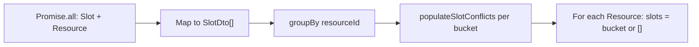

# Restore resource-driven `getSlots` assembly

## Context

The **original** stub in git ([`server/src/slots/slots.service.ts`](server/src/slots/slots.service.ts)) built the response with a slot-driven loop — no `Resource` query:

```ts
for (const slot of slots) {
  let resource = result.find((r) => r.resourceId === slot.resourceId);
  if (!resource) {
    resource = { resourceId: slot.resourceId, slots: [] };
    result.push(resource);
  }
  resource.slots.push({ ...slot, conflicts: [] });
}
```

That pattern only creates entries for resources that have at least one slot, so **Lane 4 is missing** (fails e2e at [`server/test/slots.e2e-spec.ts`](server/test/slots.e2e-spec.ts) line 377).

The **current** implementation uses `Object.entries(byResource)`, which has the same gap — only resources with slots appear.

Neither version ever fetched `Resource` from the DB. To include empty resources, the response must be **driven by all `Resource` rows**, not inferred from slots alone.

## Proposed change (single file)

Edit [`server/src/slots/slots.service.ts`](server/src/slots/slots.service.ts) `getSlots()` only.

### 1. Load slots and resources in parallel

```ts
const [slots, resources] = await Promise.all([
  this.manager.find(Slot, { order: { id: 'ASC' } }),
  this.manager.find(Resource, { order: { id: 'ASC' } }),
]);
```

`Resource` is already imported (line 5) but unused — this puts it to work. Matches [`resources.service.ts`](server/src/resources/resources.service.ts) pattern.

### 2. Keep conflict population unchanged

```ts
const slotDtos = slots.map((slot) => ({ ...slot, conflicts: [] }));
const byResource = groupBy(slotDtos, (s) => s.resourceId);

for (const resourceSlots of Object.values(byResource)) {
  await this.populateSlotConflicts(resourceSlots);
}
```

No changes to `populateSlotConflicts`.

### 3. Build result from resources (restores explicit loop style)

Replace `Object.entries(byResource).map(...)` with a resource-driven loop — same shape as the original `result` array building, but seeded from DB resources:

```ts
const result: ResourceSlotsDto[] = [];

for (const resource of resources) {
  result.push({
    resourceId: resource.id,
    slots: byResource[resource.id] ?? [],
  });
}

return result;
```



## What this fixes

| Test | Status after change |
|------|---------------------|
| `should return one entry per resource` (5 resources) | Pass |
| `should include an entry for Lane 4 even though it has no own slots` | Pass (`slots: []`) |
| `should show Pool blocker slots inside Lane 4 entry` | Still fails — needs blocking-dependency assembly (separate task) |
| Pool-in-Lane-1 / cross-resource conflict tests | Still fail — out of scope |

## Out of scope (follow-up)

- Loading `BlockingDependency` and including blocker slots in each entry
- Today-only slot filtering
- `addSlot` / `updateSlot` 409 validation

## Verification

```bash
cd server
npm run test:e2e -- --testNamePattern="one entry per resource|Lane 4 even"
```

Expect 2 passing; Lane 4 Pool-slots test still red until blocking is implemented.
