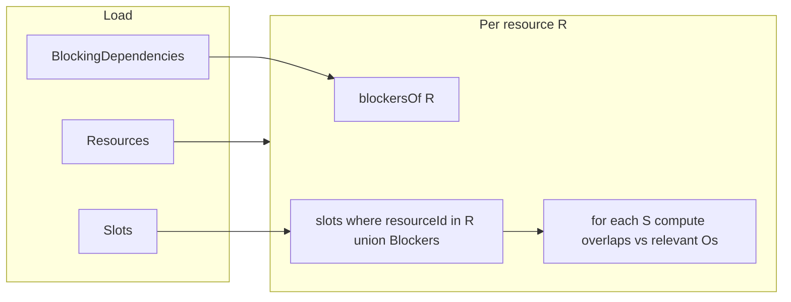

# Implement `getSlots()` in `SlotsService`

## Contract (from spec + e2e)

- **Shape**: `ResourceSlotsDto[]` — exactly **one row per resource** in the DB ([REQUIREMENTS.md](REQUIREMENTS.md) Step 1; e2e expects **5** entries and `resourceIds.size === length`).
- **Which slots appear in `entry.slots` for resource `R`**: all slots whose `resourceId` is `**R` or any resource that blocks `R**` (one-directional: Pool blocks Lane 1 ⇒ Lane 1’s entry includes Pool slots; Pool’s entry must **not** include Lane 1 slots — [server/test/slots.e2e-spec.ts](server/test/slots.e2e-spec.ts) lines 130–147, 380–394).
- **“Today” filter**: include slots that **overlap the local calendar day** for `new Date()` (same approach as [server/src/seed-data.ts](server/src/seed-data.ts) `today()` and e2e `dt()`). Include **overnight** slots that started yesterday and end today ([REQUIREMENTS.md](REQUIREMENTS.md) line 71). Overlap with the day window `[dayStart, nextDayStart)` using the same strict rule as conflicts: `slot.start < dayEnd && slot.end > dayStart` (string ISO datetimes compare lexicographically if you normalize to `YYYY-MM-DDThh:mm:ss`; parsing to `Date` is fine if consistent).
- `**conflicts` on each slot `S`**: every **other** slot `O` (same “today” filter) such that:
  - **Time overlap**: `S.start < O.end && S.end > O.start` ([REQUIREMENTS.md](REQUIREMENTS.md) lines 59–62; adjacent touching is **not** a conflict).
  - **Resource relevance**: `O.resourceId === S.resourceId` **or** `O.resourceId` is in the set of **blockers** of `S.resourceId` (dependencies where `blocked_resource_id = S.resourceId`). This matches e2e “only same or blocking resources” ([server/test/slots.e2e-spec.ts](server/test/slots.e2e-spec.ts) lines 172–198) and the Pool vs Lane 1 asymmetry (lines 150–169).
- **Conflict payload**: objects with `id`, `name`, `start`, `end`, `resourceId` (e2e lines 121–127). Nested `conflicts` on conflict rows are optional; empty or omitted is fine.

## Implementation steps (inside [server/src/slots/slots.service.ts](server/src/slots/slots.service.ts))

1. **Load data** (via existing `EntityManager`): `Resource` (order by `id` for stable output), all `BlockingDependency`, all `Slot` (ordered by `id` or start for deterministic conflict ordering).
2. **Build `blockersByBlockedId: Map<number, Set<number>>`** from `BlockingDependency`: for each row, add `blockingResourceId` to the set for key `blockedResourceId`.
3. **Compute today’s window** once (named constants for ms/day if using `Date` arithmetic per workspace rules): `dayStart` / `nextDayStart` from `new Date()` in **local** time to stay consistent with seed/e2e.
4. **Filter `todaySlots`**: keep slots where `overlapsRange(slot.start, slot.end, dayStartIso, nextDayStartIso)` (helper).
5. **For each resource `R` (in id order)**:
  - `relevantIds = { R } ∪ blockersByBlockedId.get(R) ?? empty`
  - `entrySlots = todaySlots.filter(s => relevantIds.has(s.resourceId))`
  - Map each entity to a plain `SlotDto`-like object (spread fields + `conflicts: []` initially).
6. **Fill `conflicts`**: for each slot `S` in `entrySlots`, scan `todaySlots` for candidates `O` where `O.id !== S.id`, time overlaps, and `O.resourceId === S.resourceId || blockers(S.resourceId).has(O.resourceId)`. Append shallow conflict DTOs (no deep nesting).
7. **Return** the array of `{ resourceId, slots }` for every resource, even when `slots` is empty (Lane 4 still gets an entry; blocker slots make it non-empty per e2e).

## Refactor for maintainability (recommended)

- Extract **pure helpers** in the same file or a small sibling module (e.g. `slots.utils.ts`): `parseDayBounds(now: Date)`, `rangesOverlap(aStart, aEnd, bStart, bEnd)`, `slotOverlapsDay(...)`. You will reuse the overlap + blocker logic for `addSlot` / `updateSlot` later; keeping them identical avoids drift.

## Verification

- Run `cd server && npm run test:e2e` — the **GET /slots** and **Lane 4** describe blocks should pass once `getSlots` is correct (POST/PUT tests may still fail until those methods are implemented).

## Out of scope for this plan

- `addSlot` / `updateSlot` and 409 handling (separate work), unless you want to share helpers only.

