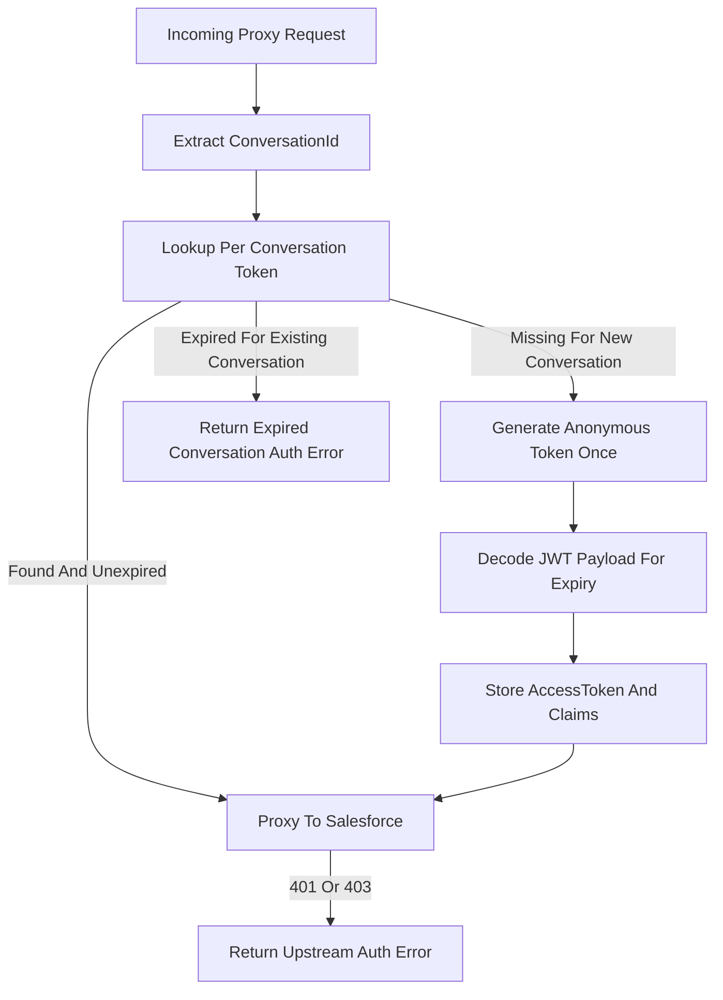

# Salesforce Livechat Session Token Plan

## Current Problem

`/Users/bugo/Documents/Developer/quack/auth-gateway/src/salesforce-livechat/client/salesforce-livechat.client.ts` currently reads and writes one `accessToken` for `tenantId + SALESFORCE_LIVECHAT`. Datadog shows the token generation itself succeeds, but retrying the same existing-conversation request with a newly minted anonymous token usually returns `403 Permission Denied`.

That means the token is not tenant-scoped. It is tied to the anonymous Salesforce identity that created or owns the conversation. Manual tests confirm that calling the same unauthenticated endpoint again, even with the same `deviceId`, returns a different `sub`, `clientId`, and `clientSessionId`. So a replacement token is not an equivalent refresh token for an existing conversation.

## Proposed Design

- Add a livechat-specific per-conversation token store instead of using `getAccessTokenByTenantId()` for livechat.
- Key tokens by `tenantId + integrationName + conversationId`, where `conversationId` is derived in this order:
  - explicit header if we choose to add one later, for example `x-salesforce-livechat-session-id`
  - `conversationId` from request body, used by `iamessage/v1/conversation`
  - conversation UUID parsed from proxied URLs like `iamessage/v1/conversation/{id}` and `iamessage/v1/queries/conversation/{id}/entries`
- Store only what the v1 unauthenticated endpoint actually returns plus decoded JWT metadata:
  - `accessToken`
  - `lastEventId`
  - `expiresAt` from decoded JWT `exp`
  - `ttl` from decoded JWT `exp`
  - optional `tokenClaims` decoded from the JWT for diagnostics only: `sub`, `deviceId`, `clientId`, `clientSessionId`, `channelAddId`, `iat`, `exp`
  - `createdAt`/`updatedAt`
- For requests without a usable `conversationId`, do not fall back to tenant-wide caching. Authenticate without persisting only for endpoints that are genuinely not conversation-bound; otherwise fail fast with a clear log because storing such a token tenant-wide recreates the current bug.

## Files To Change

- `/Users/bugo/Documents/Developer/quack/auth-gateway/src/salesforce-livechat/client/salesforce-livechat.client.types.ts`
  - Extend auth response type to include `lastEventId`.
  - Add types for `SalesforceLivechatTokenClaims`, `SalesforceLivechatConversationToken`, and `conversationId` on proxy params.
- `/Users/bugo/Documents/Developer/quack/auth-gateway/src/salesforce-livechat/service/salesforce-livechat.service.ts`
  - Extract `conversationId` from request body/path/header before calling the client.
  - Pass `conversationId` into `SalesforceLivechatProxyParams`.
  - Validate required metadata more completely: `v2_subdomain`, `organizationId`, and `developerName`.
- `/Users/bugo/Documents/Developer/quack/auth-gateway/src/salesforce-livechat/client/salesforce-livechat.client.ts`
  - Replace livechat use of `getAccessTokenByTenantId()` with `getSalesforceLivechatConversationToken()`.
  - Store conversation auth via `putSalesforceLivechatConversationToken()` after successful auth for a conversation.
  - Decode JWT payload locally to derive `expiresAt`/`ttl` and optional diagnostics. Do not verify the signature; Salesforce remains the authority when the token is used.
  - Do not re-auth on `401` or `403` for an existing conversation. Log tenant, URL, conversationId presence, token expiry state, and upstream payload, then throw the original error.
- `/Users/bugo/Documents/Developer/quack/auth-gateway/src/dynamo/dynamo.service.ts`
  - Add livechat-specific read/write/delete helpers for per-conversation token items in the existing `INTEGRATION_TABLE_NAME`.
  - Use a collision-free primary key like `chat-conversation::salesforce_livechat::{tenantId}::{conversationId}` and direct `GetCommand` by id.
  - Do not change or delete the existing tenant integration item `chat::salesforce_livechat::{tenantId}`; keep its old `accessToken` for reference during rollout.
- `/Users/bugo/Documents/Developer/quack/auth-gateway/src/config/envs-schema.ts`
  - No new table env var is needed if we reuse `INTEGRATION_TABLE_NAME`.

## Recommended Storage Choice

Use the existing `INTEGRATION_TABLE_NAME`, but create **new token items** rather than adding a session map to the existing integration item.

- Primary key `id`: `chat-conversation::salesforce_livechat::{tenantId}::{conversationId}`
- Required item fields: `tenantID`, `owner`, `type`, `entityType`, `integrationName`, `conversationId`, `accessToken`, `lastEventId`, `expiresAt`, `ttl`, `createdAt`, `updatedAt`
- Optional diagnostics field: `tokenClaims` with decoded JWT fields such as `sub`, `deviceId`, `clientId`, `clientSessionId`, `channelAddId`, `iat`, `exp`

Avoid setting `name: salesforce_livechat` on these token items. Current integration lookup queries by `tenantID`, `owner`, and `name`; if token items reuse the same `name`, existing helpers such as `getIntegrationByTenantIdAndName()` could accidentally see token records as integration records. Use `entityType: salesforce_livechat_conversation_token` plus `integrationName: salesforce_livechat` instead.

Keep the existing tenant-wide integration row as-is:

- Existing id: `chat::salesforce_livechat::{tenantId}`
- Existing `accessToken`: preserved for comparison/debugging during rollout
- New client code should stop reading this field for livechat proxy authorization

## Retry Semantics

- New conversation request with `conversationId` and no stored token:
  - authenticate once
  - decode JWT payload for `exp`
  - store the exact token under `tenantId + conversationId`
  - proxy the request
- Existing conversation request with stored unexpired token:
  - reuse the stored token exactly
  - proxy the request
- Existing conversation request with missing or expired token:
  - do not silently mint a replacement anonymous identity
  - return/log a clear expired or missing conversation auth error unless the request is known to be a new conversation create
- On `401` or `403` from Salesforce for an existing conversation:
  - do not re-auth
  - throw upstream error as-is
  - log enough structured context to identify whether this is expiry, permission/configuration, missing token, or session ownership

This avoids converting an expired or invalid conversation token into a different anonymous Salesforce identity that cannot access the original conversation.

## API Version Follow-Up

Current code uses `/iamessage/v1/authorization/unauthenticated/accessToken`. Salesforce's current docs show `/iamessage/api/v2/authorization/unauthenticated/access-token` with `esDeveloperName`, `platform`, optional `deviceId`, and `context`.

I would not mix the endpoint migration into the first fix unless we verify all current proxied endpoints are also ready for `/api/v2`. The safe sequence is:

- First fix token ownership and retry behavior using the current endpoint.
- Persist only `accessToken`, `lastEventId`, decoded `exp`, and optional decoded token claims.
- Then add a separate migration plan for Salesforce's v2 API shape if needed.

## Tests And Validation

- Add unit tests for session key extraction:
  - body `conversationId`
  - URL `conversation/{id}`
  - URL `queries/conversation/{id}/entries`
  - missing `conversationId`
- Add client tests for:
  - token lookup by `tenantId + conversationId`
  - auth and store on missing token
  - JWT decode derives `expiresAt` and handles invalid JWT defensively
  - `401` does not call `authenticate()` for an existing conversation
  - `403` does not call `authenticate()` for an existing conversation
  - upstream auth errors surface the original upstream response
- Add Dynamo tests for the new session-token helper methods.
- Validate in Datadog after release:
  - `failed to proxy request to salesforce livechat after retry` should drop sharply
  - `received auth failure...` should no longer be paired with mass `403 Permission Denied`
  - new logs should show any remaining `403` grouped by endpoint and session-key presence

## Rollout

- Ship behind a small feature flag if config infrastructure supports it, for example `SALESFORCE_LIVECHAT_SESSION_TOKEN_CACHE_ENABLED`.
- Enable for `eu` first, because Datadog evidence shows the failures are there.
- Keep the existing tenant-wide token field untouched for core Salesforce and avoid changing `/Users/bugo/Documents/Developer/quack/auth-gateway/src/salesforce/client/salesforce.client.ts`.
- Once stable, delete or ignore the old livechat tenant-wide `accessToken` path so future livechat code cannot accidentally reuse it.
