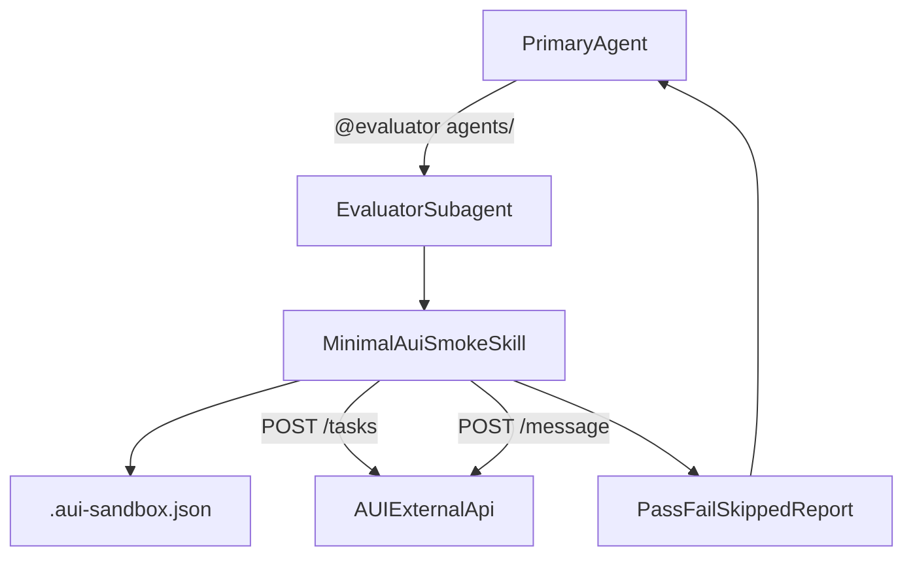

# Replace Evals With Direct AUI Smoke Tests

## Goal

Keep the existing `@evaluator` handoff and sandbox metadata contract, but rewrite the evaluator workflow so it tests deployed agent changes by calling the AUI external API directly instead of generating `.eval-suite.generated.json` and running `npx aui-evals`.

## Existing Facts To Reuse

- `[src/lib/sandbox-metadata.ts](/Users/bugo/Documents/Developer/aui/agent-builder-bff/src/lib/sandbox-metadata.ts)` already provisions everything the evaluator needs for direct AUI calls: `agentId`, `baseUrl`, and `networkApiKey` in `/home/user/project/.aui-sandbox.json`.
- `[benchmarks-v3/helpers/aui-api.ts](/Users/bugo/Documents/Developer/aui/agent-builder-bff/benchmarks-v3/helpers/aui-api.ts)` already contains the minimal working request shape for `POST /tasks`, `POST /message?is_external_api=true&include_trace_info=true`, response-text extraction, and optional trace fetch.
- `[sandbox-templates/agent-builder-subagents/.opencode/agents/evaluator.md](/Users/bugo/Documents/Developer/aui/agent-builder-bff/sandbox-templates/agent-builder-subagents/.opencode/agents/evaluator.md)` currently hardcodes the old flow: load `aui-evals`, generate a suite, run `npx aui-evals`, then read results.
- `[sandbox-templates/agent-builder-subagents/.opencode/skills/aui-evals/SKILL.md](/Users/bugo/Documents/Developer/aui/agent-builder-bff/sandbox-templates/agent-builder-subagents/.opencode/skills/aui-evals/SKILL.md)` is large because it defines suite generation, strict eval criteria, and result reading; this is the file to simplify in place.

## Planned Changes

- Rewrite `[sandbox-templates/agent-builder-subagents/.opencode/skills/aui-evals/SKILL.md](/Users/bugo/Documents/Developer/aui/agent-builder-bff/sandbox-templates/agent-builder-subagents/.opencode/skills/aui-evals/SKILL.md)` in place as a minimal direct-testing skill:
  - Keep the same file path to avoid broader wiring churn.
  - Define a tiny workflow only:
    1. read `agents/<folder>/agent.aui.json`
    2. read `/home/user/project/.aui-sandbox.json`
    3. create one task with `POST /tasks`
    4. send one or more targeted messages with `POST /message?is_external_api=true&include_trace_info=true`
    5. inspect `text` / `message` / `response` and `executed_workflows`
    6. optionally build the playground URL for human inspection
    7. return a short PASS/FAIL/SKIPPED markdown report
  - Use inline `node` snippets with built-in `fetch` and `crypto.randomUUID()` so no package, script, or runtime dependency is added.
  - Hardcode the current cluster key `VVAjnrSEfndoVvVJTGhGaPsTbJBhiLxH` in the skill for now, with a short note that the repo already hardcodes the same value in `[benchmarks-v3/config.ts](/Users/bugo/Documents/Developer/aui/agent-builder-bff/benchmarks-v3/config.ts)`.
  - Remove all `.eval-suite.generated.json`, `npx aui-evals validate`, `_summary.md`, and `_results.json` instructions.
- Update `[sandbox-templates/agent-builder-subagents/.opencode/agents/evaluator.md](/Users/bugo/Documents/Developer/aui/agent-builder-bff/sandbox-templates/agent-builder-subagents/.opencode/agents/evaluator.md)`:
  - Keep the `@evaluator agents/<folder>` contract.
  - Replace the current “generate suite / run `npx aui-evals`” job list with “load minimal AUI smoke skill / create task / send targeted test messages / return report”.
  - Expand allowed commands from the current eval-only allowlist to include `node *` (and keep `jq`, `python3`, `test`, `ls`, `cat` as needed) so the subagent can make direct HTTP calls via inline Node.
  - Preserve the read-only guarantees for `.aui.json` and `memory/`.
- Update `[sandbox-templates/agent-builder-subagents/EVALUATE.md](/Users/bugo/Documents/Developer/aui/agent-builder-bff/sandbox-templates/agent-builder-subagents/EVALUATE.md)`:
  - Replace the description of the post-push evaluator from “deep eval suite generated from config” to “direct smoke test against the deployed agent using the AUI external API”.
  - Keep the existing metadata-file explanation because it is still the auth mechanism for the new flow.
  - Adjust report-outcome language so it refers to smoke tests rather than generated suite criteria.
- Optionally trim `[sandbox-templates/agent-builder-subagents/.opencode/skills/validate-and-push/SKILL.md](/Users/bugo/Documents/Developer/aui/agent-builder-bff/sandbox-templates/agent-builder-subagents/.opencode/skills/validate-and-push/SKILL.md)` only if needed for wording consistency:
  - If the PASS/FAIL/SKIPPED contract stays the same, leave behavior unchanged.
  - Only update phrasing that explicitly depends on `@aui.io/evals` or generated-suite terminology.

## Intended Runtime Shape

## Why This Is The Minimal Path

- No new dependencies: reuse Node 24 `fetch` instead of `@aui.io/evals` or new SDKs.
- No BFF change required: current sandbox metadata already carries `baseUrl` and `networkApiKey`.
- No template/package churn required unless we later choose to remove stale eval-related wording; the direct-test flow can live entirely in the existing skill path and evaluator contract.
- The only behavioral change is swapping “generate synthetic suite” for “open a live task and send targeted messages”, which directly matches the user’s goal of testing what changed.

## Validation After Implementation

- Rebuild the `agent-builder-subagents` template so new sandboxes get the rewritten skill.
- Run one known change such as “limit the number of items in cart to 3” and confirm the evaluator:
  - creates a task successfully,
  - sends the targeted test message(s),
  - returns a report with the raw reply summary and playground URL,
  - no longer emits `.eval-suite.generated.json` or greeting-only synthetic suites.
