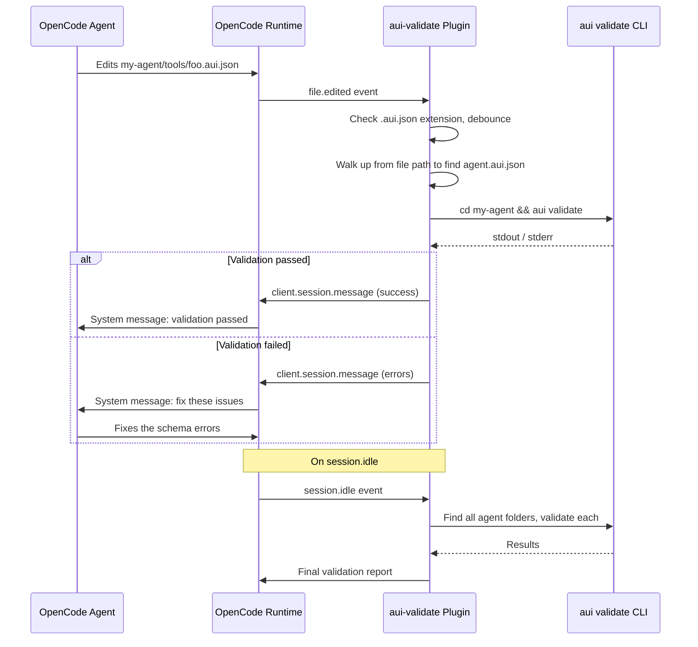

# OpenCode AUI Validation Plugin

## Context

The OpenCode agent inside E2B sandboxes edits `.aui.json` files to build AUI agents. Currently there is no automated feedback loop -- the agent can produce invalid schemas without knowing. This plugin will fire `aui validate` (from within the agent folder) on every `.aui.json` edit and feed errors/success back to the agent via `client.session.message`, enabling self-correction within the same conversation turn.

All changes live inside the sandbox template at `sandbox-templates/agent-builder/`. Nothing changes in the Next.js app itself.

## Architecture



## File Changes

### 1. CREATE `sandbox-templates/agent-builder/.opencode/plugins/aui-validate.js`

New plugin file with two event handlers:

- `**file.edited**`: Triggers on `.aui.json` edits. Skips `example-agent/` (read-only reference). Debounces at 1500ms. Walks up from the edited file path to find the nearest directory containing `agent.aui.json` (the agent root). Runs `cd <agent-root> && aui validate` and parses the stdout to determine result.
- `**session.idle**`: Finds all agent folders (directories containing `agent.aui.json`, excluding `example-agent/`) via `find`. Validates each one and reports results. Serves as a final sweep to catch anything the debounce might have skipped.

Key implementation details:

- `**aui validate` always exits 0 -- it never throws. The plugin must parse stdout to detect errors/warnings:
  - Look for `Errors:\s+(\d+)` in the Summary section; if > 0, it's a failure
  - Look for `Warnings:\s+(\d+)` in the Summary section; if > 0, include them as non-blocking suggestions
  - Final line is either `✓ Validation passed!` or `✗ Validation failed with N error(s)`
- No try/catch for validation logic -- the `$` call will always succeed. Instead, parse the output string after every run
- Uses Node.js `path.dirname` and `fs.existsSync` to walk up the directory tree and locate the agent root folder
- The `$` shell executor runs `aui validate` from within the agent folder (since `aui validate` must be run from inside the agent directory)
- Debounce prevents validation spam when the agent edits multiple files in quick succession
- Warnings are fed to the agent framed as non-blocking suggestions ("consider fixing"), while errors are framed as blocking ("fix before continuing")

### 2. MODIFY `[sandbox-templates/agent-builder/opencode.json](sandbox-templates/agent-builder/opencode.json)`

Add the `plugin` array to register the validation plugin:

```json
{
  "$schema": "https://opencode.ai/config.json",
  "model": "anthropic/claude-sonnet-4-5",
  "provider": { ... },
  "plugin": ["./.opencode/plugins/aui-validate"]
}
```

### 3. MODIFY `[sandbox-templates/agent-builder/template.ts](sandbox-templates/agent-builder/template.ts)`

Two additions to the E2B template build chain:

1. Add `.opencode/plugins` to the `mkdir -p` command (line 10-12) so the destination directory exists before copying
2. Add a `.copy()` call for the plugin file: `.copy(".opencode/plugins/aui-validate.js", ".opencode/plugins/aui-validate.js")`

## No Other Changes Required

- `.gitignore` does not block `.opencode` directories -- the plugin file will be committed
- The export route (`[src/app/api/sessions/[id]/export/route.ts](src/app/api/sessions/[id]/export/route.ts)` line 16) already excludes `.opencode/*` from exports, so the plugin will not leak into user-exported agent bundles
- `aui-agent-builder` is already installed globally in the sandbox via `template.ts` line 7, so `aui validate` is available on PATH
