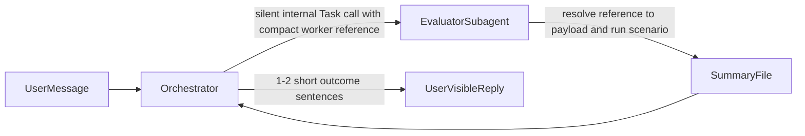

# Prompt-Only Orchestrator Silence Plan

## Goal

Stop the orchestrator from exposing internal orchestration details such as `I'll...` narration, payload paths, and trivial worker completions, while keeping concise user-facing results.

## Approach

Use prompt and contract changes only.

- Keep runtime forwarding unchanged in [src/app/api/sessions/[id]/chat/route.ts](src/app/api/sessions/[id]/chat/route.ts). That route forwards any assistant `text` part directly to the client, so the prompt layer must prevent those parts from being produced.

```355:360:src/app/api/sessions/[id]/chat/route.ts
} else if (part?.type === "text") {
  const content = props.delta ?? part.text ?? "";
  if (content) {
    collectedAgentOutput += content;
    sendEvent({ type: "text", content });
  }
}
```

- Minimize what can leak at dispatch time by changing the orchestrator-worker transport in [sandbox-templates/agent-builder-subagents/.opencode/skills/validate-and-push/SKILL.md](sandbox-templates/agent-builder-subagents/.opencode/skills/validate-and-push/SKILL.md): replace the current absolute payload-path prompt with the smallest deterministic worker reference needed to recover the payload (for example a compact `run_id + scenario_id` reference instead of a full path or JSON blob).
- Keep the worker contract transport-agnostic in [sandbox-templates/agent-builder-subagents/.opencode/skills/aui-evals/SKILL.md](sandbox-templates/agent-builder-subagents/.opencode/skills/aui-evals/SKILL.md): the worker receives orchestrator input via `Task.prompt`, resolves it into the standard payload object, writes the summary, and emits no user-facing text.
- Tighten the orchestrator silence rules in [sandbox-templates/agent-builder-subagents/.opencode/skills/validate-and-push/SKILL.md](sandbox-templates/agent-builder-subagents/.opencode/skills/validate-and-push/SKILL.md) and [src/lib/subagent-output-prompt.ts](src/lib/subagent-output-prompt.ts) with explicit negative examples (`Let me first check...`, raw prompt echoes, `Done.`) and explicit positive final-answer examples (one short outcome sentence, optional one short smoke-test sentence).
- Align supporting docs/prompts in [sandbox-templates/agent-builder-subagents/.opencode/agents/evaluator.md](sandbox-templates/agent-builder-subagents/.opencode/agents/evaluator.md) and [sandbox-templates/agent-builder-subagents/EVALUATE.md](sandbox-templates/agent-builder-subagents/EVALUATE.md) so they reinforce the same separation: orchestrator owns transport, worker owns execution, neither surfaces internal worker input.

## Proposed Flow



## Validation

- Re-run one representative change flow and inspect the SSE trace.
- Confirm there are no user-facing `text` events containing:
  - setup narration like `I'll...` or `Let me...`
  - worker references, payload paths, or raw payload content
  - trivial worker completions like `Done.`
- Confirm the final reply is still informative, e.g. one short sentence about the behavior change plus an optional smoke-test result sentence.

## Residual Risk

Because we are not adding runtime filtering, this remains a prompt-only solution. It should reduce leaks substantially by removing sensitive prompt content and tightening silence rules, but it cannot guarantee suppression as strongly as a runtime guard would.
