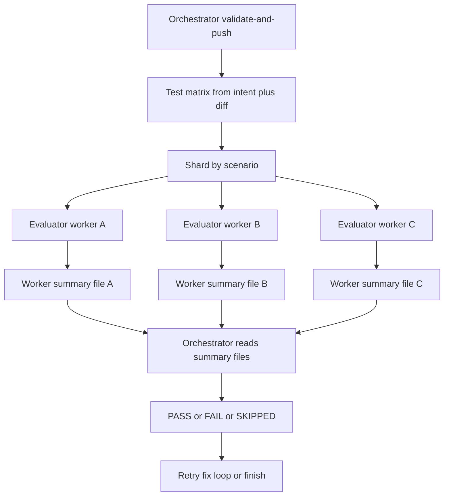

# Parallel Evaluator Fan-Out

## Goal

Reduce post-push evaluation time by having the orchestrator design the needed smoke-test scenarios once, then fan them out to multiple evaluator workers in parallel. Keep the current snapshot / revert safety model, but run the full parallel batch on the initial smoke test and on every retry in the fix loop. Each evaluator worker must write its own summary file so the orchestrator can aggregate results deterministically from disk instead of relying only on subagent chat output.

## Current Bottleneck

Today the flow is serialized:

- `[sandbox-templates/agent-builder-subagents/.opencode/skills/validate-and-push/SKILL.md](/Users/bugo/Documents/Developer/aui/agent-builder-bff/sandbox-templates/agent-builder-subagents/.opencode/skills/validate-and-push/SKILL.md)` calls a single `@evaluator` after push.
- `[sandbox-templates/agent-builder-subagents/.opencode/skills/aui-evals/SKILL.md](/Users/bugo/Documents/Developer/aui/agent-builder-bff/sandbox-templates/agent-builder-subagents/.opencode/skills/aui-evals/SKILL.md)` makes that evaluator do both jobs: design the test set and execute it.
- `[sandbox-templates/agent-builder-subagents/.opencode/agents/evaluator.md](/Users/bugo/Documents/Developer/aui/agent-builder-bff/sandbox-templates/agent-builder-subagents/.opencode/agents/evaluator.md)` is written for a single worker, single report.

That means planning, execution, and retries are all bottlenecked on one subagent.

## Proposed Runtime Shape



## Design Rules

- The orchestrator owns **test planning**.
- The evaluator owns **scenario execution only**.
- The evaluator writes a **machine-readable summary file** for its assigned scenario; the orchestrator treats that file as the source of truth.
- A shard is a full scenario, not a single turn.
  - Example: a cart-limit check stays one worker job containing all setup, positive, and overflow turns on the same task.
  - Do not split a 5-turn stateful scenario across workers.
- Use a bounded worker pool, default **2-3 parallel workers**.
- Re-run a fresh parallel batch on **every retry** in the autonomous fix loop, per your choice.
- Give every batch a `run_id` and every worker a deterministic output path, for example `/home/user/project/.eval-runs/<run_id>/<scenario_id>.json`.
- Final batch result:
  - `PASS` only if every non-skipped worker passes.
  - `FAIL` if any worker fails.
  - `SKIPPED` only if no worker could run and the aggregate reason is environmental.

## File Changes

- Update `[sandbox-templates/agent-builder-subagents/.opencode/skills/validate-and-push/SKILL.md](/Users/bugo/Documents/Developer/aui/agent-builder-bff/sandbox-templates/agent-builder-subagents/.opencode/skills/validate-and-push/SKILL.md)`
  - Add an orchestrator-side "build test matrix" step after push.
  - Define a small scenario schema for each shard: `scenario_id`, `goal`, `turns`, `expected_outcome`, `probe_type` (`POSITIVE` / `NEGATIVE` / `SETUP` mix inside the scenario), and `why_this_scenario_exists`.
  - Add a batch `run_id`, create a per-run output directory, and pass each worker an explicit `summary_file` path.
  - Replace single `@evaluator agents/<folder> intent: ...` with parallel fan-out over scenario shards.
  - Add aggregation rules that read the worker summary files from disk and make the fix loop rerun the full parallel batch after each retry.
  - Preserve snapshot / revert behavior exactly.
- Update `[sandbox-templates/agent-builder-subagents/.opencode/skills/aui-evals/SKILL.md](/Users/bugo/Documents/Developer/aui/agent-builder-bff/sandbox-templates/agent-builder-subagents/.opencode/skills/aui-evals/SKILL.md)`
  - Move scenario-design responsibility out of the evaluator skill.
  - Rewrite the contract so the worker receives an explicit scenario payload from the orchestrator and only:
    - checks preconditions,
    - runs the assigned scenario,
    - grades against the explicit expected outcome,
    - writes a worker summary file,
    - returns only a short acknowledgement pointing at the file path.
  - Keep direct AUI API execution via `/tasks` and `/message`.
- Update `[sandbox-templates/agent-builder-subagents/.opencode/agents/evaluator.md](/Users/bugo/Documents/Developer/aui/agent-builder-bff/sandbox-templates/agent-builder-subagents/.opencode/agents/evaluator.md)`
  - Reframe it as a worker subagent, not a planner.
  - Document the new invocation payload shape from the orchestrator.
  - Require the worker to persist a summary file containing enough data for orchestrator aggregation.
  - Keep it read-only.
  - Verify whether the runtime can invoke the same worker alias multiple times in parallel; if not, add fixed worker aliases like `evaluator-a`, `evaluator-b`, `evaluator-c` that all share the same skill contract.
- Update `[sandbox-templates/agent-builder-subagents/EVALUATE.md](/Users/bugo/Documents/Developer/aui/agent-builder-bff/sandbox-templates/agent-builder-subagents/EVALUATE.md)`
  - Document that the orchestrator now plans scenarios and runs them through parallel evaluator workers.
  - Explain that stateful scenarios stay intact within one worker.
  - Document aggregate PASS/FAIL/SKIPPED semantics.
- Review `[sandbox-templates/agent-builder-subagents/opencode.json](/Users/bugo/Documents/Developer/aui/agent-builder-bff/sandbox-templates/agent-builder-subagents/opencode.json)` only if needed
  - Likely no permission change is required for the worker itself.
  - If the runtime needs explicit multi-worker aliases, ensure they are included in the template files copied into the sandbox.

## File-Based Aggregation Contract

Each evaluator worker should write one JSON file, for example:

```json
{
  "run_id": "<batch-run-id>",
  "scenario_id": "<scenario-id>",
  "scenario_goal": "<short goal>",
  "agent_id": "<agent-id>",
  "task_id": "<aui-task-id-or-null>",
  "status": "PASS | FAIL | SKIPPED",
  "coverage": {
    "positive": 1,
    "negative": 1,
    "setup": 0
  },
  "failure_reason": "<short factual reason or null>",
  "notes": ["<optional caveat>"],
  "turns": [
    {
      "role": "POSITIVE | NEGATIVE | SETUP",
      "user": "<user text>",
      "reply": "<trimmed reply>",
      "status": 200,
      "verdict": "PASS | FAIL"
    }
  ]
}
```

The orchestrator should read all worker files in the batch directory and normalize them into one batch report:

- `Batch status: PASS | FAIL | SKIPPED`
- `Workers run: N`
- `Passed: X`
- `Failed: Y`
- `Skipped: Z`
- Per-worker summary with:
  - `summary_file`
  - `scenario_id`
  - `scenario_goal`
  - `task_id`
  - `status`
  - shortest factual failure reason

This aggregate report becomes the input to the fix loop diagnosis. The orchestrator should ignore missing or malformed worker chat text and fail closed if the required summary file is absent or invalid.

## Important Edge Cases

- Stateful behaviors like cart tracking, progressive disclosure, or tool-trigger chains must remain in one scenario shard.
- Over-sharding can make evaluation slower by paying task-creation overhead too many times; keep the matrix small and scenario-driven.
- If one worker returns malformed output, the batch should fail closed, not silently pass.
- If one worker never writes its summary file, treat that worker as `FAIL` with reason `summary file missing`.
- If all workers are blocked by the same environmental problem (`401`, missing metadata, API outage), aggregate to `SKIPPED` instead of a noisy multi-fail report.
- Clean up old `.eval-runs/<run_id>/` directories on success if you do not need them for debugging, or keep only the latest few runs to avoid unbounded accumulation.

## Validation

- Rebuild the `agent-builder-subagents` template.
- Verify one simple behavior change produces:
  - a scenario matrix from the orchestrator,
  - 2-3 parallel evaluator jobs,
  - 2-3 worker summary files on disk,
  - one aggregate report derived from those files.
- Verify a stateful change like cart limit is kept in one worker shard and still checks both the allowed boundary and overflow.
- Verify the full parallel batch reruns after each fix-loop retry.
