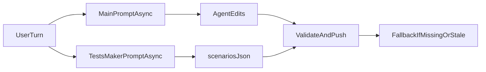

# Parallel Tests-Maker Dispatch

## What’s true today

The current system does **not** run `tests-maker` in parallel.

- [src/lib/v2-chat-prompt.ts](/Users/bugo/Documents/Developer/aui/agent-builder-bff/src/lib/v2-chat-prompt.ts) explicitly tells the main agent to dispatch `tests-maker` before editing:

```35:40:/Users/bugo/Documents/Developer/aui/agent-builder-bff/src/lib/v2-chat-prompt.ts
  const testsMakerInstruction = useSubagents
    ? `Before editing any .aui.json file in this turn, you MUST dispatch the `tests-maker` subagent ...
It will write /home/user/project/.tests-maker/${agentId}/scenarios.json. Do NOT begin editing before `tests-maker` has been dispatched on this turn.`
```

- [sandbox-templates/agent-builder-subagents/.opencode/skills/tests-maker/SKILL.md](/Users/bugo/Documents/Developer/aui/agent-builder-bff/sandbox-templates/agent-builder-subagents/.opencode/skills/tests-maker/SKILL.md) says the Task call is `fire-and-wait` and synchronous.
- [sandbox-templates/agent-builder-subagents/.opencode/agents/tests-maker.md](/Users/bugo/Documents/Developer/aui/agent-builder-bff/sandbox-templates/agent-builder-subagents/.opencode/agents/tests-maker.md) says the BFF already spawns a parallel session, but the backend does not currently do that.
- [src/app/api/sessions/[id]/chat/route.ts](/Users/bugo/Documents/Developer/aui/agent-builder-bff/src/app/api/sessions/[id]/chat/route.ts) reads `useSubagents` from the request but does **not** pass it into `buildV2PromptBody()`, while [src/app/api/sessions/poll/[id]/chat/route.ts](/Users/bugo/Documents/Developer/aui/agent-builder-bff/src/app/api/sessions/poll/[id]/chat/route.ts) does.

## Implementation

### 1. Add a backend dispatcher for `tests-maker`

Create a small OpenCode helper that can:

- create a second OpenCode session in the same sandbox directory,
- build the dedicated `tests-maker` prompt payload from the current user message, `agentId`, and agent folder,
- call `prompt_async` without blocking the main chat flow,
- log failures as non-fatal.

Likely home: a new helper under `src/lib/` reused by both chat routes.

### 2. Launch it in parallel from both OpenCode chat routes

Update both:

- [src/app/api/sessions/[id]/chat/route.ts](/Users/bugo/Documents/Developer/aui/agent-builder-bff/src/app/api/sessions/[id]/chat/route.ts)
- [src/app/api/sessions/poll/[id]/chat/route.ts](/Users/bugo/Documents/Developer/aui/agent-builder-bff/src/app/api/sessions/poll/[id]/chat/route.ts)

Behavior:

- when `provider === "opencode"`, `useSubagents === true`, and `agentId` exists, start the `tests-maker` background session before or alongside the main `prompt_async` call,
- do **not** await completion before the main agent starts,
- keep the existing fallback behavior later if `scenarios.json` is missing or stale.

### 3. Replace the prompt contract so the main agent no longer waits

Update [src/lib/v2-chat-prompt.ts](/Users/bugo/Documents/Developer/aui/agent-builder-bff/src/lib/v2-chat-prompt.ts) so it stops instructing the primary agent to dispatch `tests-maker` itself.

New intent for the prompt block:

- tell the agent that a background `tests-maker` run may already be producing `/home/user/project/.tests-maker/<agentId>/scenarios.json`,
- tell it **not** to wait on or invoke `tests-maker` via Task,
- tell it to reuse the file later during validate-and-push step 4 if present, and fall back to in-turn matrix design only if the file is absent or mismatched.

### 4. Align the sandbox skill/docs with the real runtime

Update these template files so they all describe the same architecture:

- [sandbox-templates/agent-builder-subagents/.opencode/skills/tests-maker/SKILL.md](/Users/bugo/Documents/Developer/aui/agent-builder-bff/sandbox-templates/agent-builder-subagents/.opencode/skills/tests-maker/SKILL.md)
- [sandbox-templates/agent-builder-subagents/.opencode/agents/tests-maker.md](/Users/bugo/Documents/Developer/aui/agent-builder-bff/sandbox-templates/agent-builder-subagents/.opencode/agents/tests-maker.md)
- [sandbox-templates/agent-builder-subagents/EVALUATE.md](/Users/bugo/Documents/Developer/aui/agent-builder-bff/sandbox-templates/agent-builder-subagents/EVALUATE.md)

Specifically remove the current contradiction between:

- `Task` + synchronous wait, and
- “BFF spawns you in parallel”.

After this change, the docs should consistently say:

- the BFF launches `tests-maker` in a separate OpenCode session,
- the main agent should not spawn it itself,
- the output file is best-effort and non-blocking.

### 5. Fix route parity for `useSubagents`

Even with the backend dispatcher, [src/app/api/sessions/[id]/chat/route.ts](/Users/bugo/Documents/Developer/aui/agent-builder-bff/src/app/api/sessions/[id]/chat/route.ts) should still pass `useSubagents` into `buildV2PromptBody()` so the main system prompt stays consistent with the session mode, just like the poll route already does.

## Safety / race handling

Keep the existing design where `scenarios.json` is optional input, not a hard dependency.

That means:

- background `tests-maker` failure stays non-fatal,
- the main agent never writes `.tests-maker/...` itself,
- later validation/test execution still falls back to in-turn scenario generation if the file is missing, incomplete, or no longer matches the shipped diff.

A simple safe contract is:



## Validation

After implementation, verify:

- both chat routes start the background `tests-maker` flow when `useSubagents` is on,
- the main agent prompt no longer tells the model to wait on a synchronous Task,
- sandbox template docs all describe the same architecture,
- existing post-push fallback still works if `scenarios.json` is late or absent.
