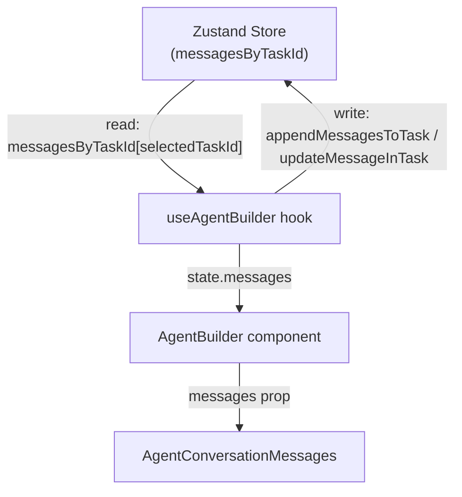

# Persist Agent Builder Conversations in Zustand Store

## Problem

Conversation messages are stored in `useState` inside [useAgentBuilder.ts](apps/operator/src/widgets/AgentBuilder/useAgentBuilder.ts) (line 20). When the `AgentBuilder` component unmounts — either by toggling `isAgentVisible` off or navigating away from the `InstructionsLayout` — all messages are lost.

The Zustand store ([useAgentBuilderStore.ts](apps/operator/src/stores/useAgentBuilderStore.ts)) already persists `agentTasksList` and `selectedAgentTaskId`, but contains **no message data**.

## Solution

Store messages in the Zustand store as a `Record<string, IAgentMessage[]>` map keyed by task ID. The hook reads/writes messages through the store instead of local state.

## Changes

### 1. Update the Zustand store (`useAgentBuilderStore.ts`)

- Export the `IAgentMessage` interface (currently duplicated in `useAgentBuilder.ts` and `AgentConversationMessages.tsx`):

```typescript
export interface IAgentMessage {
  id: string;
  role: "user" | "agent";
  text: string;
  isLoading?: boolean;
  createdAt: number;
  interactionNumber?: number;
}
```

- Add a `messagesByTaskId` map and three actions to the store state:

```typescript
messagesByTaskId: Record<string, IAgentMessage[]>;
setMessagesForTask: (taskId: string, messages: IAgentMessage[]) => void;
appendMessagesToTask: (taskId: string, messages: IAgentMessage[]) => void;
updateMessageInTask: (taskId: string, messageId: string, updater: (msg: IAgentMessage) => IAgentMessage) => void;
```

- Implement the actions using standard Zustand `set()` with immutable updates on the `messagesByTaskId` record.
- Clean up: when `setAgentTasksList` replaces the task list, orphaned task IDs can be pruned from `messagesByTaskId` to avoid memory leaks.

### 2. Refactor the hook (`useAgentBuilder.ts`)

- **Remove** the local `useState<IAgentMessage[]>` for messages (line 20).
- **Derive** `messages` from the store: read `messagesByTaskId[selectedAgentTaskId] ?? []`.
- **Refactor** `appendAssistantText` / `finishAssistantMessage` to call `updateMessageInTask(selectedAgentTaskId, ...)`.
- **Refactor** `handleSendMessage` to call `appendMessagesToTask(selectedAgentTaskId, [userMsg, assistantMsg])` instead of `setMessages(prev => [...prev, ...])`.
- **Refactor** `handleCreateTask` and identity-change cleanup to call `setMessagesForTask(taskId, [])` instead of `setMessages([])`.
- **Remove** the duplicated `IAgentMessage` interface from this file; import from the store.

### 3. Remove duplicated `IAgentMessage` from `AgentConversationMessages.tsx`

- Import `IAgentMessage` from `useAgentBuilderStore` instead of re-declaring it locally (lines 4-11 of [AgentConversationMessages.tsx](apps/operator/src/widgets/AgentBuilder/partials/AgentConversationMessages.tsx)).

## What does NOT change

- The `conversationText` and `isSendingMessage` local state in the hook remain as `useState` — these are ephemeral input states, not conversation history.
- The CLI session management, streaming logic, and all component props/rendering stay identical.
- `AgentBuilder.tsx`, `AgentConversationBox.tsx`, `AgentChatMessage.tsx`, and `AgentChatHeader.tsx` require **no changes** — they receive `messages` as a prop from the hook, and the hook will still return the same shape.

## Data flow after the change



When the user navigates away and back, `AgentBuilder` remounts, calls `useAgentBuilder`, which reads from the Zustand store — messages are still there.
