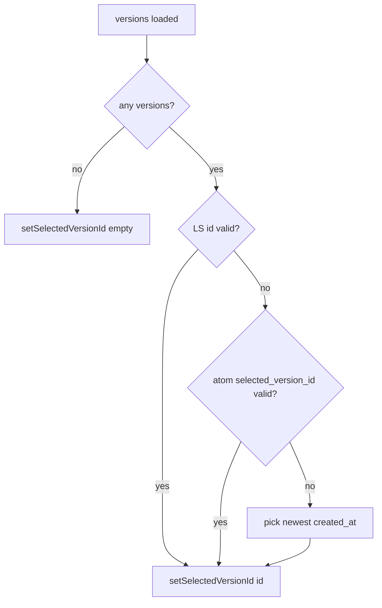

# Persist selected agent version in localStorage

## Current behavior (source of truth in code)

Selection is driven by `[useVersionDropdown.ts](apps/operator/src/components/VersionDropdown/useVersionDropdown.ts)`: Jotai `[current-agent-atom.ts](apps/operator/src/atoms/current-agent-atom.ts)` holds `selected_version_id` on `IAgentItem`, and this effect picks a value whenever versions load:

```192:217:apps/operator/src/components/VersionDropdown/useVersionDropdown.ts
  useEffect(() => {
    const availableIds = new Set(sortedVersions.map((version) => version.id));

    if (!sortedVersions.length) {
      setSelectedVersionId('');
      return;
    }

    const selectedVersionId = currentAgent?.selected_version_id || '';
    if (selectedVersionId && availableIds.has(selectedVersionId)) {
      setSelectedVersionId(selectedVersionId);
      return;
    }

    if (currentAgent?.active_version_id && availableIds.has(currentAgent.active_version_id)) {
      setSelectedVersionId(currentAgent.active_version_id);
      return;
    }

    if (liveVersion?.id) {
      setSelectedVersionId(liveVersion.id);
      return;
    }

    setSelectedVersionId(sortedVersions[0]?.id || '');
  }, [currentAgent?.active_version_id, currentAgent?.selected_version_id, liveVersion?.id, sortedVersions, setSelectedVersionId]);
```

After a full refresh, `selected_version_id` is usually missing on the agent object loaded from the API (`[useCurrentAgent.ts](apps/operator/src/hooks/useCurrentAgent.ts)` replaces the atom with `IAgentItem` from the network), so the effect falls through to **live/active** then `sortedVersions[0]` — not a stable “what the user last had open” signal.

## Target behavior

| Scenario                                                               | Expected selection                                                                                                      |
| ---------------------------------------------------------------------- | ----------------------------------------------------------------------------------------------------------------------- |
| User returns / refreshes                                               | Last version they had selected, if that version still exists in the fetched list                                        |
| First visit for that agent (no stored id, or invalid/archived-away id) | **Newest** version by `created_at` (matches “last created” / default for first entrance; explicitly **not** live-first) |
| User switches to another agent                                         | Existing agent-switch effect already clears selection; then the same rules apply for the new agent’s stored key         |

**Priority order** when resolving after `versions` are available:

1. **localStorage** (per `currentAgent.id`) if the id is in `availableIds`
2. **In-memory / API** `currentAgent.selected_version_id` if valid (same-session edge cases; harmless if usually empty on cold load)
3. **Default:** single “newest” version: pick the id with maximum `new Date(created_at).getTime()` over `versions` (tie-breaker: stable secondary sort by `id` if needed)

Remove the **live / `active_version_id` first** branches from this resolver so the only automatic default is “newest,” unless overridden by storage or an already-valid `selected_version_id`.

## Implementation approach

### 1. Small storage helper (operator)

Add a dedicated module (e.g. `[apps/operator/src/helpers/agentSelectedVersionStorage.ts](apps/operator/src/helpers/agentSelectedVersionStorage.ts)`) to avoid scattering magic strings and to wrap `JSON.parse` in try/catch (corrupt storage → treat as empty map):

- **Key:** a single namespaced string, e.g. `operator-agent-selected-version`
- **Value:** `Record<agentId, versionId>` (same pattern as `[useLocalSelectedTask.ts](apps/operator/src/hooks/useLocalSelectedTask.ts)`’s `lastSelectedTasks` object)
- **API:** `getPersistedVersionId(agentId: string): string | null`, `setPersistedVersionId(agentId: string, versionId: string): void`
- Do **not** write when `versionId` is empty (agent switch clears selection with `''` in `[useVersionDropdown.ts](apps/operator/src/components/VersionDropdown/useVersionDropdown.ts)` lines 154–190 — must not wipe the stored preference for that agent)

### 2. Write path: centralize on `setSelectedVersionId`

Extend `[useSetSelectedVersionIdAtom](apps/operator/src/atoms/current-agent-atom.ts)` so that whenever `selectedVersionId` is non-empty and `prev?.id` exists, call `setPersistedVersionId(prev.id, selectedVersionId)`. That covers:

- Dropdown change (`[handleSelectChange](apps/operator/src/components/VersionDropdown/useVersionDropdown.ts)`)
- Create draft (`[handleCreateSubmit](apps/operator/src/components/VersionDropdown/useVersionDropdown.ts)`)
- Publish + activate (`[handlePublishVersionConfirm](apps/operator/src/components/VersionDropdown/useVersionDropdown.ts)`)
- Revert to published (`[handleRevertToPublishedVersion](apps/operator/src/components/VersionDropdown/useVersionDropdown.ts)`)

No need to duplicate writes in each handler.

### 3. Read path: update the resolver `useEffect`

In `[useVersionDropdown.ts](apps/operator/src/components/VersionDropdown/useVersionDropdown.ts)`, replace the body of the resolver effect with the priority list above:

- Read persisted id for `currentAgent.id`
- Drop `liveVersion` / `active_version_id` default branches
- Replace `sortedVersions[0]` fallback with explicit newest-by-`created_at` over `versions` (or `sortedVersions` mapped back to ids — use the full `versions` list so ordering matches “newest created,” not dropdown sort order)
- Trim `useEffect` dependencies: remove `liveVersion?.id` and `currentAgent?.active_version_id` if no longer used in that effect

### 4. Validation

- Run `nx lint operator` on the touched files.

## Flow (mermaid)



## Out of scope / assumptions

- **Per-agent** scope is assumed (storage key includes agent id). If you need **per network + agent**, say so — that would change the map key shape.
- **“Newest”** is defined as latest `created_at`. If product intent is instead highest `version_number` / `version_revision_number`, that would be a one-line change in the default picker.
