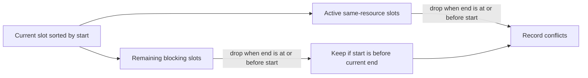

# Prune slots that can no longer conflict

Change only [`server/src/slots/slots.service.ts`](server/src/slots/slots.service.ts), inside `annotateConflicts`.

Own slots are already ordered by `s.start`. Overlap is `a.start < b.end && a.end > b.start`, and touching ranges do not conflict ([REQUIREMENTS.md](REQUIREMENTS.md)). Once `current.start >= other.end`, that other slot cannot overlap the current slot or any later own slot.

## Active slots

This filter is already correct and should stay:

```91:91:server/src/slots/slots.service.ts
    active = active.filter((other) => other.end > slot.start);
```

Because own slots are sorted by start, every slot still in `active` overlaps the current one. No extra overlap check is needed there.

## Blocking slots

Blocking slots are not ordered against the current slot, and the loop still scans the full list every time:

```98:102:server/src/slots/slots.service.ts
    for (const blocking of blockingSlots) {
      if (blocking.start < slot.end && blocking.end > slot.start) {
        slot.conflicts!.push({ ...blocking, conflicts: [] });
      }
    }
```

Keep a local working list (do not mutate the query result in place) and apply the same expiry rule before the overlap check:

- `let blockers = blockingSlots`
- each iteration: `blockers = blockers.filter((other) => other.end > slot.start)`
- among what remains, a conflict is only `blocking.start < slot.end` (`blocking.end > slot.start` is already true)

A blocker that starts after the current slot ends must stay in `blockers`. A later own slot can still overlap it. Only an ended blocker is safe to drop.


