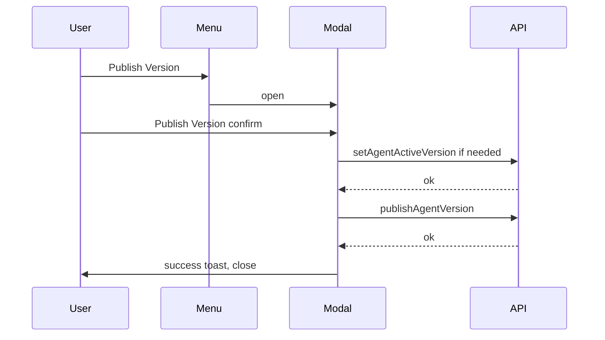

# Combine publish with activate (modal confirm)

## Current behavior

- [VersionActionsMenuItems.tsx](apps/operator/src/components/VersionDropdown/partial/VersionActionsMenuItems.tsx) renders two items: **Publish Version** (opens modal via `onOpenPublishVersion`) and **Activate Version** (`onActivateVersion` → `[handleActivateVersion](apps/operator/src/components/VersionDropdown/useVersionDropdown.ts)`).
- `[handlePublishVersionConfirm](apps/operator/src/components/VersionDropdown/useVersionDropdown.ts)` only calls `publishAgentVersion`; `[handleActivateVersion](apps/operator/src/components/VersionDropdown/useVersionDropdown.ts)` only calls `setAgentActiveVersion` and updates selected version.

## Target behavior

- **Single menu entry** for going live: keep **Publish Version** only; remove **Activate Version** from the shared menu renderer.
- **On modal confirm** (`handlePublishVersionConfirm`): resolve `versionId` as today (`publishModalVersionId ?? currentAgent?.selected_version_id`). Then:
  1. If `versionId !== currentAgent.active_version_id`, `await setAgentActiveVersion({ urlParams: { id: currentAgent.id }, active_version_id: versionId })`, then invalidate `current-agent` (same as current activate path) and `setSelectedVersionId(versionId)`.
  2. `await publishAgentVersion({ ... })` with existing `urlParams` / `published_by`.
  3. Keep existing version-list + `current-agent` invalidations and success handling after publish; use **one** success toast (e.g. keep “Version published successfully” only, avoid duplicate activate toast).
- **If step 1 fails**: show the existing-style activate error and **do not** call publish.
- **If step 2 fails after step 1 succeeded**: show publish error (user may be in a partially updated state; ordering still matches backend dependency).

## UI / props cleanup

- [VersionActionsMenuItems.tsx](apps/operator/src/components/VersionDropdown/partial/VersionActionsMenuItems.tsx): drop `onActivateVersion`, `isActivateDisabled`, and the second `MenuItem`.
- [VersionActionsButton.tsx](apps/operator/src/components/VersionDropdown/partial/VersionActionsButton.tsx): remove activate-related props; pass only publish/edit/archive props into `renderVersionActionsMenuItems`.
- [VersionDropdown.tsx](apps/operator/src/components/VersionDropdown/VersionDropdown.tsx): stop destructuring/passing `handleActivateVersion`, `isActivateDisabled`, `isActivateDisabledForVersion` into `VersionActionsButton` / `VersionHistoryPanel`.
- [VersionHistoryRow.tsx](apps/operator/src/components/VersionDropdown/partial/VersionHistoryRow.tsx) + [VersionHistoryPanel.tsx](apps/operator/src/components/VersionDropdown/partial/VersionHistoryPanel.tsx): remove `onActivateVersion`, `isActivateDisabled` / `isActivateDisabledForVersion` props and the wrapper that called `onActivateVersion(version)`.
- [useVersionDropdown.ts](apps/operator/src/components/VersionDropdown/useVersionDropdown.ts): remove `handleActivateVersion`, `isActivateDisabled`, and `isActivateDisabledForVersion` (and their exports in the hook return) once unused; extend `handlePublishVersionConfirm` dependencies to include `setAgentActiveVersion` and `setSelectedVersionId`.

## Modal loading state

- [VersionDropdown.tsx](apps/operator/src/components/VersionDropdown/VersionDropdown.tsx): pass `isLoading={isPublishingVersion || isActivatingVersion}` to [PublishVersionModal](apps/operator/src/components/VersionDropdown/partial/PublishVersionModal.tsx) so the confirm button shows loading during the full chain.

## Files touched (summary)

| Area           | File                                                                                                                                                                                                         |
| -------------- | ------------------------------------------------------------------------------------------------------------------------------------------------------------------------------------------------------------ |
| Orchestration  | [useVersionDropdown.ts](apps/operator/src/components/VersionDropdown/useVersionDropdown.ts)                                                                                                                  |
| Menu items     | [VersionActionsMenuItems.tsx](apps/operator/src/components/VersionDropdown/partial/VersionActionsMenuItems.tsx)                                                                                              |
| Actions button | [VersionActionsButton.tsx](apps/operator/src/components/VersionDropdown/partial/VersionActionsButton.tsx)                                                                                                    |
| Wiring         | [VersionDropdown.tsx](apps/operator/src/components/VersionDropdown/VersionDropdown.tsx)                                                                                                                      |
| History        | [VersionHistoryRow.tsx](apps/operator/src/components/VersionDropdown/partial/VersionHistoryRow.tsx), [VersionHistoryPanel.tsx](apps/operator/src/components/VersionDropdown/partial/VersionHistoryPanel.tsx) |

## Validation

- Run `nx lint operator` (and fix any unused imports/types from removed props).
