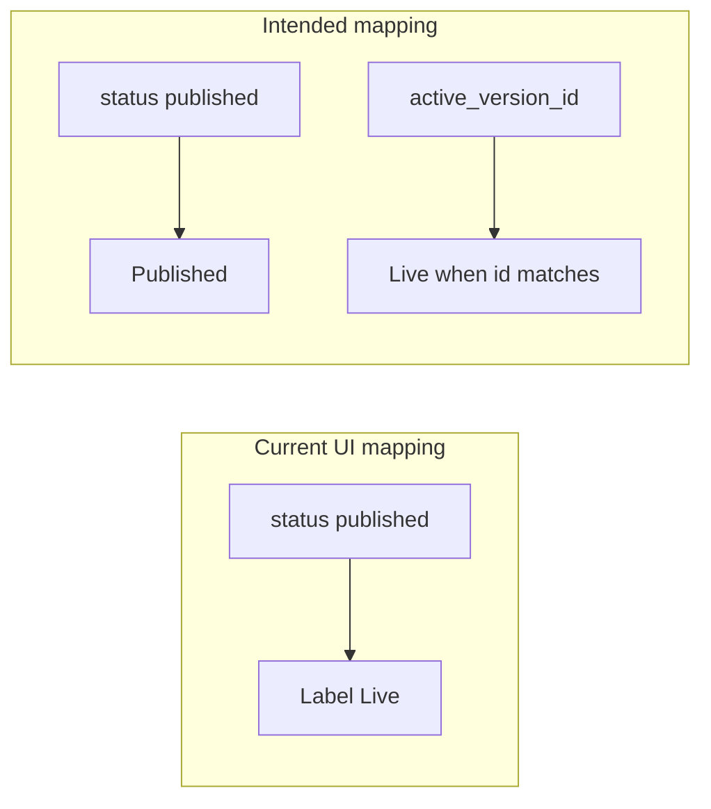

# Published vs Live: model and implementation direction

## Opinion

Separating **Published** and **Live** is the right model when multiple rows can keep `status === 'published'` while only one is **activated** (the one in current agent state, `[active_version_id](apps/operator/src/atoms/current-agent-atom.ts)` / agent payload).

- **Published** answers: “Has this version ever been deployed / released?”
- **Live** answers: “Is this the version currently serving traffic / selected as active?”

That matches how `[useSetAgentActiveVersion](apps/operator/src/components/VersionDropdown/useVersionDropdown.ts)` already treats activation separately from the publish mutation.

You **do not have to** add a fourth API status (`live`) unless product or backend needs it in contracts, analytics, or filters at the API layer. The frontend can derive display:

- `isLive = version.id === currentAgent.active_version_id && version.status === 'published'` (or whatever rule the backend uses for “activatable” rows).

Adding a new enum value is a **backend-coordinated** change (`[TAgentVersionStatus](apps/operator/src/api/agent-versions.ts)`), migration of existing rows, and documentation. Prefer **derived UI** first unless there is a hard requirement for the server to emit `live` as a distinct `status`.

## What is wrong today (root cause, not just labels)

| Area                                                                                                | Current behavior                                      | Issue                                                                                                            |
| --------------------------------------------------------------------------------------------------- | ----------------------------------------------------- | ---------------------------------------------------------------------------------------------------------------- |
| `[getStatusConfig](apps/operator/src/components/VersionDropdown/versionDropdownFormat.ts)`          | `published` → label **"Live"**                        | Every published row looks “Live”.                                                                                |
| `[liveVersion](apps/operator/src/components/VersionDropdown/useVersionDropdown.ts)`                 | `sortedVersions.find(v => v.status === 'published')`  | Picks arbitrary first published, not necessarily `active_version_id`.                                            |
| `[getVersionHistorySubline](apps/operator/src/components/VersionDropdown/versionDropdownFormat.ts)` | Any `published` + `published_at` → **"Live since …"** | Same conflation; comment mentions “non-live published” but the branch does not distinguish.                      |
| History filter                                                                                      | Label **"Live"**, value `published`                   | List is correct (all published), but label says “Live” only — conflicts with **published + live** history story. |

## Recommended implementation (frontend-first)

1. **Introduce a small helper** (e.g. in `[versionDropdownFormat.ts](apps/operator/src/components/VersionDropdown/versionDropdownFormat.ts)` or next to the hook): given `version`, `activeVersionId`, return display chip: **Live** vs **Published** vs **Draft** vs **Archived**, with appearances (e.g. success for Live, a distinct style for Published-but-not-live — align with design system chips).
2. **Redefine `liveVersion`** in `[useVersionDropdown.ts](apps/operator/src/components/VersionDropdown/useVersionDropdown.ts)` to the version whose `id === currentAgent.active_version_id` (when present and listed), not “first published”. Use that consistently for defaults (`fromVersionId`, etc.) where “current production version” is intended.
3. **Update `getVersionHistorySubline`** to accept `activeVersionId` (or precomputed `isLive`): only the active published version gets “Live since …”; other published rows use the historical range copy already partially implemented in the lower branch.
4. **History filter UX (product requirement):** Show the **history of published and live** versions in one place: the filtered list should include **every** `status === 'published'` row (full deployment history). **Live** is not a separate API bucket here — it is the row where `id === active_version_id`, distinguished with chips and sublines. Rename the misleading **"Live"** filter option to something like **"Published & live"** (or **"Published"** with helper copy if needed) so users expect multiple rows plus one marked live. Optional later: add a separate **"Live only"** narrow filter (`id === active_version_id`) if users need to isolate the active row; that would be a second filter value (sentinel like `'live_active'`), not a replacement for the combined history view.
5. **Mirror changes** in `[dark-new/](apps/operator/src/components/VersionDropdown/dark-new/)` partials (`[VersionListRow.tsx](apps/operator/src/components/VersionDropdown/dark-new/partial/VersionListRow.tsx)`, etc.) and `[VersionCustomOption.tsx](apps/operator/src/components/VersionDropdown/partial/VersionCustomOption.tsx)`) wherever status chips duplicate `status === 'published'`.
6. **Optional backend follow-up**: only if you need `status: 'live'` in API responses for non-operator clients or strict invariants — coordinate schema change and then map types in `[agent-versions.ts](apps/operator/src/api/agent-versions.ts)`.

## Risks to validate with product/backend

- Can `active_version_id` be empty while some versions are published? If yes, define UI for “no live version” vs draft-only.
- Confirm whether **archived** versions can still be `published` in the API or if archive implies unpublish — affects chip rules.
