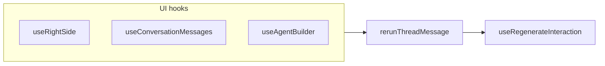

# Pass agent/version on regenerate (operator)

## Context

- **Create task** already sends versioning in `[TCreateTaskPayload](apps/operator/src/api/request.ts)` (`agent: { agent_id, version_id }`) from `[MainContext` `sendMessage](apps/operator/src/contexts/MainContext.tsx)` when creating a new task (see ~1862–1872).
- **Regenerate** uses `[useRegenerateInteraction](apps/operator/src/api/message-right-side.ts)`, which POSTs to `api/v1/tasks/{taskId}/interactions/{interactionId}/regenerate`. The `[useMutate](libs/api/src/api/react-query.ts)` implementation puts every payload field except `urlParams` / `extraHeaders` / `query` / `signal` into the JSON body, so adding `agent` here is sufficient—no axios layer change.
- All user-facing regenerate flows that hit this API go through `[rerunThreadMessage](apps/operator/src/widgets/ConversationMessages/rerunThreadMessage.ts)` in three places: `[useRightSide](apps/operator/src/components/RightSide/useRightSide.ts)`, `[useConversationMessages](apps/operator/src/widgets/ConversationMessages/useConversationMessages.ts)`, and `[useAgentBuilder](apps/operator/src/widgets/AgentBuilder/useAgentBuilder.ts)`.

## Implementation

### 1. Shared typing (avoid drift with create-task)

- In `[apps/operator/src/api/request.ts](apps/operator/src/api/request.ts)`, derive and export a small type from the existing payload, e.g. `export type TCreateTaskAgentPayload = NonNullable<TCreateTaskPayload['agent']>` (name can match local conventions).
- In `[apps/operator/src/api/message-right-side.ts](apps/operator/src/api/message-right-side.ts)`, extend `TRegenerateInteractionPayload` with an optional `agent?: TCreateTaskAgentPayload | null` (import the type from `request.ts`). It already spreads `Partial<TInteractionInfo>` and other fields into the body; `agent` is additive.

### 2. Thread rerun helper

- In `[rerunThreadMessage.ts](apps/operator/src/widgets/ConversationMessages/rerunThreadMessage.ts)`:
  - Add an optional parameter, e.g. `agent?: TCreateTaskAgentPayload | null`.
  - When calling `regenerateInteraction`, include `...(agent != null ? { agent } : {})` (or always pass `agent` if you choose to mirror `createTask` and always send the object—see note below).
  - Update the `regenerateInteraction` function type in `TRerunThreadMessageParams` to allow the extended payload shape.

**Semantics (align with product/backend):** Backend: if `agent` is omitted, original task agent is preserved; if provided, use that agent/version. **Recommendation:** mirror `MainContext` create-task behavior and **always** pass `agent` built from `useCurrentAgent` + `useVersionedListParams` at the three call sites (same `agent_id` / `version_id` sources as lines 1869–1871). That keeps “new task” and “regenerate” consistent. If you instead need “preserve original unless user is in a version-scoped context,” gate on `versionIdForQuery` / feature flags—confirm with backend/product if unsure.

### 3. Wire call sites (same sources as `createTask`)

For each caller of `rerunThreadMessage`, import `[useCurrentAgent](apps/operator/src/hooks/useCurrentAgent.ts)` and `[useVersionedListParams](apps/operator/src/hooks/useVersionedListParams.ts)` (same pair as `[MainContext](apps/operator/src/contexts/MainContext.tsx)` ~356–357) and build:

`agent: { agent_id: currentAgent?.id, version_id: versionIdForQuery }` — match the **exact** optional/null handling used in `createTask` (including whether `version_id` is `undefined` vs `null`) so the payload is consistent.

| File                                                                                                      | Change                                                                                        |
| --------------------------------------------------------------------------------------------------------- | --------------------------------------------------------------------------------------------- |
| `[useRightSide.ts](apps/operator/src/components/RightSide/useRightSide.ts)`                               | Call hooks; pass `agent` into `rerunThreadMessage` inside `handleRegenerate`.                 |
| `[useConversationMessages.ts](apps/operator/src/widgets/ConversationMessages/useConversationMessages.ts)` | Same in `handleRerun`.                                                                        |
| `[useAgentBuilder.ts](apps/operator/src/widgets/AgentBuilder/useAgentBuilder.ts)`                         | Same in `handleRerunInteraction` for the `same-thread` branch that uses `rerunThreadMessage`. |

### 4. Validation

- Run `nx lint operator` (or the narrowest target) on touched files.
- Manually verify: with a version selected in the UI, regenerate from the right-side panel and from message edit rerun; confirm the new task reflects the selected version (per backend behavior).

## Out of scope / note

- `[useFallbackActionInnerAccordion](apps/operator/src/components/RightSide/partials/FallbackActionInnerAccordion/useFallbackActionInnerAccordion.ts)` calls `handleRegenerate(regeneratePayload)`, but `[handleRegenerate](apps/operator/src/components/RightSide/useRightSide.ts)` is currently `async () =>` and **does not accept or forward** that argument. Fixing that workflow is separate from adding `agent` to the regenerate API body via `rerunThreadMessage`.
