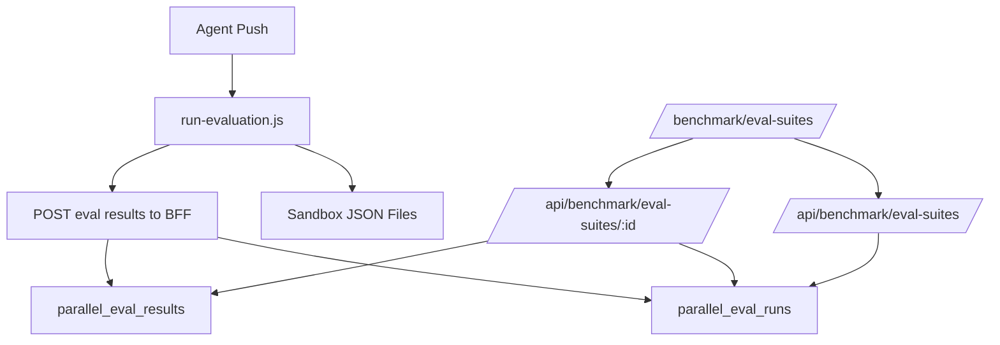

# Save Parallel Eval Results

## Facts From The Current Code

- `[sandbox-templates/agent-builder-parallel-eval/.opencode/skills/parallel-evaluation/scripts/run-evaluation.js](sandbox-templates/agent-builder-parallel-eval/.opencode/skills/parallel-evaluation/scripts/run-evaluation.js)` currently writes results only inside the sandbox:
  - `evaluation_results.json` in the agent directory via `writeRun`
  - `/home/user/project/.eval-runs/latest.json` via `writeBatchResult`
  - `/tmp/smoke-task-ids.jsonl` via `persistTaskIds`
- `[src/app/api/benchmark/eval-suites/route.ts](src/app/api/benchmark/eval-suites/route.ts)` currently reads `benchmark.generated_v3_tests`, which stores generated test definitions, not execution results.
- `[src/lib/benchmark-snapshot-storage.ts](src/lib/benchmark-snapshot-storage.ts)` already centralizes Mongo collection constants.
- `[benchmarks-v3/save-run-mongo.ts](benchmarks-v3/save-run-mongo.ts)` and `[src/app/api/benchmark/v3/runs/*](src/app/api/benchmark/v3/runs)` already use a good pattern: one run document plus many per-test result documents.

## Proposed Implementation

1. Add dedicated Mongo collections for sandbox parallel eval runs.

- Add constants in `[src/lib/benchmark-snapshot-storage.ts](src/lib/benchmark-snapshot-storage.ts)`, for example:
  - `PARALLEL_EVAL_RUNS_COLLECTION = "parallel_eval_runs"`
  - `PARALLEL_EVAL_RESULTS_COLLECTION = "parallel_eval_results"`
- Use new collections rather than `v3_runs`/`v3_results`, because the sandbox evaluator result schema is different from `benchmarks-v3/tests/types.ts`.

1. Add a BFF write endpoint for completed sandbox evals.

- Create a route such as `[src/app/api/benchmark/eval-suites/runs/route.ts](src/app/api/benchmark/eval-suites/runs/route.ts)` with `POST`.
- Validate the payload shape from `run-evaluation.js`:
  - run metadata: `sessionId`, `agentId`, `sandboxId`, `environment`, `generatedAt`, `status`, `allPassed`, `evaluatorModel`
  - test source: `agentBuilderPrompt`, raw `testQuestions`
  - per-result rows: `user_input`, `expected_answer`, `scenario`, `actual_answer`, `verdict`, `reasoning`, `task_id`
- Persist:
  - one run doc in `parallel_eval_runs`
  - one row per result in `parallel_eval_results`, linked by `runId`
- Make writes idempotent by using a stable key such as `{ sessionId, agentId, generatedAt }` or a runner-generated `runId`; this prevents duplicate rows if the sandbox retries the POST.

1. Give the sandbox evaluator a safe way to call the BFF.

- Extend `[src/lib/sandbox-metadata.ts](src/lib/sandbox-metadata.ts)` metadata with non-secret routing fields such as `sandboxId` and a `resultsUrl`, probably derived from `QUEUE_BASE_URL` or a new explicit env var.
- If auth is required, add a dedicated server-side env var like `PARALLEL_EVAL_RESULTS_TOKEN` and pass only that scoped write token to the sandbox environment/metadata. Do not pass `STORAGE_MONGODB_URI` into the sandbox.
- Update `[src/lib/session-manager.ts](src/lib/session-manager.ts)` where sandbox envs/metadata are prepared so parallel-eval sandboxes know where to submit results.

1. Update `run-evaluation.js` to persist after the run is assembled.

- Add a helper like `persistRunToBff(run, questionsFile, metadata, sessionId, agentDir)`.
- Call it after `writeRun`, `writeEvaluationMemory`, and `writeBatchResult` in both paths:
  - normal completion
  - `missing networkApiKey` error path
- Treat DB persistence as best-effort for the evaluator: log/notify on failure, but do not break the agent’s evaluation loop if Mongo/BFF is temporarily unavailable.
- Apply the same script change to the active parallel-eval templates, not only the focused one:
  - `[sandbox-templates/agent-builder-parallel-eval/.opencode/skills/parallel-evaluation/scripts/run-evaluation.js](sandbox-templates/agent-builder-parallel-eval/.opencode/skills/parallel-evaluation/scripts/run-evaluation.js)`
  - `[sandbox-templates/agent-builder-parallel-eval-gpt-5-5/.opencode/skills/parallel-evaluation/scripts/run-evaluation.js](sandbox-templates/agent-builder-parallel-eval-gpt-5-5/.opencode/skills/parallel-evaluation/scripts/run-evaluation.js)`
  - `[sandbox-templates/agent-builder-parallel-eval-ori-skills/.opencode/skills/parallel-evaluation/scripts/run-evaluation.js](sandbox-templates/agent-builder-parallel-eval-ori-skills/.opencode/skills/parallel-evaluation/scripts/run-evaluation.js)`

1. Extend `/benchmark/eval-suites` read APIs to include saved results.

- Update `[src/app/api/benchmark/eval-suites/route.ts](src/app/api/benchmark/eval-suites/route.ts)` so the list can include persisted parallel eval runs with aggregate fields: total, passed, failed, invalid, status, agent, session, sandbox, generated date.
- Update `[src/app/api/benchmark/eval-suites/[id]/route.ts](src/app/api/benchmark/eval-suites/[id]/route.ts)` so detail returns full generated tests plus their saved judge results ordered by test index.
- Preserve existing generated-v3 suite behavior unless the product expectation is to replace it entirely.

1. Update the `/benchmark/eval-suites` UI.

- In `[src/app/benchmark/eval-suites/page.tsx](src/app/benchmark/eval-suites/page.tsx)`, add result-aware fields to the sidebar: status and counts instead of only manual validation counts for persisted runs.
- In the detail panel, show each test question next to its result:
  - user input
  - expected answer
  - verdict
  - failure/judge reasoning
  - task id
  - raw simulator output/transcript from `actual_answer`
- Keep the existing validation controls for generated-v3 suite definitions if those remain on the page.

1. Validate narrowly.

- Run `npm run lint` or at least lint the changed TS/TSX files.
- Run a local route-level smoke test by POSTing a representative `run-evaluation.js` payload to the new endpoint, then fetching `/api/benchmark/eval-suites` and `/api/benchmark/eval-suites/{id}`.
- If template scripts are changed, rebuild templates with `npm run build:template` or the repo’s existing template build command before relying on new sandboxes.

## Resulting Flow

## Why This Shape

This fixes the cause of the issue: eval results currently only live in sandbox files, so `/benchmark/eval-suites` cannot show them after the fact. Persisting completed runs through the BFF keeps Mongo credentials server-side, gives the UI a durable source, and avoids corrupting the existing Benchmark V3 collections with a different result schema.
