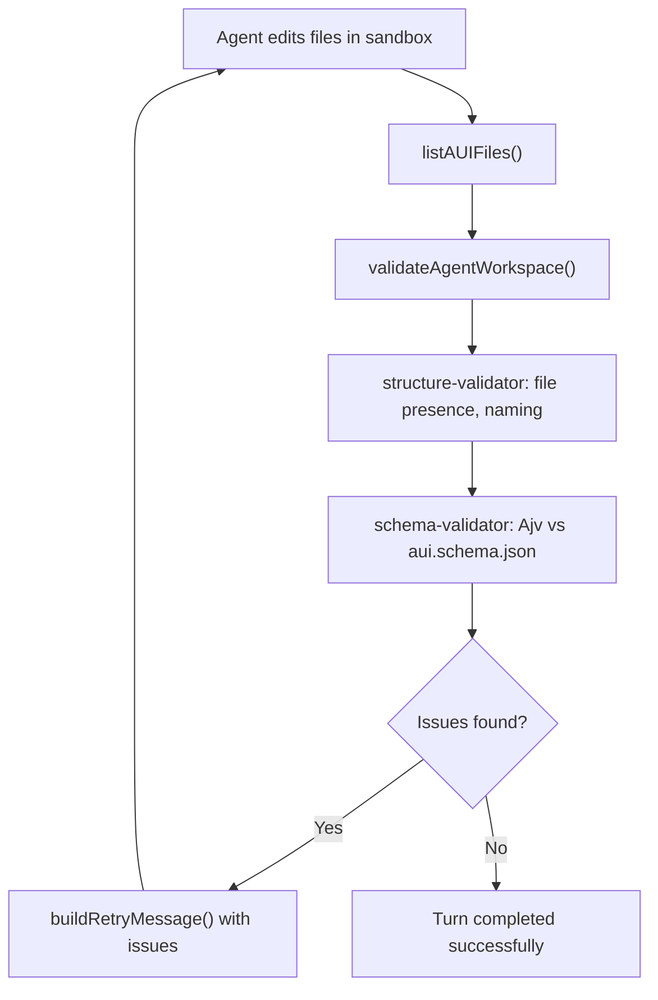

# Schema Validation Integration

## Problem

The current [lib/aui/validation.ts](lib/aui/validation.ts) performs only manual structural checks:

- File presence (required files exist)
- JSON parsing
- `$schema` field is present
- Naming conventions (kebab-case params, SCREAMING_SNAKE_CASE tools)
- `rules.post.success` / `rules.post.fail` are non-empty arrays

It **never validates against `aui.schema.json**`. The schemas exist in the sandbox (for the agent's reference) but are not used server-side at all. This means generated files can have structurally invalid content (wrong types, missing required fields, invalid enum values, bad condition structures, etc.) and pass validation.

## Schema Source

The authoritative schemas live at `/Users/bugo/Documents/Developer/aui/aui-agent-builder-v2/schemas/`:

- `**aui.schema.json**` (1,051 lines, Draft-07) — main agent config schema. Uses `oneOf` to validate 6 file types: `agent.aui.json`, `parameters.aui.json`, `entities.aui.json`, `tools/*.aui.json`, `rules.aui.json`, `integrations.aui.json`
- `**interaction-reasoning.schema.json**` (314 lines, Draft 2020-12) — runtime reasoning trace schema (documentation/reference, not validated against generated files)
- `**interaction-reasoning.examples.json**` (432 lines) — example traces

## Approach

### 1. Sync schemas from external repo

Copy the 3 schema files from `/Users/bugo/Documents/Developer/aui/aui-agent-builder-v2/schemas/` into [sandbox-templates/aui-developer/schemas/](sandbox-templates/aui-developer/schemas/), replacing the current ones. This keeps them in the same location that the E2B template already copies from.

### 2. Install Ajv

Add `ajv` and `ajv-formats` as dependencies. Ajv is the standard JSON Schema validator for Node.js and supports both Draft-07 (used by `aui.schema.json`) and Draft 2020-12.

### 3. Reorganize validation into focused modules

Replace the single [lib/aui/validation.ts](lib/aui/validation.ts) with a `validation/` directory:

```
lib/aui/validation/
├── index.ts               # Orchestrator: validateAgentWorkspace()
├── schema-validator.ts    # Ajv JSON Schema validation against aui.schema.json
└── structure-validator.ts # File presence, directory structure, naming conventions
```

`**schema-validator.ts**` — JSON Schema validation:

- Loads `aui.schema.json` from `sandbox-templates/aui-developer/schemas/`
- Compiles it once with Ajv (lazy singleton)
- Exports `validateFileAgainstSchema(filePath, content)` that validates a parsed `.aui.json` file against the compiled schema
- Maps Ajv error objects to human-readable error strings for the retry prompt
- Skips `test.aui.json` files (not covered by the schema)

`**structure-validator.ts**` — structural checks (extracted from current `validation.ts`):

- Required file presence checks
- Tools and tests directory checks
- Naming convention enforcement (kebab-case params, SCREAMING_SNAKE_CASE tools)
- Tool `rules.post` non-empty checks

`**index.ts**` — orchestrator:

- Runs structure validation first (fast, catches missing files early)
- Then runs schema validation on each `.aui.json` file
- Returns combined error array
- Exports `validateAgentWorkspace()` with the same signature as today

### 4. Update imports

Update [lib/aui-runtime.ts](lib/aui-runtime.ts) line 18:

```typescript
// Before
import { validateAgentWorkspace } from "./aui/validation";
// After
import { validateAgentWorkspace } from "./aui/validation/index";
```

### 5. Add tests

Add schema validation tests in `tests/aui-validation.test.ts`:

- Valid agent file passes validation
- Missing required field fails
- Invalid parameter code format fails
- Invalid tool code format fails
- Schema validation catches type mismatches
- Graceful handling when schema file is malformed

## Validation Flow (no change to runtime flow)

The existing call site in [lib/aui-runtime.ts](lib/aui-runtime.ts) lines 249-273 already handles:

1. Agent generates files via OpenCode
2. `validateAgentWorkspace()` checks the output
3. If issues found, sends `buildRetryMessage()` with the issues
4. Agent retries with stricter instructions
5. Re-validates

This flow remains identical — only the depth and accuracy of validation increases.



## Files Changed

- **New:** `lib/aui/validation/index.ts`, `lib/aui/validation/schema-validator.ts`, `lib/aui/validation/structure-validator.ts`, `tests/aui-validation.test.ts`
- **Deleted:** `lib/aui/validation.ts` (replaced by validation directory)
- **Modified:** `lib/aui-runtime.ts` (import path), `package.json` (add ajv)
- **Synced:** `sandbox-templates/aui-developer/schemas/` (3 files from external repo)
