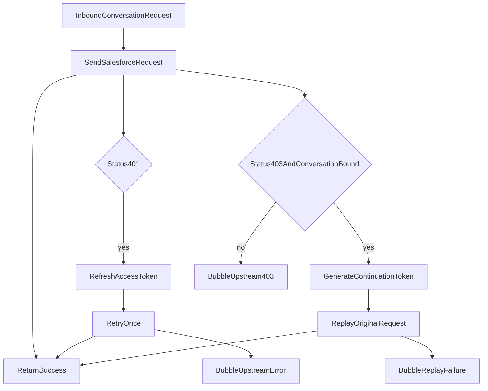

# Salesforce Livechat Simple Test Patch

## What I verified

- The current flow is concentrated in `[src/salesforce-livechat/client/salesforce-livechat.client.ts](src/salesforce-livechat/client/salesforce-livechat.client.ts)`, `[src/salesforce-livechat/service/salesforce-livechat.service.ts](src/salesforce-livechat/service/salesforce-livechat.service.ts)`, and `[src/proxy/controller/proxy.controller.ts](src/proxy/controller/proxy.controller.ts)`.
- The client currently treats `401` and `403` as the same case and always does `authenticate() + retry once`.

```76:84:src/salesforce-livechat/client/salesforce-livechat.client.ts
      if (status === 401 || status === 403) {
        this.logger.log('received auth failure from salesforce livechat, re-authenticating and retrying', {
          url,
          status,
          data: error?.response?.data,
        });
        const newAccessToken = await this.authenticate(params);
```

- There is no existing conversation-specific state, invalidation, or retry suppression anywhere else in this repo.
- For this test-first patch, no new conversation state will be added in `NodeCache` or Dynamo; the goal is only to validate whether the immediate retry behavior is wrong today.
- Salesforce’s docs separate access-token generation from continuation-token generation:
  - [Authorization](https://developer.salesforce.com/docs/service/messaging-api/guide/authorization.html)
  - [Generate continuation token](https://developer.salesforce.com/docs/service/messaging-api/references/miaw-api-reference?meta=generateContinuationToken)
  - [Create conversation](https://developer.salesforce.com/docs/service/messaging-api/references/miaw-api-reference?meta=createConversation)
- The confirmed continuation endpoint is `GET /iamessage/api/v2/authorization/continuation-access-token`, and Salesforce documents that it returns `{ accessToken, lastEventId }`, where the JWT keeps the same subject ID, uses a different client ID, and does not extend JWT expiration time.
- `context7` was used against `/websites/developer_salesforce`, but in this environment it only exposed the thin Salesforce doc corpus index, not the detailed continuation endpoint contract. The implementation plan therefore keeps an explicit doc-validation step for request headers and replay semantics before writing the continuation call.

## Target behavior

- `401` means access token is stale/invalid:
  - stop treating it the same as `403`
  - fetch a fresh access token using the existing unauthenticated access-token endpoint
  - retry the original request once
- `403` on conversation-bound endpoints means the auth context may no longer be valid for that conversation:
  - do not treat it as the same branch as `401`
  - attempt Salesforce continuation using `GET /iamessage/api/v2/authorization/continuation-access-token`
  - replay the request with the returned continuation `accessToken`
  - if the failing flow is SSE-related, carry forward the returned `lastEventId` according to the official contract
  - if the replay still returns `403`, stop there and bubble the failure
- `403` on non-conversation endpoints should not guess at continuation behavior; it should bubble as an upstream authorization/permission failure without introducing new retry loops.



## Implementation plan

1. Make the smallest possible change in `[src/salesforce-livechat/client/salesforce-livechat.client.ts](src/salesforce-livechat/client/salesforce-livechat.client.ts)` so the retry policy matches the test hypothesis:

- split the shared `401 || 403` branch
- keep `401` on the existing `authenticate()` retry path
- add a separate `403` branch for conversation-bound URLs only
- call Salesforce continuation before replaying the failed conversation request
- keep the replay bounded to one attempt

1. Extend `[src/salesforce-livechat/client/salesforce-livechat.client.types.ts](src/salesforce-livechat/client/salesforce-livechat.client.types.ts)` only if needed for the continuation response shape:

- continuation-token response
- optional continuation replay context including `lastEventId` if required by the documented endpoint behavior

1. Keep the first patch scoped to the existing Live Chat client and current token storage:

- reuse the existing access-token caching path already implemented through `[src/dynamo/dynamo.service.ts](src/dynamo/dynamo.service.ts)`
- do not add new `NodeCache` or Dynamo state
- do not add invalid-conversation suppression
- do not add cross-request continuation persistence

1. Make the client endpoint-aware:

- only continuation-handle paths that actually target an existing conversation, for example `/conversation/{id}` and `/queries/conversation/{id}`
- leave authorization endpoint calls and non-conversation endpoints on simpler rules
- treat `401` as access-token refresh via the existing unauthenticated token endpoint, but treat `403` as a distinct continuation attempt rather than another generic `authenticate()`
- do not retry indefinitely; every branch should have a single bounded replay path

1. Add the continuation step only after validating the exact Salesforce contract from the official endpoint doc:

- use `GET /iamessage/api/v2/authorization/continuation-access-token`
- verify required request headers, whether the call itself requires bearer auth, and how the returned `accessToken` and `lastEventId` must be applied on replay
- verify whether `lastEventId` matters only for SSE reconnect flows or also for any REST conversation replay path in this gateway
- if the doc cannot be verified cleanly, stop there and clarify before implementation rather than guessing

1. Preserve the existing controller error handling in `[src/proxy/controller/proxy.controller.ts](src/proxy/controller/proxy.controller.ts)`:

- do not introduce a new typed terminal error in this first patch
- let the existing Axios-to-`HttpException` mapping continue to surface upstream failures

1. Add focused tests only if they are the smallest path to safe validation:

- no cached token -> authenticate -> send
- `401` -> invalidate token -> refresh -> retry once
- `403` on conversation endpoint -> continuation token call -> replay
- continuation token returns `lastEventId` -> preserve/apply it when the documented replay path requires it
- `403` on non-conversation endpoint -> no continuation attempt

## Scope notes

- I did not find any higher-level polling or conversation orchestration layer in this repo. For this patch, that is fine because the goal is only to validate the immediate `403` continuation hypothesis.
- This patch will not solve cross-request or cross-pod continuation state. If testing shows the same conversation fails again on later requests, a second patch should add stateful continuation handling.
