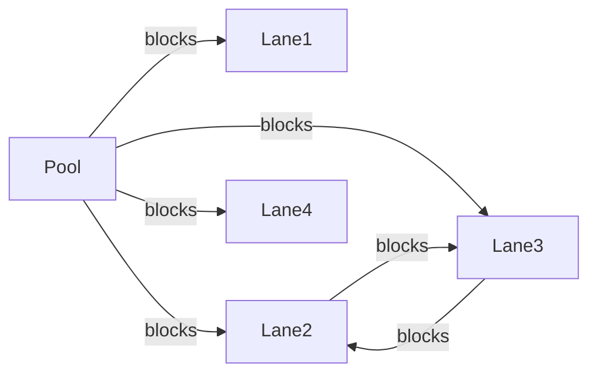

# Slot Conflict Detection

## Rules (from [REQUIREMENTS.md](REQUIREMENTS.md))

**Overlap:** `a.start < b.end && a.end > b.start` (string compare works with `YYYY-MM-DDThh:mm:ss`). Touching endpoints do not conflict.

**When does slot S on resource R conflict with slot T?**
1. Same resource: `T.resourceId === R`, or
2. Upstream blocker: there exists a `BlockingDependency` where `blockingResourceId === T.resourceId` and `blockedResourceId === R`

Blocking is **one-directional**. Example: Pool blocks Lane 1 → overlapping Lane 1 slots list the Pool slot in `conflicts`; Pool slots do **not** list Lane 1. Mutual deps (Lane 2 ↔ Lane 3) make those overlaps mutual.

## Implementation — [server/src/slots/slots.service.ts](server/src/slots/slots.service.ts)

All work stays in this file (already uses `EntityManager`; entities are registered). Extract private helpers and wire the three public methods.

### Shared helpers

1. **`overlaps(a, b)`** — time overlap predicate above.
2. **`buildBlockersByBlocked(deps)`** — `Map<blockedResourceId, Set<blockingResourceId>>` from all `BlockingDependency` rows.
3. **`toSlotDto(slot, conflicts?)`** — map entity → `{ id, name, start, end, resourceId, conflicts }` (conflict entries use `conflicts: []`).
4. **`findConflicts(candidate, allSlots, blockersByBlocked, excludeSlotId?)`**
   - Candidate resource = `candidate.resourceId`
   - Relevant other slots: same `resourceId`, or `resourceId` in `blockersByBlocked.get(candidate.resourceId)`
   - Skip `excludeSlotId` (for updates) and skip self by `id` when present
   - Return overlapping slots as `SlotDto[]` with `conflicts: []`

### `getSlots()`

1. Load in parallel: all `Resource`, all `BlockingDependency`, all `Slot` (`Promise.all`).
2. Filter to **today’s relevant slots**: include if `start` date is today **or** `end` date is today (covers overnight slots that started yesterday).
3. Build `blockersByBlocked` map.
4. For **every** resource (including Lane 4 with no own slots):
   - `visibleSlots` = today’s slots where `resourceId === R` **or** `resourceId` is in blockers of R
   - For each visible slot, compute `conflicts` via `findConflicts` against **all today’s slots** (not only `visibleSlots`), using the slot’s own `resourceId`
5. Return `ResourceSlotsDto[]` ordered stably (e.g. by `resourceId`).

### `addSlot()` / `updateSlot()`

Reuse `findConflicts` against existing DB slots.

- If conflicts length > 0 → `throw new HttpException(conflicts, HttpStatus.CONFLICT)`.
- Else save and return `toSlotDto(saved, [])`.
- `updateSlot`: pass `excludeSlotId: slotId` so self does not conflict with itself.

## Out of scope

- No e2e or unit test runs; no test file changes.
