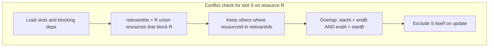

# Slot Conflict Detection

Conflicts are **not** “any two different resources that overlap.” Per [REQUIREMENTS.md](REQUIREMENTS.md) and [server/test/slots.e2e-spec.ts](server/test/slots.e2e-spec.ts):

- Two ranges overlap when `a.start < b.end AND a.end > b.start` (string-compare ISO datetimes; **touching** endpoints do not conflict).
- For a slot on resource `R`, a conflicting slot is an overlapping slot on:
  1. **the same resource** `R`, or
  2. a resource that **blocks** `R` (`BlockingDependencies.blockedResourceId = R`).
- Blocking is **one-directional**: Pool vs Lane 1 overlaps count as conflicts **on the Lane 1 slot**, not on the Pool slot.

Seed graph (from [server/src/seed-data.ts](server/src/seed-data.ts)): Pool blocks Lanes 1–4; Lane 2 and Lane 3 block each other.

All logic lives in [server/src/slots/slots.service.ts](server/src/slots/slots.service.ts) (replace the current stub). DTOs, controller, and entities stay as they are.

## Helpers (private methods on `SlotsService`)

- **`slotsOverlap`**: `a.start < b.end && a.end > b.start`.
- **`blockingIdsByResource`**: `Map<blockedId, Set<blockingId>>` from `BlockingDependency`.
- **`relevantResourceIds(resourceId)`**: `{ resourceId } ∪ blockers`.
- **`findConflicts(candidate, slots, excludeId?)`**: other slots whose `resourceId` is relevant and times overlap. Map to `SlotDto` **without nested `conflicts`** (avoids recursion; 409 tests only require `id/name/start/end/resourceId`).
- **`toSlotDto(slot, conflicts)`**: `{ id, name, start, end, resourceId, conflicts }`.
- **`isTodaysSlot`**: overlaps local today: `slot.end > todayT00:00:00 && slot.start < tomorrowT00:00:00` so overnight slots (started yesterday, ending today) are included.

Load `Resource`, `BlockingDependency`, and `Slot` with `Promise.all` (independent reads).

## `getSlots()`

1. Load all resources, all dependencies, all slots; keep today’s slots.
2. One `ResourceSlotsDto` **per resource** (including Lane 4 with no own bookings).
3. For resource `R`, `slots` = today’s slots on `R` **plus** today’s slots on resources that block `R` (Pool slots appear under each Lane; Lane 1 slots do **not** appear under Pool).
4. Each listed slot gets `conflicts` from **that slot’s own `resourceId`**, not from the grouping resource (a Pool slot shown under Lane 1 still has empty/Pool-only conflicts).

## `addSlot()` / `updateSlot()`

1. Build a candidate `{ start, end, resourceId }` (`updateSlot`: load by id, apply new times; if missing, `throw new NotFoundException()` so PUT 999999 is **404** — `findOneOrFail` would 500 in e2e).
2. `findConflicts` against existing slots (`updateSlot` excludes `slotId`).
3. If any: `throw new HttpException(conflicts, HttpStatus.CONFLICT)` so the body is a **raw array**. Do **not** use `ConflictException(array)` — Nest wraps arrays into `{ message, statusCode }`, which fails the 409 tests and the global filter.
4. Save and return `toSlotDto(saved, [])`.

## Validation

Run `npm run test:e2e` in `server/`. Coverage that must pass: one entry per resource, Pool-in-Lane grouping, one-way blocking, same-resource + blocker conflicts, adjacent POST 201, cross-resource POST 409, PUT self-exclusion, Lane 4 empty-own-slots.